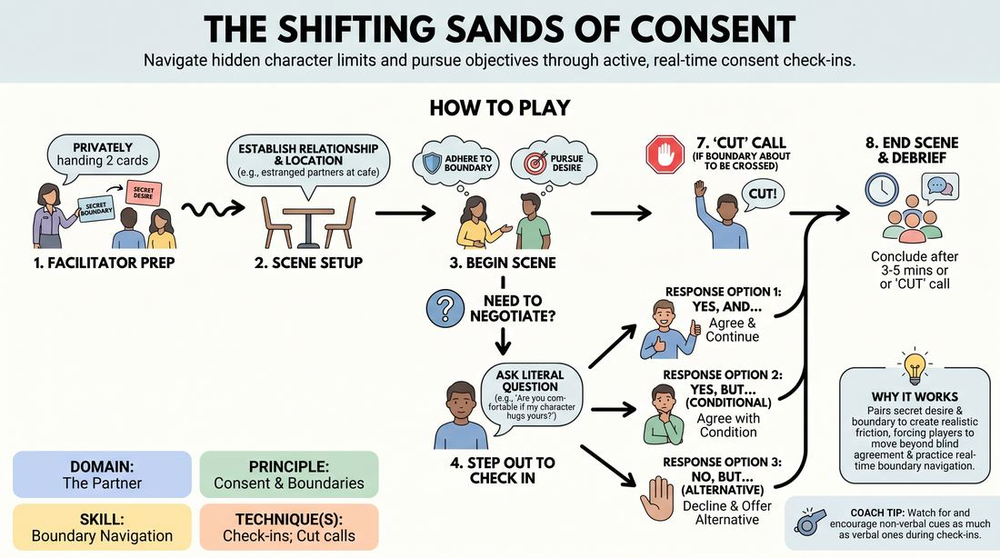

# Dynamic Boundaries

{ .game-hero }

> Navigate hidden character limits and pursue objectives through active, real-time consent check-ins.

## Overview
In this exercise, players improvise scenes while holding secret, non-negotiable character boundaries and driving personal desires. Because these limits are hidden, players must actively read physical and verbal cues, stepping out of character to negotiate consent when approaching sensitive territory. The result is a highly realistic simulation of dynamic boundary navigation that prioritizes safety without sacrificing dramatic stakes.

## What It Trains
- **Domain:** D2 — The Partner
- **Principle(s):** Consent & Boundaries; Yes, And; Truth Over Pandering
- **Skill(s):** Boundary Navigation; Offer Reception; Stakes / The 'Want'; Active Listening
- **Technique(s):** Check-ins; Cut calls; Negotiating physical contact
- **Focus:** mixed

**Objective:** To develop competent boundary navigation and active listening skills, specifically training players to use explicit check-ins, practice 'Truth Over Pandering' through conditional agreements, and safely manage high-stakes character objectives.

## At a Glance
| Aspect | Detail |
|---|---|
| Players | 4–8 (ideal 4-8) |
| Time | ~25 min |
| Complexity | 3/5 |
| Skill level | competent |
| Energy | medium |
| Physicality | medium |
| Modality | in_person |
| Space | moderate |
| Props | Boundary Cards, Desire Cards |
| Audience | not required |

## Setup
Prepare two sets of index cards: 'Boundary Cards' (e.g., 'Cannot be touched above the elbow', 'Cannot discuss past relationships') and 'Desire Cards' (e.g., 'Must convince partner to hold hands', 'Must uncover a secret'). Arrange the playing space with two chairs in the center for the active players, while the remaining 2-6 players sit in a semi-circle as active observers.

## How to Play
1. The facilitator pairs up two players and privately hands each player one secret Boundary Card and one secret Desire Card.
2. The facilitator establishes a simple relationship and location for the scene, such as two estranged business partners meeting at a quiet cafe.
3. Players begin the scene, actively pursuing their secret character desire while strictly adhering to their own secret character boundary.
4. When a player wants to initiate physical contact, delve into sensitive topics, or senses they are approaching a boundary, they must step out of character to perform a 'Check-in'.
5. To check in, the player makes direct eye contact and asks a clear, literal question, such as, 'Are you comfortable if my character hugs yours?'
6. The partner must respond honestly based on their character's secret boundary, choosing between 'Yes, and...', 'Yes, but...' (conditional), 'No, but...' (alternative), or a direct 'No'.
7. If a player feels their boundary is about to be crossed without a check-in, or if they feel genuinely uncomfortable, they can call 'Cut' to immediately pause the scene with no explanation required.
8. The scene concludes after three to five minutes, or immediately following a 'Cut' call, transitioning directly into a structured group debrief.

## Facilitation Notes
- Emphasize that calling 'Cut' is a successful application of safety mechanics, not a failure of the scene or the player.
- Watch for players 'pandering' by ignoring their secret boundaries just to make the scene run smoother; gently remind them that honoring boundaries builds stronger dramatic tension.
- Start with simple, physical boundaries for early rounds before introducing complex emotional or narrative boundaries as the group's comfort level grows.
- Ensure players clearly distinguish between their personal safety boundaries and their character's fictional boundaries during the setup.

## Variations
- Open Boundaries: Play the same setup but with both players' boundaries openly displayed to the audience, turning the exercise into a dramatic irony study for the observers.
- Escalating Stakes: Introduce a mid-scene prompt where the facilitator hands a new, more urgent Desire Card to one player, forcing them to renegotiate established boundaries under pressure.

## Debrief
- What physical or verbal cues tipped you off that you were approaching your partner's hidden boundary?
- How did it feel to use 'Yes, but...' or 'No, but...' to redirect the scene while still honoring your character's limits?
- For the player pursuing a desire, how did negotiating boundaries actually heighten the dramatic stakes of your objective?
- How can we apply this practice of stepping out of character to check in during our regular, unscripted scene work?

## Safety & Inclusion
Establish a clear distinction between character boundaries and player boundaries before starting. Ensure players know they can use the 'Cut' mechanic for personal safety at any time, and that personal safety always overrides character objectives. Keep the pre-written cards free of real-world trauma triggers.

## Why It Works
By pairing a secret desire with a secret boundary, the game creates a natural friction that mirrors real-world social dynamics. It forces players to move away from blind agreement ('yes-and' without boundaries) and instead teaches them to negotiate. Stepping out of character for check-ins demystifies consent, proving that explicit communication preserves safety without destroying the theatrical illusion.
