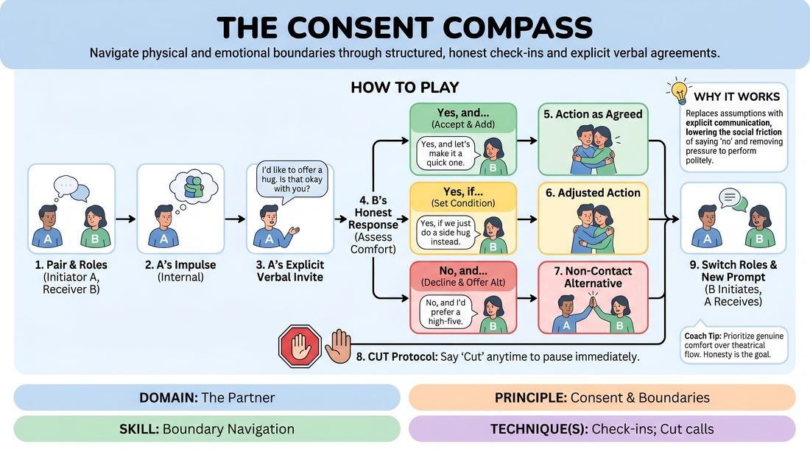

# The Boundary Compass

{ .game-hero }

> Navigate physical and emotional boundaries through structured, honest check-ins and explicit verbal agreements.

## Overview
A structured partner exercise where players practice translating implicit physical or emotional impulses into explicit, verbal invitations. Partners respond with absolute honesty, choosing from three distinct boundary-setting options to prioritize personal comfort over theatrical politeness. This drill establishes a shared vocabulary for real-time negotiation, active listening, and psychological safety on stage.

## What It Trains
- **Domain:** D2 — The Partner
- **Principle(s):** Consent & Boundaries; Yes, And; Truth Over Pandering
- **Skill(s):** Boundary Navigation; Active Listening; Offer Reception
- **Technique(s):** Check-ins; Cut calls; Negotiating physical contact; Yes, And… sentence games
- **Focus:** skill_drill

**Objective:** To develop proactive consent-seeking communication, master verbal check-ins before physical contact, and practice setting clear, honest boundaries without fear of stalling a scene.

## At a Glance
| Aspect | Detail |
|---|---|
| Players | 2+ (ideal 4+) |
| Time | ~15 min |
| Complexity | 2/5 |
| Skill level | novice |
| Energy | low |
| Physicality | low |
| Modality | in_person |
| Space | minimal |
| Props | none |
| Audience | not required |

## Setup
Players form pairs and stand facing each other at a comfortable distance (about four feet apart) in a spacious room. No props or materials are required. The facilitator should ensure the room is quiet enough for pairs to hear each other clearly.

## How to Play
1. Divide the group into pairs and designate one player as Partner A (the Initiator) and the other as Partner B (the Receiver) for the first round.
2. The facilitator provides Partner A with a private prompt representing an internal desire or impulse that involves physical proximity, touch, or high emotional intensity (e.g., wanting to offer a comforting hug or wanting to whisper a secret).
3. Partner A must translate this internal impulse into an explicit, respectful verbal invitation, stating their intent and asking for permission while detailing the proposed physical contact or proximity.
4. Partner B listens actively, assesses their own genuine comfort level in the moment, and responds using one of three structured options: 'Yes, and...', 'No, and...', or 'Yes, if...'.
5. If Partner B responds with 'Yes, and...', they accept the offer and can add a preference; Partner A then executes the action exactly as agreed upon.
6. If Partner B responds with 'Yes, if...', they set a specific condition or modification (e.g., 'Yes, if you tap my shoulder instead of hugging me'), which Partner A must strictly adhere to when performing the action.
7. If Partner B responds with 'No, and...', they decline the physical action and offer a non-contact alternative (e.g., 'No, and I would prefer we just sit side-by-side'); Partner A must immediately accept this boundary without negotiation.
8. Introduce the 'Cut' protocol: at any point during the interaction, if either player feels uncomfortable, overwhelmed, or uncertain, they can say 'Cut' to immediately end the exercise with no explanation required.
9. Have partners switch roles so that Partner B becomes the Initiator and Partner A becomes the Receiver, using a new prompt provided by the facilitator.

## Facilitation Notes
- Coaching Cue: Remind Receivers that 'Truth Over Pandering' is the golden rule. It is far better to say a genuine 'No' or 'Yes, if' than a polite, uncomfortable 'Yes' just to please your partner.
- Pitfall: Initiators sometimes rush into the physical action before the Receiver has fully articulated their response. Fix: Side-coach Initiators to remain completely still until the verbal agreement is finalized.
- Coaching Cue: Normalize the 'No'. Celebrate when a player sets a boundary, reminding the group that clear boundaries build the trust necessary for bold, physical play.
- Pitfall: Players treating the 'Yes, if' or 'No, and' as a joke or a gag. Fix: Remind the group of the safety-sensitive nature of the drill and encourage them to check in with their real-world comfort levels.
- Coaching Cue: Actively monitor the room for the 'Cut' call. If a pair calls 'Cut', step in gently to offer a quiet, private check-in away from the main group, ensuring no pressure is placed on them to explain.

## Variations
- Silent Compass: Run the exercise using only non-verbal cues, eye contact, and open hand gestures to seek and grant permission, testing non-verbal boundary navigation.
- In-Character Integration: Transition the exercise into a slow-paced scene where characters must maintain their fictional roles while using explicit, out-of-character check-ins for physical contact.
- The Temperature Check: Before the prompt is given, partners share their current physical boundaries for the day (e.g., 'No touching my head or neck today'), establishing a baseline before play begins.

## Debrief
- For Initiators: How did it feel to explicitly ask for permission instead of acting on impulse? Did you find yourself making assumptions about your partner's comfort?
- For Receivers: Was it difficult to choose 'No, and' or 'Yes, if' instead of automatically saying 'Yes' to keep the momentum going? What helped you stay true to your boundaries?
- For Both: How does knowing your partner has the absolute right to say 'No' or call 'Cut' actually increase your freedom and confidence to make physical offers?
- How can we carry this practice of explicit check-ins into our fast-paced, spontaneous scene work without breaking the theatrical illusion?

## Safety & Inclusion
This is a highly safety-sensitive exercise. Participation must be entirely voluntary. Establish a clear, non-judgmental atmosphere before starting. Ensure players know they can step out at any time. Respect all physical boundaries absolutely, and emphasize that a player's real-world comfort always supersedes any theatrical or character choice.

## Why It Works
This game works because it replaces assumptions with explicit communication. By providing a structured, three-tiered response system ('Yes, and', 'No, and', 'Yes, if'), it lowers the social friction of saying 'no' and removes the pressure to pander. It teaches players that boundaries do not block collaboration; instead, they define a safe playground where both performers can fully commit, knowing their physical and emotional autonomy is protected.
