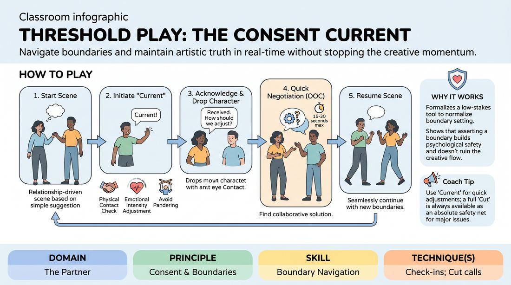

# The Consent Current

{ .game-hero }

> Navigate boundaries and maintain artistic truth in real-time without stopping the creative momentum.

## Overview
This exercise introduces a dynamic, mid-scene pause mechanic that allows players to step out of character to negotiate physical contact, address emotional comfort, or correct inauthentic choices. By normalizing brief, collaborative check-ins, players learn to co-create a safe, high-trust environment where boundaries are treated as creative assets rather than narrative roadblocks.

## What It Trains
- **Domain:** D2 — The Partner
- **Principle(s):** Consent & Boundaries; Yes, And; Truth Over Pandering
- **Skill(s):** Boundary Navigation; Active Listening; Offer Reception
- **Technique(s):** Check-ins; Cut calls; Negotiating physical contact
- **Focus:** connection

**Objective:** To develop proactive boundary navigation and active listening skills, allowing players to execute real-time check-ins and honor personal truth over artistic pandering.

## At a Glance
| Aspect | Detail |
|---|---|
| Players | 2–8 (ideal 4-8) |
| Time | ~15 min |
| Complexity | 3/5 |
| Skill level | competent |
| Energy | medium |
| Physicality | low |
| Modality | in_person |
| Space | moderate |
| Props | none |
| Audience | not required |

## Setup
An open playing space. Players stand in a circle or semi-circle. No props or materials are required. The facilitator establishes a shared understanding of physical safety and emotional boundaries before beginning.

## How to Play
1. Gather the group and explain that this exercise integrates real-time consent and boundary negotiation directly into active scenes.
2. Invite two players to step forward and begin a standard, relationship-driven scene based on a simple suggestion.
3. Introduce the 'Current' mechanic: at any point, a player can pause the scene's reality by taking a step back, making a small hand gesture, and stating, 'Current: [specific boundary, feeling, or request].'
4. Instruct players to use this mechanic for physical contact checks, emotional intensity adjustments, or when they feel they are 'pandering' (making choices just to please the partner rather than honoring their character's truth).
5. The receiving partner must immediately drop character, make eye contact, and reply, 'Received. How should we adjust?'
6. The two players then engage in a brief, out-of-character negotiation (lasting no more than 15 to 30 seconds) to find a collaborative solution.
7. Once an adjustment is agreed upon, both players step back into their physical positions, resume character, and seamlessly continue the scene with the new boundary integrated.
8. Remind players that a full 'Cut' remains available at any time as an absolute safety net if a scene cannot be safely negotiated or needs to end immediately.

## Facilitation Notes
- Model the mechanic early by stepping into a demonstration scene to show how quickly and casually a 'Current' check-in can be executed.
- Keep negotiations brief and solution-oriented; if players begin debating the narrative arc out of character, prompt them to make a quick choice and test it in play.
- Encourage extreme specificity in the check-in (e.g., 'I want to grab your hand, is that okay?' rather than 'Can I touch you?').
- Watch for 'pandering'—if a player looks visibly uncomfortable but is saying 'yes' to keep the scene going, gently side-coach them to call a 'Current' and find their truth.
- Normalize the awkwardness of breaking character; remind the group that explicit practice builds the muscle for intuitive, implicit boundary navigation later.

## Variations
- Non-Verbal Currents: For advanced players, transition the verbal check-in to subtle, non-verbal cues (like a specific hand placement or eye contact shift) to negotiate boundaries without breaking the scene's auditory flow.
- Third-Party Currents: Allow offstage players to call a 'Current' if they observe a boundary being approached that the onstage players might not notice, practicing collective care.

## Debrief
- How did it feel to initiate a 'Current' check-in? Did it feel empowering, or did you experience resistance to breaking the scene's flow?
- How did the brief out-of-character negotiation affect your level of trust with your scene partner?
- In what ways did honoring a boundary actually open up new, unexpected narrative directions for the scene?
- How can we distinguish between a character's boundary (which we can play with) and a player's boundary (which requires a 'Current' check-in)?

## Safety & Inclusion
This game is highly consent-sensitive. Ensure all participants know they have absolute autonomy over their physical space and emotional limits. If a participant is uncomfortable with physical touch, they can state this as a baseline boundary before the scene starts, or use the 'Current' to maintain distance. Participation in physical contact is always optional.

## Why It Works
By formalizing a low-stakes, mid-scene negotiation tool, this game removes the shame and friction often associated with boundary setting. It teaches players that asserting a boundary does not ruin a scene; instead, it builds the psychological safety necessary for deeper vulnerability, truer connection, and more authentic storytelling.
