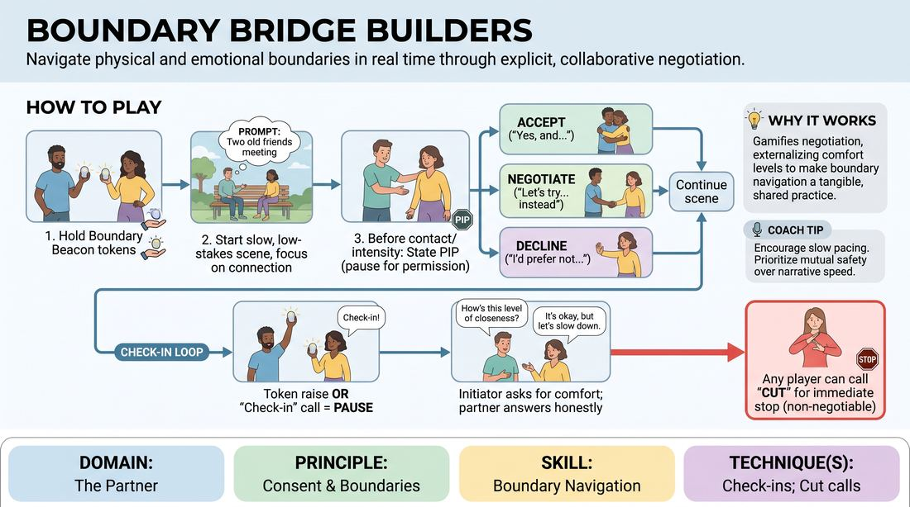

# Boundary Bridges

{ .game-hero }

> Navigate physical and emotional boundaries in real time through explicit, collaborative negotiation.

## Overview
Boundary Bridges is a slow-tempo, highly conscious scene-work exercise where players prioritize safety and mutual comfort over narrative speed. By using physical tokens and explicit verbal check-ins, players learn to pause, negotiate, and adjust physical contact or emotional intensity in real time. The experience shifts the focus of improv from clever plot progression to the deep, supportive connection of co-creating a safe creative space.

## What It Trains
- **Domain:** D2 — The Partner
- **Principle(s):** Consent & Boundaries; Yes, And; Vulnerability; Group Mind
- **Skill(s):** Boundary Navigation; Active Listening; Offer Reception; Support Work
- **Technique(s):** Check-ins; Cut calls; Negotiating physical contact
- **Focus:** connection

**Objective:** To develop practical boundary navigation and active listening skills by integrating explicit verbal check-ins and non-verbal signaling into active scene work, training players to prioritize mutual consent over narrative momentum.

## At a Glance
| Aspect | Detail |
|---|---|
| Players | 3–6 (ideal 3-5 players plus 1 facilitator) |
| Time | ~15 min |
| Complexity | 3/5 |
| Skill level | advanced_beginner |
| Energy | low |
| Physicality | low |
| Modality | in_person |
| Space | minimal |
| Props | boundary beacons (small physical tokens like colored cloth, foam ball, or card) |
| Audience | not required |

## Setup
Players stand in a semi-circle in a quiet, minimal space. Each player selects a small, distinct physical token (such as a colored card, a small foam ball, or a piece of cloth) to act as their 'Boundary Beacon.' The facilitator establishes a low-stakes, supportive atmosphere and reviews the core vocabulary: Potential Interaction Points (PIPs), Boundary Beacons, Verbal Check-ins, and the 'Cut' call.

## How to Play
1. Distribute a physical token (the Boundary Beacon) to each player and have them hold it comfortably in one hand throughout the exercise.
2. The facilitator provides a simple, low-stakes scene prompt, such as a relationship (e.g., two old friends meeting at a train station) and a location.
3. Two players enter the playing space to begin a slow-paced, character-driven scene, focusing on emotional connection and physical proximity.
4. Before initiating any physical contact, entering another player's personal space, or introducing highly sensitive emotional topics, the initiating player must state a 'Potential Interaction Point' (PIP) out loud (e.g., 'I would like to place my hand on your shoulder, how does that feel?').
5. The receiving player must respond to the PIP with one of three choices: accept the offer ('Yes, and...'), negotiate a modification ('Let's explore a handshake instead'), or raise their physical Boundary Beacon to signal a soft pause.
6. If a player raises their Boundary Beacon, or if any participant feels a sudden shift in comfort, any player or the facilitator can call 'Check-in' to immediately pause the scene.
7. During a Check-in, the initiator asks a direct, honest question about comfort (e.g., 'How are you feeling with this level of closeness?'), and the partner answers honestly, allowing the scene to adapt its direction based on their real-time feedback.
8. At any point, any player can call 'Cut' for an immediate, non-negotiable end to the scene if a boundary is crossed or if they feel unsafe, which the facilitator immediately honors without requiring explanation.

## Facilitation Notes
- Side-coaching cue: 'Slow down the physical action. Let the negotiation be the most interesting part of the scene.'
- Pitfall: Players rushing through the PIPs or treating them as a joke. Fix: Pause the scene and remind the group that honest, vulnerable communication is the primary metric of success here, not comedy.
- Side-coaching cue: 'Listen to the subtext. If you see hesitation, call a Check-in on behalf of your partner.'
- Pitfall: Players 'pandering' by saying yes to physical contact when they actually feel uncomfortable. Fix: Praise players who say 'no' or negotiate modifications, framing their boundaries as creative gifts that steer the scene in unexpected, authentic directions.

## Variations
- Silent Beacons: Play the scene entirely in gibberish or silence, relying solely on physical proximity, eye contact, and the raising of the Boundary Beacon to trigger physical adjustments without verbal negotiation.
- The Multi-Player Container: Increase the active players to three or four, requiring players to manage boundaries and check-ins across multiple partners simultaneously.

## Debrief
- How did it feel to explicitly state your physical intentions before acting on them? Did it hinder or deepen your connection?
- What was your internal experience when negotiating a modification or raising your Boundary Beacon?
- How did prioritizing safety and consent over narrative progression change the overall quality of the scene?
- In what ways can we carry this hyper-awareness of partner comfort into fast-paced, traditional improv formats?

## Safety & Inclusion
This game is highly sensitive and requires explicit, pre-established group trust. Ensure all players understand that saying 'no' or calling 'Cut' is a celebrated act of self-care and excellent teamwork. For players with physical mobility or visual differences, the Boundary Beacon can be replaced with a clear verbal cue (e.g., saying 'Beacon') or a distinct physical gesture that is comfortable for them.

## Why It Works
By gamifying the negotiation of physical and emotional space, this exercise removes the social pressure to 'always say yes' to physical offers. The physical token externalizes internal comfort levels, making boundary navigation a tangible, shared responsibility. This builds a strong group mind and teaches players that true support work lies in honoring their partner's real-world humanity over fictional narrative demands.
