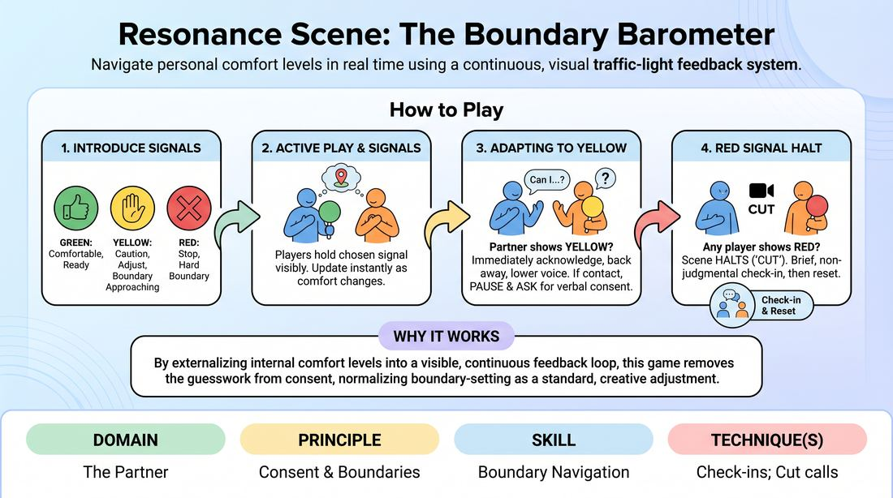

# The Boundary Barometer

{ .game-hero }

> Navigate personal comfort levels in real time using a continuous, visual traffic-light feedback system.

## Overview
The Boundary Barometer is an active scene-work exercise that uses a continuous, visible feedback system to help players communicate their comfort levels in real time. By utilizing simple color signals, players learn to dynamically calibrate physical proximity, touch, and emotional intensity. This creates a supportive environment where personal safety and authentic connection take precedence over narrative momentum.

## What It Trains
- **Domain:** D2 — The Partner
- **Principle(s):** Consent & Boundaries; Truth Over Pandering
- **Skill(s):** Boundary Navigation; Active Listening
- **Technique(s):** Check-ins; Cut calls; Negotiating physical contact
- **Focus:** connection

**Objective:** To develop real-time boundary navigation, active listening, and the ability to prioritize personal comfort ('Truth Over Pandering') through immediate, low-stakes check-ins and physical adjustments.

## At a Glance
| Aspect | Detail |
|---|---|
| Players | 4+ (ideal 4-6) |
| Time | ~15 min |
| Complexity | 2/5 |
| Skill level | advanced_beginner |
| Energy | medium |
| Physicality | medium |
| Modality | in_person |
| Space | moderate |
| Props | colored cards (Green, Yellow, Red) - optional |
| Audience | not required |

## Setup
Players stand in a semi-circle. Two players step into the center to perform a scene. Each player is given a set of three colored cards (Green, Yellow, Red) or agrees on three distinct hand gestures (e.g., open palm for Green, flat waving hand for Yellow, closed fist for Red) to represent their current comfort level.

## How to Play
1. Introduce the three calibration signals: Green means comfortable and ready to proceed; Yellow means caution, approaching a boundary, or needing an adjustment; Red means stop immediately.
2. Instruct the active players to hold their chosen signal visibly in front of their chest throughout the scene, updating it instantly as their internal comfort level shifts.
3. Begin a standard two-person scene based on a simple relationship or location prompt.
4. If a player shifts their signal to Yellow, the scene partner must immediately acknowledge the shift and adapt by backing away physically, lowering their vocal volume, or changing the topic.
5. If physical contact is initiated or proposed while a partner is displaying a Yellow signal, the initiator must pause and explicitly ask for verbal consent before proceeding.
6. If any player signals Red, the scene is immediately halted with a 'Cut' called by the players or the facilitator.
7. Upon a Red signal, conduct a brief, non-judgmental check-in where the signaling player states their boundary, and then reset the scene to a comfortable point or start a new scene entirely.

## Facilitation Notes
- Side-coach players to keep their eyes on their partner's physical signals, treating the barometer as an active subtext of the scene.
- Address the common pitfall of players staying on Green out of politeness; remind them that 'Truth Over Pandering' means honesty is the highest form of support.
- If a Red signal is triggered, ensure the check-in is brief, supportive, and focused on calibration rather than blame or explanation.
- Encourage proactive use of the Yellow signal to help players practice navigating boundaries before they are fully crossed.

## Variations
- In-Character Calibration: Players must address and negotiate the Yellow signal entirely within their characters' voices and relationships.
- Silent Sliders: Run the scene completely without dialogue, forcing players to rely solely on physical distance, body language, and the barometer cards to find comfortable boundaries.

## Debrief
- How did having a continuous, visible feedback tool change your awareness of your partner's comfort?
- What made it challenging to signal Yellow or Red, and how did you overcome the urge to prioritize the scene's momentum over your comfort?
- How did it feel when your partner immediately adjusted their play in response to your Yellow signal?
- How can we apply this heightened sensitivity to boundaries in regular scenes without physical cards?

## Safety & Inclusion
This exercise is highly safety-sensitive. Participation must be fully voluntary, and players have absolute autonomy over their boundaries. No player should ever be asked to justify or defend why they signaled Yellow or Red. For players with physical or mobility limitations, hand gestures can be replaced with verbal cues or colored cards placed on a nearby stand.

## Why It Works
By externalizing internal comfort levels into a visible, continuous feedback loop, this game removes the guesswork from consent. It normalizes the act of setting boundaries as a standard, creative adjustment rather than a scene-killing mistake, building deep trust and psychological safety between partners.
