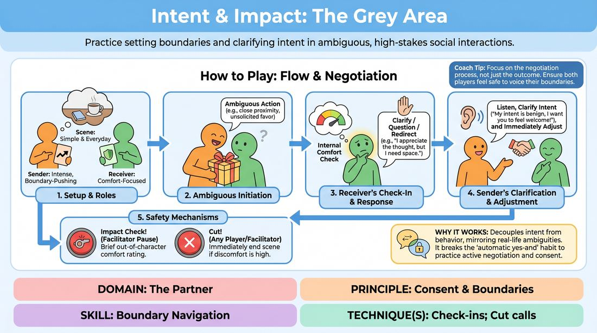

# Navigating the Grey

{ .game-hero }

> Practice setting boundaries and clarifying intent in ambiguous, high-stakes social interactions.

## Overview
A structured role-play exercise where players navigate scenes featuring characters with well-meaning but boundary-pushing behaviors. Players practice balancing collaborative scene-building with personal comfort, learning to voice discomfort and negotiate physical or emotional space in real time. The experience shifts focus from automatic agreement to authentic, consensual communication.

## What It Trains
- **Domain:** D2 — The Partner
- **Principle(s):** Consent & Boundaries; Truth Over Pandering
- **Skill(s):** Boundary Navigation; Active Listening; Offer Reception
- **Technique(s):** Check-ins; Cut calls; Negotiating physical contact
- **Focus:** skill_drill

**Objective:** To develop boundary navigation and active listening skills by practicing in-character check-ins, negotiating physical contact, and prioritizing truth over pandering when faced with ambiguous offers.

## Setup
Prepare a set of character cards detailing roles with intense personal styles or ambiguous but non-malicious intentions (e.g., an over-enthusiastic mentor, an overly helpful neighbor). Arrange the space for a standard two-player scene with the remaining players observing as active listeners.

## How to Play
1. Distribute character cards to two active players: one plays a character with an intense, boundary-pushing style (the Sender), and the other plays a character with standard boundaries (the Receiver).
2. Establish a simple, everyday scene premise, such as a workplace orientation or a casual coffee meeting.
3. The Sender initiates the scene by introducing an action or statement that is ambiguous and potentially boundary-pushing (e.g., standing very close, offering unsolicited personal advice).
4. The Receiver performs an internal check-in to assess their comfort level, then responds in-character by clarifying, questioning, or gently redirecting the behavior (e.g., 'I prefer a bit more personal space' or 'What do you mean by that?').
5. The Sender must actively listen to these cues, verbally clarify their character's benign intent (e.g., 'I just want to make sure you feel welcome!'), and immediately adjust their physical or verbal behavior to respect the stated boundary.
6. At any point of high tension, the facilitator can call 'Impact Check!' to temporarily pause the scene, allowing players to briefly rate their out-of-character comfort level (e.g., thumbs up/down) before resuming.
7. Any player or the facilitator can call 'Cut' at any moment to immediately end the scene if a boundary is crossed or if the negotiation becomes genuinely uncomfortable.

## Facilitation Notes
- Emphasize that the Sender's character must have benign intentions; they are not playing a villain, but rather someone with a mismatched social style.
- Actively coach the Receiver to avoid 'pandering' or automatically accepting uncomfortable physical contact just to keep the scene moving.
- Normalize the 'Cut' call as a successful application of safety and agency, celebrating it rather than treating it as a failure of the scene.
- Monitor for 'bleed'—where character discomfort spills over into actual player distress—and step in with an 'Impact Check!' if you sense real-world tension.

## Variations
- Non-Verbal Only: Restrict the boundary negotiation entirely to physical adjustments, eye contact, and body language to heighten physical awareness.
- Multi-Player Grey: Introduce a third player as a neutral bystander who can model checking in on behalf of others ('Is everything okay here?').

## Debrief
- For the Receiver: How did it feel to prioritize your character's comfort over immediate, polite agreement?
- For the Sender: How did you balance maintaining your character's intense personality while genuinely adjusting to your partner's boundaries?
- For both: How did the 'Impact Check!' or the potential for a 'Cut' call affect your sense of safety and freedom to explore the scene?
- How can we apply this balance of 'truth over pandering' to our regular, non-structured improv scenes?

## Safety & Inclusion
Before starting, conduct a brief 'Lines and Veils' or boundary check-in to establish what physical touch or topics are strictly off-limits for the session. Ensure players know they have absolute autonomy to call 'Cut' or step out of the exercise at any time without explanation.

## Why It Works
By decoupling malicious intent from boundary-pushing behavior, this game mirrors real-life social ambiguities. It breaks the improv habit of automatic compliance ('yes-and' without boundaries) and replaces it with active negotiation, proving that scenes can be dynamic, dramatic, and collaborative even when characters say 'no' or 'not so close'.
