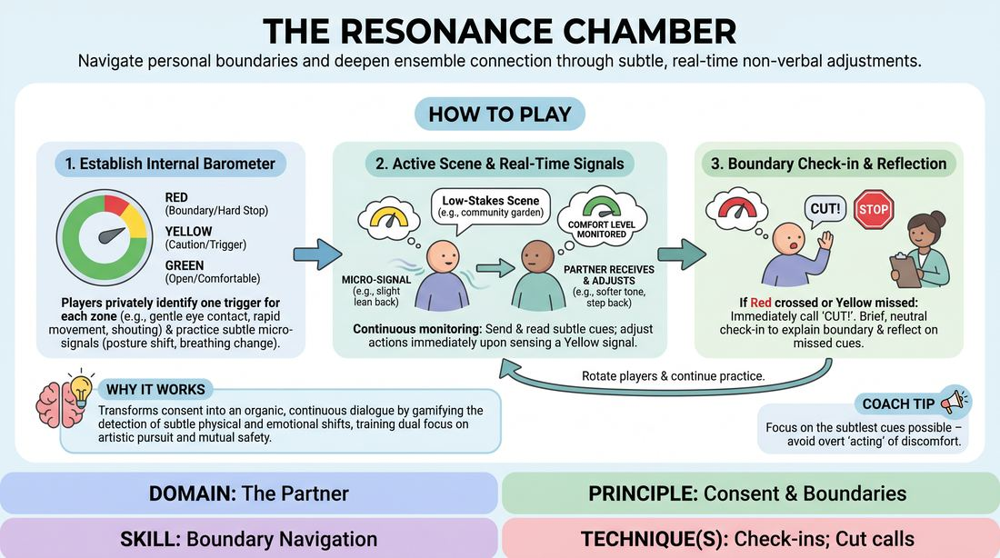

# The Attunement Chamber

{ .game-hero }

> Navigate personal boundaries and deepen ensemble connection through subtle, real-time non-verbal adjustments.

## Overview
This exercise invites players to explore and communicate their personal comfort levels dynamically within an active scene. By establishing internal thresholds of comfort, caution, and hard boundaries, participants learn to send and read micro-signals, adjusting their physical and emotional choices in real time. The result is a highly connected, supportive ensemble that prioritizes mutual safety and authentic interaction over performative comedy.

## What It Trains
- **Domain:** D2 — The Partner
- **Principle(s):** Consent & Boundaries; Yes, And; Truth Over Pandering
- **Skill(s):** Boundary Navigation; Active Listening; Physicality & Space Work; Peripheral Awareness
- **Technique(s):** Check-ins; Cut calls; Negotiating physical contact
- **Focus:** connection

**Objective:** To develop advanced boundary navigation and active listening skills, training players to use subtle non-verbal check-ins and real-time physical adjustments to honor personal comfort zones without disrupting the narrative flow.

## At a Glance
| Aspect | Detail |
|---|---|
| Players | 3–6 (ideal 3-6) |
| Time | ~40 min |
| Complexity | 3/5 |
| Skill level | competent |
| Energy | low |
| Physicality | low |
| Modality | in_person |
| Space | moderate |
| Props | none |
| Audience | not required |

## Setup
An open, quiet room with space for a performance area and a small semi-circle of chairs for observers. No props or materials are required. The facilitator should prepare a list of low-stakes, relationship-focused scene prompts.

## How to Play
1. Introduce the concept of the internal barometer, explaining that every player has three distinct comfort zones: Green (fully open and comfortable), Yellow (cautious, experiencing mild discomfort or hesitation), and Red (a hard boundary requiring an immediate stop).
2. Instruct players to sit quietly for a few minutes to privately identify one specific trigger for each zone (e.g., Green: gentle eye contact; Yellow: rapid physical encroachment; Red: sudden shouting or aggressive physical contact). These remain private.
3. Demonstrate how to express these states using subtle, non-verbal micro-signals rather than overt acting, such as slight shifts in posture, changes in breathing patterns, brief breaks in eye contact, or minor adjustments in physical proximity.
4. Select two or three players to enter the performance space to begin a scene based on a simple, low-stakes prompt (e.g., two neighbors organizing a community garden), while the remaining players sit as active observers.
5. As the scene progresses, players must continuously monitor their own internal comfort levels and subtly signal their state using the non-verbal cues established in step three.
6. If a player senses a partner's Yellow signal, they must immediately and subtly adjust their own choices—such as stepping back, softening their vocal tone, or shifting the topic—to restore a sense of comfort, all while remaining in character.
7. If a Red boundary is crossed, or if Yellow signals are repeatedly missed, the affected player must immediately call 'Cut!' to pause the scene.
8. Upon a 'Cut!' call, the facilitator pauses the action for a brief, neutral check-in where the player explains the boundary, the ensemble reflects on missed cues, and the scene is either reset with adjusted choices or retired.
9. Rotate players frequently between the active scene and the observer pool to ensure everyone practices both sending and receiving subtle boundary signals.

## Facilitation Notes
- Side-coaching cue: 'Look for the micro-shifts. Watch the shoulders, the breath, the distance.'
- Pitfall: Players over-acting their discomfort to make it obvious. Fix: Remind them that the power of this exercise lies in real, subtle human reactions, not theatrical pantomime.
- Pitfall: Ignoring a Yellow signal to keep a funny bit going. Fix: Pause the scene and remind the group that honoring a partner's boundary is always more important than the joke.
- Side-coaching cue: 'If you feel a shift in your partner, take a half-step back or soften your voice. See how that changes the room's energy.'
- Pitfall: Feeling shame or failure when a 'Cut' is called. Fix: Frame every 'Cut' as a successful application of safety protocols and a valuable learning moment for the entire ensemble.

## Variations
- Verbal Integration: Allow players to use subtle, in-character verbal check-ins (e.g., 'Are you alright with this?') alongside non-verbal signals to practice explicit boundary negotiation within the fiction.
- Blind Attunement: Run the scene with one player blindfolded (or eyes closed), forcing the other players to rely entirely on vocal tone, breath, and physical distance to communicate and respect boundaries.

## Debrief
- How did it feel to balance your character's objectives with a continuous, heightened awareness of your own physical and emotional comfort?
- What specific, subtle non-verbal signals did you notice your partners using, and how did you adjust your play in response?
- For the observers, what micro-expressions or physical shifts did you spot that the active players might have missed?
- How does prioritizing your partner's comfort over the scene's momentum change your understanding of the 'yes-and' philosophy?

## Safety & Inclusion
This exercise deals directly with personal boundaries and consent. Participation must be entirely voluntary, and players must feel empowered to call 'Cut!' at any moment without explanation or judgment. Ensure the pre-game reflection is quiet and self-paced, and emphasize that players do not need to share deeply personal traumas to participate effectively.

## Why It Works
By gamifying the detection of subtle physical and emotional shifts, this exercise transforms consent from an external, disruptive rule into an organic, continuous dialogue. It trains improvisers to maintain a dual focus: pursuing their artistic goals while remaining deeply attuned to their partner's somatic state. This builds a safer, more responsive ensemble capable of navigating high-stakes emotional territory with trust and precision.
