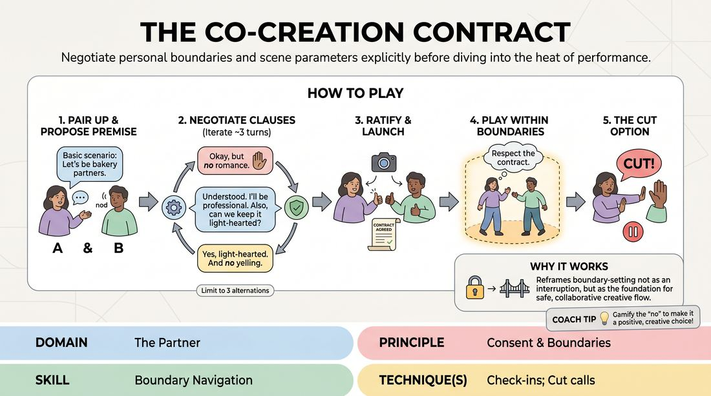

# The Scene Treaty

{ .game-hero }

> Negotiate personal boundaries and scene parameters explicitly before diving into the heat of performance.

## Overview
A structured, low-energy exercise designed for virtual spaces where pairs explicitly negotiate their personal comfort zones and scene parameters before launching into play. Instead of blindly agreeing to an initial offer, players take turns proposing clauses—specific boundaries or preferences—to build a customized safety contract. The resulting scene is played entirely within these mutually agreed-upon terms, proving that clear boundaries foster deeper creative freedom.

## What It Trains
- **Domain:** D2 — The Partner
- **Principle(s):** Consent & Boundaries; Yes, And; Truth Over Pandering
- **Skill(s):** Boundary Navigation; Active Listening; World-Building
- **Technique(s):** Check-ins; Cut calls; Negotiating physical contact; C.R.O.W. (Character, Relationship, Objective, Where)
- **Focus:** connection

**Objective:** To develop proactive boundary navigation and active listening by replacing immediate, unexamined agreement with explicit, verbal check-ins and authentic self-advocacy.

## At a Glance
| Aspect | Detail |
|---|---|
| Players | 2+ (ideal Pairs (2-16 players)) |
| Time | ~15 min |
| Complexity | 3/5 |
| Skill level | advanced_beginner |
| Energy | low |
| Physicality | low |
| Modality | virtual |
| Space | minimal |
| Props | none |
| Audience | not required |

## Setup
Conducted via a video conferencing platform. Players work in pairs. The facilitator ensures all participants have their cameras on and can easily unmute. No physical props or space are required, making it ideal for remote learning.

## How to Play
1. Pair Up and Assign Roles: Divide the group into pairs. In each pair, designate Player A as the Initiator and Player B as the Responder.
2. Propose the Premise: Player A initiates by proposing a basic, open-ended relationship or scenario, such as being business partners opening a bakery or siblings cleaning out a childhood home.
3. Introduce the First Clause: Instead of immediately starting the scene, Player B acknowledges the premise and introduces a personal boundary or preference (a clause) regarding how they want to play this scenario, such as requesting to avoid high-stress arguments.
4. Acknowledge and Counter-Propose: Player A verbally confirms they understand and accept Player B's clause, proposes how they will adapt to it, and simultaneously adds a clause of their own, such as requesting to keep physical comedy off-camera.
5. Iterate the Treaty: Player B acknowledges Player A's clause and adds one final parameter or refines an existing one. Limit this negotiation phase to three alternating rounds per player to keep the momentum active.
6. Ratify and Launch: Once both players verbally agree to the final set of clauses, they officially ratify their treaty with a mutual nod or thumbs-up to the camera, then immediately begin the scene.
7. Play Within the Boundaries: Players improvise the scene, strictly honoring the negotiated clauses. If a player wants to introduce a new element that borders on a boundary, they must perform a quick, in-character or out-of-character verbal check-in.
8. The Cut Option: At any point, if a boundary is crossed or a player feels uncomfortable, either player can call Cut to pause the scene, adjust, or end the play immediately without explanation.

## Facilitation Notes
- Spotting Pandering: Watch out for players who quickly say yes to a boundary without actually processing or adapting to it. If a player glosses over their partner's boundary, pause them and ask how their character actually adjusts to that rule.
- Encourage Authentic Truths: Remind players that clauses should reflect real preferences or comfort levels rather than just wacky, fictional character quirks.
- Virtual Sightlines: In a virtual environment, encourage players to use direct eye contact with their cameras and clear verbal cues, as physical presence is limited.
- Keep it Brief: Do not let the negotiation phase drag on. Keep a strict timer of 90 seconds for the treaty-building phase to prevent over-intellectualizing.

## Variations
- The Silent Signal: Introduce non-verbal hand gestures, like a hand to the chest, during the scene to signal a boundary check-in without breaking the vocal flow of the dialogue.
- The Blind Treaty: The responder introduces a boundary clause before the initiator reveals the scene premise, forcing the initiator to build a scenario entirely around a pre-established boundary.
- Multi-Player Treaty: Run the game with three players, where each player must negotiate their relationship with the other two, rotating clauses in a circle before the scene starts.

## Debrief
- How did it feel to pause and explicitly negotiate boundaries instead of immediately jumping into Yes-And mode?
- Did you feel any internal pressure to pander or agree to something uncomfortable just to keep the scene easy? How did you handle that?
- How did having a clear, pre-negotiated treaty affect your sense of safety and freedom once the scene actually started?
- What did this exercise reveal about how we communicate our personal boundaries in collaborative creative spaces?

## Safety & Inclusion
This game is highly safety-sensitive. It explicitly centers on player agency. Facilitators must emphasize that Cut is a structural tool of empowerment, not a failure. Players have absolute right-of-refusal on any premise or clause, and no player should ever be forced to explain why they have a specific boundary.

## Why It Works
By gamifying the negotiation of boundaries, this exercise removes the social stigma of saying no in improv. It reframes boundary-setting not as an interruption to the creative flow, but as the very foundation of collaborative world-building. When players know exactly where the safety lines are drawn, they can play with maximum commitment and trust within those boundaries.
