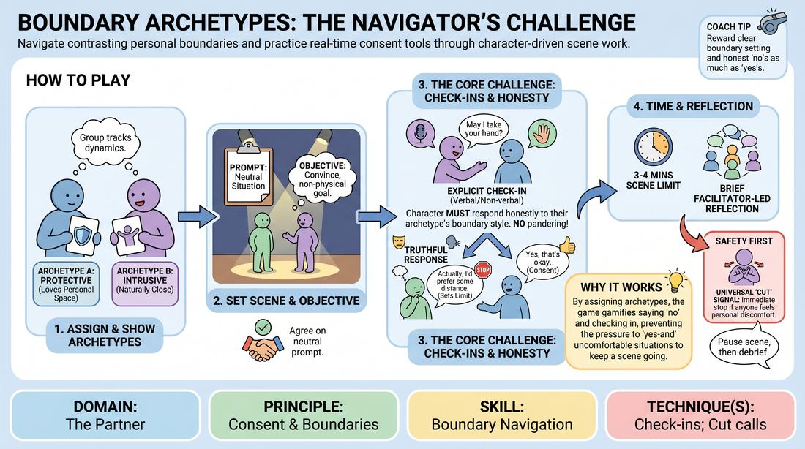

# Boundary Archetypes

{ .game-hero }

> Navigate contrasting personal boundaries and practice real-time consent tools through character-driven scene work.

## Overview
In this structured exercise, players adopt specific character archetypes that embody distinct boundary styles—ranging from highly protective of personal space to naturally intrusive. Operating within a neutral scene prompt, players must pursue a simple objective while actively using explicit consent tools like verbal check-ins and a universal safety signal. The experience highlights the friction between character desires and personal comfort, teaching players how to negotiate physical and emotional boundaries dynamically.

## What It Trains
- **Domain:** D2 — The Partner
- **Principle(s):** Consent & Boundaries; Truth Over Pandering
- **Skill(s):** Boundary Navigation; Active Listening
- **Technique(s):** Check-ins; Cut calls; Negotiating physical contact
- **Focus:** skill_drill

**Objective:** To develop competent boundary navigation and active listening skills by practicing proactive check-ins, establishing clear personal limits, and honoring safety signals while maintaining character integrity.

## Setup
Prepare a set of index cards featuring different boundary archetypes (such as 'The Space Invader,' 'The Private Sentinel,' 'The People-Pleaser,' 'The Direct Inquirer'). Prepare a list of neutral, everyday scene prompts (such as 'Waiting for a delayed train' or 'Sharing a small office desk'). Establish a clear, physical and verbal safety signal (such as raising both hands and saying 'Cut' or 'Time Out') that immediately halts all action. Arrange the space with a moderate playing area and seating for the off-stage players.

## How to Play
1. Distribute one Boundary Archetype card to each player openly so the group can track the active dynamics.
2. Select two players to step into the performance space and assign them a neutral scene prompt along with a simple, non-physical objective (such as 'convince your partner to swap seats' or 'get your partner to share a personal recipe').
3. Instruct the players to begin the scene, fully embodying their assigned archetype's boundary style (such as a character who hates being touched vs. a character who uses touch to connect).
4. Require players to perform an explicit verbal or non-verbal check-in before initiating any physical contact or asking highly personal questions (such as 'May I place my hand on your shoulder?' or 'Are you comfortable if I ask about your family?').
5. The receiving player must respond honestly according to their character's archetype, practicing saying 'no' or setting a clear limit if that aligns with their character's profile.
6. Emphasize the principle of 'Truth Over Pandering': characters must not simply yield to make the scene easy; they must authentically represent their archetype's boundaries while keeping the actual players safe.
7. Remind all participants that any player can call 'Cut' using the pre-established safety signal at any moment if they feel personal discomfort, which immediately ends the scene with no questions asked.
8. Limit each scene to 3 to 4 minutes to keep the energy focused, then transition to a brief facilitator-led reflection before rotating the next pair.

## Facilitation Notes
- Side-coach actively: If a player is about to make physical contact without checking in, freeze the scene gently and ask, 'How can we check in here first?'
- Pitfall: Players may confuse character discomfort with actual player discomfort. Fix: Explicitly define the 'Cut' signal as a player-level safety valve, not a character-level dramatic choice. If a player looks genuinely stressed, pause the scene immediately.
- Encourage 'Truth Over Pandering' by reminding players that a scene does not need a happy, agreeable ending to be successful; a clear, respectful 'no' is a highly satisfying dramatic resolution.
- Ensure the archetypes do not become caricatures that mock real-world neurodivergence or trauma; coach players to play the boundary style with sincerity and humanity rather than exaggeration.

## Variations
- Silent Negotiation: Run the scene entirely in gibberish or silence, forcing players to rely solely on physical proximity, eye contact, and non-verbal check-ins to establish boundaries.
- The Shift: Halfway through the scene, the facilitator calls out 'Shift!', and the two players must swap their boundary archetypes mid-interaction, adapting to the opposite boundary needs.

## Debrief
- How did it feel to uphold your character's boundary style when it conflicted with your partner's objective?
- What verbal or non-verbal cues did you use to check in, and how did the response affect the momentum of the scene?
- How did the principle of 'Truth Over Pandering' manifest? Did you find yourself wanting to give in just to keep the scene agreeable?
- How can we translate these explicit check-ins into our regular, unscripted scene work without breaking the theatrical flow?

## Safety & Inclusion
Because this game directly addresses physical and emotional boundaries, the facilitator must establish a high-trust environment. Participation must be fully voluntary. Clearly distinguish between the character's boundaries and the player's actual boundaries. The 'Cut' signal must be treated as absolute and sacred, followed by immediate support from the facilitator without demanding explanation or justification from the player who called it.

## Why It Works
By assigning explicit boundary archetypes, the game bypasses the polite 'yes-and' trap where players feel forced to accept physical contact or invasive questions to keep a scene going. It gamifies the act of saying 'no' and checking in, turning consent into an active, visible mechanic. This builds muscle memory for real-time boundary negotiation, proving that dramatic tension and comedic value can coexist with absolute safety and mutual respect.
