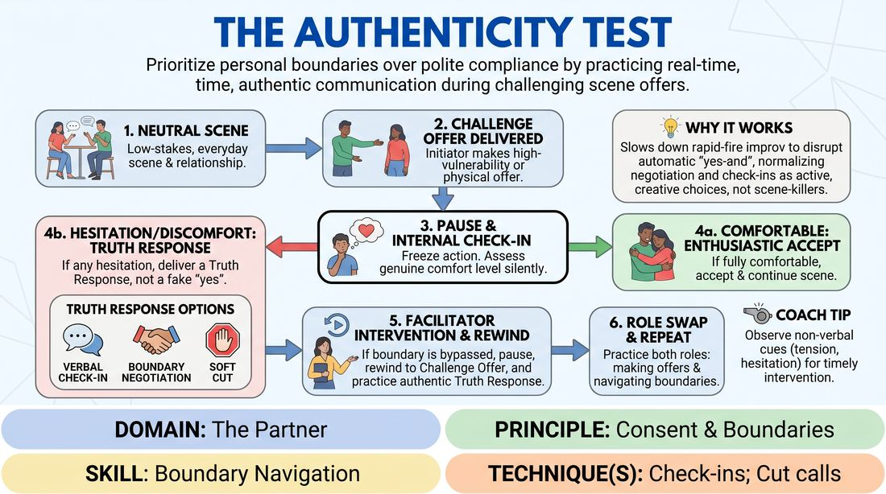

# The Truth Check-In

{ .game-hero }

> Prioritize personal boundaries over polite compliance by practicing real-time, authentic communication during challenging scene offers.

## Overview
A structured, low-energy skill drill where players practice pausing and evaluating their comfort levels when presented with high-vulnerability or physical offers. Instead of automatically accepting an offer that causes internal hesitation, players learn to negotiate, redirect, or pause the action. This exercise makes the internal process of boundary navigation visible, collaborative, and safe.

## What It Trains
- **Domain:** D2 — The Partner
- **Principle(s):** Consent & Boundaries; Vulnerability; Truth Over Pandering
- **Skill(s):** Boundary Navigation; Offer Reception; Active Listening
- **Technique(s):** Check-ins; Cut calls; Negotiating physical contact
- **Focus:** skill_drill

**Objective:** To develop the skill of boundary navigation and active self-assessment, training players to prioritize personal truth and consent over the pressure to pander or blindly yes-and uncomfortable offers.

## At a Glance
| Aspect | Detail |
|---|---|
| Players | 3–5 (ideal 3-5) |
| Time | ~15 min |
| Complexity | 3/5 |
| Skill level | competent |
| Energy | low |
| Physicality | low |
| Modality | in_person |
| Space | minimal |
| Props | none |
| Audience | not required |

## Setup
An open, quiet space. Three to five players stand in a circle or semi-circle. Two players step into the center to perform, while the remaining players and the facilitator act as supportive observers.

## How to Play
1. Two players begin a low-stakes, neutral scene based on a simple, everyday relationship and setting.
2. At any point, the initiating player delivers a Challenge Offer that invites physical proximity, touch, or deep emotional vulnerability.
3. Upon receiving the offer, the responding player must freeze the scene's action to perform a silent, internal check-in, assessing their genuine comfort level.
4. If the responding player feels entirely comfortable, they enthusiastically accept the offer and continue the scene.
5. If the responding player feels any hesitation, discomfort, or a desire to comply solely to keep the scene going, they must deliver a Truth Response instead of accepting.
6. The Truth Response can take three forms: a verbal check-in, a boundary negotiation, or a soft Cut.
7. If the facilitator notices the responding player hesitating, showing physical tension, or complying without genuine enthusiasm, they gently pause the scene to ask the player what they felt internally.
8. If a boundary was bypassed, the facilitator guides the player to rewind the scene to the Challenge Offer and practice delivering an authentic Truth Response.
9. After a successful boundary negotiation or a reset, players swap roles so everyone practices both making challenge offers and navigating boundaries.

## Facilitation Notes
- Frame interventions with extreme care: never shame a player for pandering. Treat it as a natural habit we are gently unlearning together.
- Ensure Challenge Offers are calibrated: they should invite vulnerability rather than being intentionally shocking, offensive, or triggering.
- Remind players that character discomfort is different from player discomfort. This drill protects the actor.
- Encourage active listening: when a player sets a boundary, their partner must receive it with warm, immediate acceptance, modeling a supportive partner.

## Variations
- The Proactive Query: Before making the physical or emotional offer, the initiator must ask an in-character or out-of-character question to check consent first.
- The Silent Signal: Players use a non-verbal physical gesture to signal an internal check-in without breaking the vocal flow of the scene.

## Debrief
- How did it feel to pause a scene to advocate for your personal comfort instead of prioritizing the narrative?
- For those observing, what subtle physical cues signaled that a player was entering the Pandering Trap?
- How did receiving a boundary negotiation actually help you support your partner and make the scene feel safer?
- What makes it difficult to say no or negotiate in a standard improv scene, and how can we overcome that pressure?

## Safety & Inclusion
This game is highly consent-sensitive. Establish a firm rule before playing that any player can call Cut at any time for any reason, with zero explanation required. Ensure players understand they have absolute autonomy over their physical bodies and emotional boundaries, and that setting a boundary is a gift of clarity to their partner.

## Why It Works
By slowing down the rapid-fire pace of improv, this drill disrupts the automatic yes-and reflex that often leads to boundary violations. It normalizes negotiation and check-ins as active, creative choices rather than scene-killers, proving that authentic scenes are built on mutual safety and trust rather than polite compliance.
