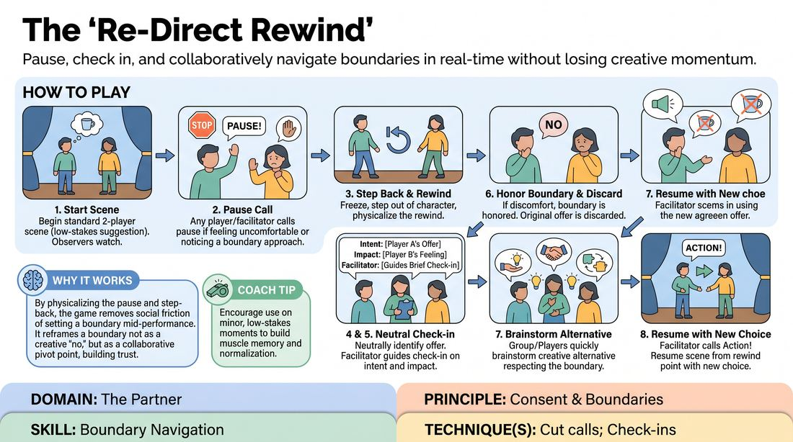

# The Rewind Re-Route

{ .game-hero }

> Pause, check in, and collaboratively navigate boundaries in real-time without losing creative momentum.

## Overview
This structured exercise provides a safe, low-stakes environment for players to practice real-time boundary setting and consent negotiation. During an active scene, any participant or the facilitator can call a pause to step out of character, check comfort levels, and collaboratively brainstorm a mutually agreeable alternative. The players then rewind physically and resume the scene with the newly negotiated choice, proving that respecting boundaries enhances rather than hinders creativity.

## What It Trains
- **Domain:** D2 — The Partner
- **Principle(s):** Consent & Boundaries; Truth Over Pandering
- **Skill(s):** Boundary Navigation; Active Listening; Offer Reception; Support Work
- **Technique(s):** Check-ins; Cut calls; Negotiating physical contact
- **Focus:** skill_drill

**Objective:** To build practical skills in boundary navigation, active listening, and real-time consent communication. Players learn to prioritize performer safety and comfort over narrative momentum, transforming potential moments of friction into collaborative, creative pivots.

## Setup
An open, comfortable performance space. No props or materials are required. Before beginning, the facilitator leads a brief, confidential circle where players can share any immediate physical or thematic boundaries (e.g., no touch to the face, no themes of family loss) to establish a baseline of safety.

## How to Play
1. Begin a standard two-player scene based on a simple, low-stakes suggestion, with the remaining players and the facilitator observing.
2. At any point during the scene, if a player feels uncomfortable, senses their partner is hesitant, or if the facilitator notices a boundary being approached (such as unprompted physical contact or escalating intensity), anyone can call out 'Rewind!'
3. Immediately upon hearing the call, both active players freeze in place, step out of character, and physically take one step backward to represent returning to the moment just before the triggering action.
4. The person who called the pause (or the facilitator) neutrally identifies the specific verbal or physical offer that prompted the rewind, keeping the observation objective and non-judgmental.
5. The facilitator guides a brief, out-of-character check-in, asking the initiating player for their creative intent and the receiving player how the offer landed or how they would prefer to proceed.
6. If the receiving player expresses any level of discomfort or hesitation, their boundary is immediately and unconditionally honored; the original offer is discarded without debate or defense.
7. The players, supported by the group, quickly brainstorm a creative alternative that achieves the scene's emotional or narrative goal while fully respecting the stated boundary.
8. Once a new path is agreed upon, the facilitator calls 'Action!' and the players resume the scene from the rewind point, seamlessly integrating the new choice.

## Facilitation Notes
- Model a completely neutral, non-punitive tone when calling or managing a rewind; frame it as a standard, positive tool for creative calibration rather than a mistake.
- Ensure check-ins remain strictly at the performer level ('As a player, I felt...') rather than the character level ('My character wouldn't like...') to maintain clear psychological safety.
- If players hesitate to call 'Rewind' themselves due to polite compliance, the facilitator should actively call the first few rewinds to normalize the mechanic and lower the barrier to entry.
- Watch for subtle physical cues of discomfort, such as tensing shoulders, stepping back, or forced laughter, and use these as gentle opportunities to initiate a rewind.

## Variations
- Silent Rewinds: Players use a specific non-verbal physical gesture (like a double-tap on their own shoulder) to signal a rewind without breaking the vocal flow of the scene.
- Thematic Focus: Run the exercise with a specific focus on practicing physical contact (e.g., handshakes, hugs, close proximity) to build high physical attunement.

## Debrief
- How did it feel to step out of character mid-scene to discuss a boundary? Did it disrupt your creativity, or did it open up new pathways?
- What did you notice about your own comfort levels when negotiating physical or emotional offers in real time?
- How does knowing you have an instant 'Rewind' button affect your willingness to make bold, collaborative choices?
- How can we carry this heightened awareness of our partner's comfort into scenes where we aren't explicitly using the rewind mechanic?

## Safety & Inclusion
This game is highly safety-sensitive. Participation must be entirely voluntary, and players must be reminded that they have absolute autonomy over their bodies and comfort. The facilitator must ensure no player is pressured to justify or explain why they have a boundary; a simple 'I'm not comfortable with that' is always sufficient and must be accepted without question.

## Why It Works
By physicalizing the pause and step-back, the game removes the social friction of setting a boundary mid-performance. It reframes a boundary not as a creative 'no,' but as a collaborative pivot point. This builds trust, as players experience firsthand that their safety is prioritized over the scene, which paradoxically frees them to be more vulnerable and playful.
