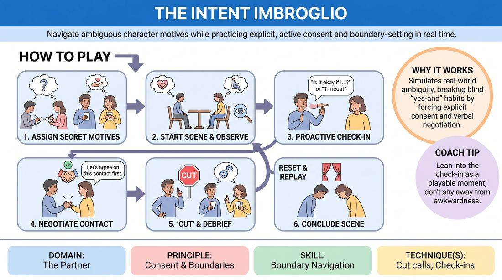

# Intentional Intersections

{ .game-hero }

> Navigate ambiguous character motives while practicing explicit, active consent and boundary-setting in real time.

## Overview
Two players navigate a scene with secret, conflicting personal agendas that naturally create social pressure or physical proximity. Off-stage players act as Intention Senders, assigning these hidden motives to challenge the performers' boundary-reading skills. The exercise creates a safe, structured environment to practice real-time check-ins, explicit physical negotiation, and the constructive use of 'Cut' calls.

## What It Trains
- **Domain:** D2 — The Partner
- **Principle(s):** Consent & Boundaries; Truth Over Pandering
- **Skill(s):** Boundary Navigation; Active Listening
- **Technique(s):** Check-ins; Cut calls; Negotiating physical contact
- **Focus:** skill_drill

**Objective:** To develop competent boundary navigation and active listening skills by training players to recognize subtle discomfort, initiate proactive check-ins, verbally negotiate physical contact, and confidently execute 'Cut' calls to prioritize personal safety over performance pressure.

## At a Glance
| Aspect | Detail |
|---|---|
| Players | 3–5 (ideal 3-5) |
| Time | ~15 min |
| Complexity | 3/5 |
| Skill level | competent |
| Energy | medium |
| Physicality | medium |
| Modality | in_person |
| Space | moderate |
| Props | index cards, pens |
| Audience | not required |

## Setup
Arrange a moderate playing space with two chairs. Prepare index cards and pens. Divide a group of 3 to 5 players into two active Performers and 1 to 3 Intention Senders (who will draft and assign the secret motives). Establish a neutral, everyday location (e.g., a waiting room or a park bench) before starting.

## How to Play
1. The Intention Senders secretly write a distinct, complex internal motive on an index card for each of the two Performers (e.g., 'You desperately want a comforting hug but will freeze if they hesitate' or 'You suspect they have a secret and will try to get physically close to find clues').
2. The Performers receive their secret cards without showing them to each other and enter the designated neutral scene location.
3. Performers begin the scene, actively playing toward their secret motives using dialogue and physical positioning, intentionally keeping their exact goals ambiguous to create realistic social friction.
4. Both players must actively listen and observe their partner's non-verbal cues (such as leaning away, hesitation, or changes in vocal tone) to gauge their comfort level.
5. If a player senses a shift in intensity or wants to initiate physical proximity, they must perform a proactive check-in, either in-character ('Is it okay if I sit closer?') or as a meta-moment ('Meta-check: are you comfortable if I step into your space?').
6. Any physical contact beyond accidental bumping must be explicitly negotiated and verbally agreed upon before it occurs; players are encouraged to practice 'Truth Over Pandering' by saying 'No' or offering an alternative if uncomfortable.
7. If either player feels confused, overwhelmed, or senses a boundary is being crossed, they must call 'Cut' to immediately freeze the scene.
8. Upon a 'Cut' call, the players step out of character, reveal their secret cards, and briefly discuss the friction point and how they could have navigated it differently.
9. After the brief debrief, the players either reset and replay the scene from a few moments before the 'Cut' using their new mutual understanding, or bring the scene to a clean close.

## Facilitation Notes
- Coaching Cue: Remind players that calling 'Cut' is a highly skilled, positive intervention and a successful application of the drill, not a failure of the scene.
- Pitfall: Players might try to 'yes-and' their way through physical discomfort to keep the scene going. Fix: Side-coach immediately with 'Truth over pandering—check in or call Cut if you feel a boundary pinch.'
- Ensure the secret intentions written by the Senders focus on everyday social awkwardness or relational desires rather than extreme, aggressive, or trauma-inducing scenarios.
- Encourage the use of meta-check-ins by modeling them yourself during the introduction, showing that stepping out of character briefly preserves safety without ruining the play.

## Variations
- Silent Signals: Play the scene entirely in gibberish or silently, forcing players to rely solely on physical boundary navigation and non-verbal check-ins.
- The Observer's Cut: Allow the Intention Senders to call 'Cut' if they observe a boundary pinch that the performers seem to be ignoring, helping train external observation of consent.

## Debrief
- How did knowing your partner's secret intention after the reveal change your interpretation of their physical choices?
- What specific non-verbal cues did you notice that signaled it was time to perform a check-in?
- If you called 'Cut' or negotiated a boundary, how did it feel to prioritize your personal comfort over the narrative flow?
- How can we apply this level of explicit physical negotiation to high-energy or fast-paced comedic scenes?

## Safety & Inclusion
This game is highly safety-sensitive. Establish a firm, pre-agreed boundary agreement before play. Ensure all players know they have absolute autonomy to say 'no' to any physical offer or to call 'Cut' at any time without explanation or social penalty. If a player is uncomfortable with physical proximity, adapt the cards to focus on emotional or verbal boundaries instead.

## Why It Works
By introducing ambiguous, high-pressure motives, the game simulates the real-world complexity of reading consent. Forcing players to use explicit verbal negotiation and 'Cut' calls breaks the habit of blind agreement ('yes-and' at all costs) and builds muscle memory for active boundary management, proving that safety actually enhances creative freedom.
