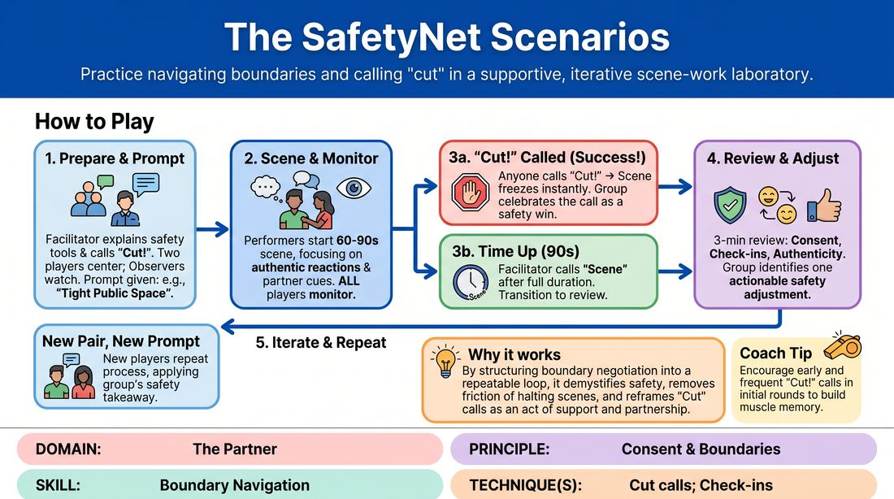

# Safety Net Scenarios

{ .game-hero }

> Practice navigating boundaries and calling "cut" in a supportive, iterative scene-work laboratory.

## Overview
This is an iterative training exercise where players perform short, prompt-driven scenes designed to test physical and emotional boundaries in a low-stakes environment. Any participant, whether performing or observing, can halt the action instantly by calling "Cut!" to address comfort levels. The group then uses a structured, non-punitive review process to evaluate consent, check-ins, and authentic character choices before trying again with actionable adjustments.

## What It Trains
- **Domain:** D2 — The Partner
- **Principle(s):** Consent & Boundaries; Truth Over Pandering; Group Mind
- **Skill(s):** Boundary Navigation; Active Listening; Support Work
- **Technique(s):** Cut calls; Check-ins; Negotiating physical contact
- **Focus:** skill_drill

**Objective:** To build practical competency in real-time boundary navigation, normalize the use of the "Cut" call as an active safety tool, and train players to prioritize personal and partner safety over comedic or narrative momentum.

## At a Glance
| Aspect | Detail |
|---|---|
| Players | 4+ (ideal 4-8) |
| Time | ~20 min |
| Complexity | 3/5 |
| Skill level | advanced_beginner |
| Energy | medium |
| Physicality | low |
| Modality | in_person |
| Space | minimal |
| Props | none |
| Audience | not required |

## Setup
Players stand in a semi-circle facing a designated performance space. No props or special materials are required. The facilitator prepares a list of low-stakes, everyday prompts that naturally involve close physical proximity, personal space negotiation, or mild emotional vulnerability.

## How to Play
1. The facilitator explains the core safety tools, emphasizing that anyone (performers, observers, or facilitator) can call "Cut!" at any moment to immediately freeze the scene if a boundary feels crossed or safety is compromised.
2. Two players step into the performance space while the remaining players act as active "Safety Observers."
3. The facilitator provides a prompt that sets up a scenario involving physical proximity or personal space negotiation, such as two strangers sharing a tiny public bench.
4. The performers begin a short scene lasting 60 to 90 seconds, focusing on authentic reactions and paying close attention to their partner's verbal and non-verbal cues.
5. If any player calls "Cut!", the scene freezes instantly; the group immediately transitions to a supportive debrief, celebrating the call as a successful application of the safety tool.
6. If the scene runs its full duration without a "Cut!", the facilitator calls "Scene" at the 90-second mark to transition to the review phase.
7. The facilitator guides a brief, 3-minute group review using three focus areas: Consent & Boundaries (how physical contact or space was negotiated), Check-ins (noticing verbal/non-verbal cues), and Truth Over Pandering (whether players stayed true to their comfort levels instead of pushing for a laugh).
8. The group collectively identifies one specific, actionable safety adjustment for the next pair of performers.
9. Two new players step up, receive a new prompt, and repeat the process, incorporating the previous group's takeaway.

## Facilitation Notes
- Normalize the Cut Call: Actively praise the first few players who call "Cut!" to remove any stigma of failure or disruption. Frame it as a gift of clarity to the ensemble.
- Watch for Pandering: Gently call out moments where a player overrides their own physical comfort or their character's logical boundaries just to keep a funny bit going. Remind them that truth is more compelling than compliance.
- Keep Debriefs Objective: Ensure the post-scene discussion remains analytical and non-punitive. Use phrasing like 'What did we observe?' rather than 'What did you do wrong?'
- Side-Coach Check-Ins: During the scene, if you notice physical proximity increasing without eye contact or a physical check-in, softly side-coach: 'Check in with your partner's body language.'

## Variations
- The Silent Negotiation: Run the scene entirely in gibberish or silence, forcing players to rely solely on physical cues, breath, and spatial distance to negotiate boundaries.
- The Re-Route: Instead of calling "Cut" to stop the scene entirely, a player can call "Re-Route" to instantly rewind the last five seconds and try a different, more comfortable physical choice.

## Debrief
- How did it feel to have the power to call "Cut" as an observer versus as an active performer?
- What subtle physical or verbal cues did you notice your partner using to signal comfort or discomfort?
- In what moments did you feel tempted to 'pander' or ignore a boundary for the sake of comedy, and how did you navigate that?
- How does knowing your partner can and will call "Cut" actually give you more freedom to play boldly?

## Safety & Inclusion
Before starting, establish that players have absolute autonomy over their physical bodies. Clearly state that any player can opt out of a prompt or step out of a scene at any time without explanation. Ensure that prompts are adaptable for players with mobility or sensory differences, focusing on spatial awareness and verbal boundaries rather than mandatory physical contact.

## Why It Works
By turning boundary negotiation into a structured, repeatable loop, this game demystifies safety and removes the social friction of halting a scene. Celebrating the "Cut" call reframes boundary setting from a "scene-killer" into an act of profound support and group mind. This builds the muscle memory needed to maintain personal integrity (Truth Over Pandering) while co-creating a highly collaborative, high-trust stage environment.
