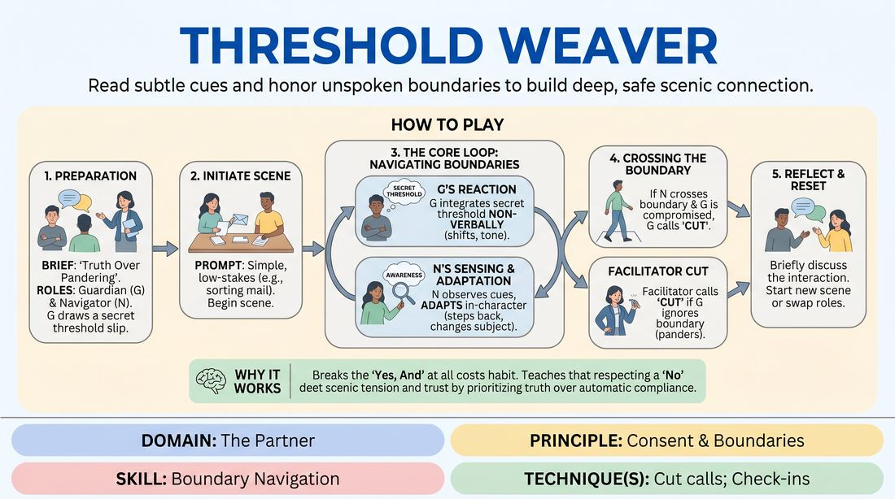

# The Silent Line

{ .game-hero }

> Read subtle cues and honor unspoken boundaries to build deep, safe scenic connection.

## Overview
This partner-based scene-work exercise challenges players to navigate hidden boundaries in real time. One player is given a secret, non-negotiable character boundary that they must defend truthfully, while their partner must actively observe non-verbal cues and adjust their choices without breaking the reality of the scene. The result is a highly focused, intimate experience that sharpens physical and emotional attunement.

## What It Trains
- **Domain:** D2 — The Partner
- **Principle(s):** Consent & Boundaries; Truth Over Pandering
- **Skill(s):** Boundary Navigation; Active Listening; Single-Partner Empathy & Mirroring
- **Technique(s):** Check-ins; Cut calls; Negotiating physical contact
- **Focus:** connection

**Objective:** To develop acute non-verbal observation, practice in-character boundary negotiation, and normalize the use of 'Cut' calls as an active, positive safety tool that prioritizes partner comfort over scenic momentum.

## At a Glance
| Aspect | Detail |
|---|---|
| Players | 3–6 (ideal 3-6) |
| Time | ~15 min |
| Complexity | 3/5 |
| Skill level | competent |
| Energy | medium |
| Physicality | medium |
| Modality | in_person |
| Space | moderate |
| Props | Secret threshold cards, Slips of paper |
| Audience | not required |

## Setup
Prepare several slips of paper with specific 'thresholds' (e.g., 'cannot make direct eye contact for more than three seconds,' 'must step back if someone enters arm's length,' 'cannot discuss the future,' 'becomes uncomfortable when receiving compliments'). Arrange the space for a standard two-person scene with the remaining players (1 to 4) acting as active observers.

## How to Play
1. Brief the players on the concept of 'Truth Over Pandering,' explaining that a player must honor their character's boundary authentically rather than ignoring it to make the scene run smoothly.
2. Designate one player as the Guardian and another as the Navigator. Have the Guardian secretly draw a threshold slip of paper, keeping its contents hidden from the Navigator.
3. Provide a simple, low-stakes relationship prompt to start the scene, such as 'two neighbors sorting mail' or 'coworkers organizing a shared desk.'
4. Begin the scene. The Guardian must integrate their secret threshold into their character's behavior, reacting honestly and non-verbally whenever the boundary is approached.
5. The Navigator plays the scene naturally but maintains high sensory awareness, looking for physical shifts, changes in vocal tone, or sudden topic changes that signal a boundary.
6. If the Navigator senses a boundary, they must adapt their behavior in-character (e.g., stepping back, changing the subject, or checking in using dialogue).
7. If the Navigator crosses the boundary and the Guardian feels their character's space or comfort is genuinely compromised, the Guardian must call 'Cut' to pause the scene immediately.
8. The facilitator can also call 'Cut' if they notice a boundary being crossed and the Guardian is 'pandering' (ignoring the boundary to keep the scene going).

## Facilitation Notes
- Emphasize that calling 'Cut' is a tool of success, not failure; it demonstrates that the players are actively protecting the safety of the space.
- Remind players that real-world personal comfort always overrides the game's fictional thresholds. If a player feels personally uncomfortable, they should call a real-world 'Cut' immediately.
- Encourage Navigators to use 'micro-pauses' before physical movements or sensitive questions to give the Guardian time to telegraph their comfort level.
- Watch out for 'guessing-game' syndrome, where the Navigator stops acting and just tries to guess the card. Keep them grounded in the scene's relationship.

## Variations
- Double Blind: Both players draw secret thresholds, requiring mutual navigation and heightened sensitivity from both sides simultaneously.
- The Physical Handshake: Start the scene with a mandatory physical contact prompt (like a handshake or high-five) that must be negotiated around a secret physical threshold.

## Debrief
- To the Guardian: How did it feel to hold that boundary without explicitly stating it? Did you feel tempted to pander to keep the scene moving?
- To the Navigator: What physical or verbal cues tipped you off that you were approaching a boundary?
- How did calling or hearing 'Cut' affect your sense of safety and freedom in the scene?
- How can we apply this level of attunement to our regular, unconstrained improv scenes?

## Safety & Inclusion
Explicitly state before playing that if any prompt or physical proximity triggers real-world discomfort, players have absolute permission to call a real-world 'Cut' or step out of the exercise without explanation. Ensure written thresholds do not mimic real-world trauma.

## Why It Works
By making the boundary absolute ('Truth Over Pandering'), this game breaks the habit of automatic compliance ('Yes, And' at all costs) and teaches players that respecting a 'No' or a boundary actually deepens scenic tension and trust.
