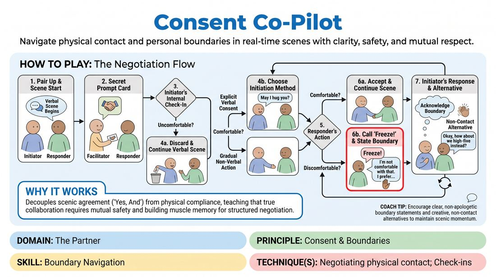

# The Consent Compass

{ .game-hero }

> Navigate physical contact and personal boundaries in real-time scenes with clarity, safety, and mutual respect.

## Overview
A structured partner exercise where players practice initiating, negotiating, and setting boundaries around physical touch within active scenes. By introducing secret physical prompts, the game creates realistic moments of decision-making, teaching players to prioritize personal comfort over scenic momentum.

## What It Trains
- **Domain:** D2 — The Partner
- **Principle(s):** Consent & Boundaries; Truth Over Pandering; Yes, And
- **Skill(s):** Boundary Navigation; Active Listening; Offer Reception
- **Technique(s):** Check-ins; Cut calls; Negotiating physical contact
- **Focus:** skill_drill

**Objective:** To develop practical skills in negotiating physical contact, recognizing internal boundaries, and communicating consent clearly without sacrificing active listening or collaborative play.

## Setup
An open playing space. The facilitator prepares a list of simple, relationship-focused scene starters (e.g., estranged siblings meeting, neighbors over a fence) and a set of physical contact prompt cards (e.g., 'offer a warm hug', 'place a hand on their shoulder', 'playfully nudge them'). Players work in pairs, with one pair performing at a time while others observe respectfully.

## How to Play
1. Divide the group into pairs and invite the first pair to the stage, designating one as the Initiator and the other as the Responder.
2. Provide the pair with a simple, low-stakes relationship scenario to begin their scene verbally.
3. After about thirty seconds of verbal interaction, the facilitator discreetly shows the Initiator a physical contact prompt card, keeping it hidden from the Responder.
4. The Initiator must immediately perform an internal check-in: if they feel personally uncomfortable with the prompt, they must discard it and continue the scene verbally without penalty.
5. If comfortable, the Initiator chooses how to execute the prompt: either by asking for explicit verbal consent in-character (e.g., 'May I hug you?') or by starting the physical action slowly and transparently.
6. The Responder must listen to their own comfort level. If they are comfortable with the touch, they accept it and continue the scene.
7. If the Responder feels any discomfort, they must immediately call 'Freeze!' to pause the action, then state their boundary clearly and without apology (e.g., 'I don't want to be hugged right now').
8. Upon hearing 'Freeze!', the Initiator must pause, acknowledge the boundary, and immediately propose a non-contact alternative that preserves the scene's emotional intent (e.g., 'Understood. Can I offer a high-five instead?').
9. If the Responder is comfortable with the alternative, the scene resumes; if they still feel uncomfortable, or if at any point a boundary cannot be negotiated, either player may call 'Cut!' to safely and immediately end the scene with applause from the group.

## Facilitation Notes
- Always celebrate 'Freeze!' and 'Cut!' calls with immediate, warm support to reinforce that setting boundaries is a successful, positive action.
- Ensure the physical contact prompts are graduated; start with low-intensity touch (handshakes, high-fives) before moving to higher-intensity touch (hugs, close proximity).
- Watch for non-verbal signs of hesitation or discomfort (e.g., tensing up, pulling back) and gently pause the scene to check in if a player seems to be 'pushing through' their discomfort.
- Remind players to 'de-role' after the scene by shaking out their limbs and stating their real names to clearly separate character actions from personal boundaries.

## Variations
- Non-Verbal Adjustments: Instead of calling 'Freeze!', the Responder uses physical mirroring or subtle spatial adjustments to signal their boundary, and the Initiator must read and adapt to these cues without verbalizing.
- Open Negotiation: Run the scene where both players have physical prompts, requiring a continuous, mutual dance of physical check-ins and boundary setting throughout the scene.

## Debrief
- For the Responders: How did it feel to articulate a boundary in real-time? Did you feel any pressure to 'yes-and' the physical offer for the sake of the scene?
- For the Initiators: What was your process for finding an alternative physical offer once a boundary was set? How did it affect your creative choices?
- For the group: How does prioritizing personal consent actually make us more creative and daring in our physical choices?

## Safety & Inclusion
This exercise is highly safety-sensitive. Participation must be entirely voluntary. Before starting, establish that players have absolute autonomy over their bodies; a 'Cut' or 'Freeze' is never a failure. Facilitators must ensure a supportive, non-judgmental atmosphere and should never pressure a player to explain why they set a boundary.

## Why It Works
By decoupling scenic agreement ('Yes, And') from physical compliance, this game teaches players that true collaboration requires mutual safety. The structured negotiation loop ('Freeze' -> State Boundary -> Offer Alternative) builds muscle memory for real-time consent, transforming boundary navigation from a scene-disrupting obstacle into an active, creative dialogue.
