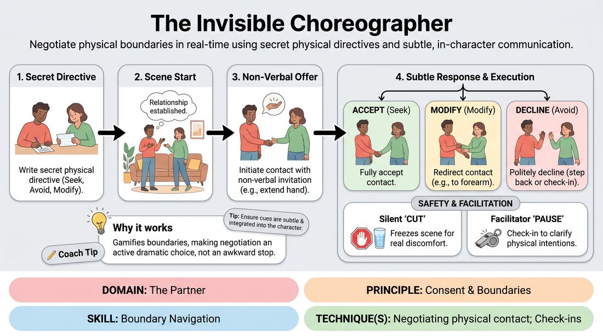

# The Invisible Choreographer

{ .game-hero }

> Negotiate physical boundaries in real-time using secret physical directives and subtle, in-character communication.

## Overview
A physical scene-work exercise where players navigate secret personal boundaries using subtle non-verbal cues and in-character check-ins. By treating physical contact as a collaborative, negotiated choreography, players learn to prioritize safety and consent without stalling the narrative momentum.

## What It Trains
- **Domain:** D2 — The Partner
- **Principle(s):** Consent & Boundaries; Truth Over Pandering
- **Skill(s):** Boundary Navigation; Active Listening; Offer Reception; Physicality & Space Work
- **Technique(s):** Negotiating physical contact; Check-ins; Cut calls
- **Focus:** connection

**Objective:** To develop advanced boundary navigation and physical contact negotiation skills, training players to read non-verbal cues, offer and receive physical touch with explicit consent, and practice 'Truth Over Pandering' by honoring personal comfort over scene agreement.

## At a Glance
| Aspect | Detail |
|---|---|
| Players | 4–12 (ideal 4-6) |
| Time | ~20 min |
| Complexity | 3/5 |
| Skill level | competent |
| Energy | medium |
| Physicality | medium |
| Modality | in_person |
| Space | moderate |
| Props | blank cards, pens |
| Audience | not required |

## Setup
Arrange chairs in a semi-circle facing a moderate performance space. Provide blank index cards and pens. Before starting, establish a universal, silent 'cut' signal (e.g., crossing hands over the chest) that any player can use to instantly freeze the action if they feel uncomfortable.

## How to Play
1. Distribute a blank index card and pen to each player, instructing them to write down a secret physical directive of their choice.
2. Directives must fall into one of three categories: Seek (e.g., seek a hand on my shoulder), Avoid (e.g., avoid any touch to my head), or Modify (e.g., allow side-hugs only).
3. Have two or three players step into the performance space to initiate a character-driven scene based on a simple relationship suggestion.
4. Instruct players to initiate physical contact only by first offering a non-verbal invitation, such as extending a hand or leaning in, rather than immediately touching.
5. The receiving player must read the invitation and respond using a subtle non-verbal cue (like a nod or step back) or an integrated, in-character verbal check-in (e.g., 'May I hold your hand?').
6. The receiver then executes their response based on their secret directive: they can fully accept the contact, modify it (e.g., redirecting a hand to the forearm), or politely decline in-character.
7. If a player's real-life comfort is crossed, or if they feel unsafe, they must use the pre-established silent 'cut' signal to immediately freeze the scene.
8. The facilitator may also call a soft 'pause' to check in on the physical dynamics, helping players clarify their physical intentions before resuming.

## Facilitation Notes
- Emphasize that real-life personal comfort always overrides the secret card directive; the card is a training tool, not a binding contract.
- Praise players who successfully modify or decline physical offers in-character, highlighting how these choices build realistic, high-stakes relationships.
- Watch for 'default agreement' where players ignore their secret directive or personal comfort just to keep the scene moving; pause and remind them of 'Truth Over Pandering'.
- Encourage low-stakes physical offers to start, such as a touch on the elbow or a high-five, rather than high-intensity physical contact.
- Ensure the silent 'cut' signal is practiced by everyone once before the scenes begin so that using it feels low-friction and normalized.

## Variations
- Open Directives: Play the scene with the physical directives written on cards placed on the floor, visible to the audience but not to the scene partners.
- The Verbal Compass: Require all physical contact offers to be accompanied by an explicit, in-character verbal question woven into the dialogue.

## Debrief
- How did it feel to propose physical contact with an active expectation of negotiation rather than assuming automatic agreement?
- For receivers, how did you navigate the tension between keeping the scene's momentum going and honoring your secret directive or personal comfort?
- In what ways did modifying or declining a physical offer actually deepen the relationship or narrative of the scene?
- How can we apply this practice of non-verbal reading and active check-ins to standard, unconstrained improv scenes?

## Safety & Inclusion
This game is highly safety-sensitive. The facilitator must explicitly state that any player can decline any physical contact at any time for any reason, regardless of their card's directive. Ensure the silent 'cut' signal is treated with absolute respect and immediately halts all action. For virtual or low-contact adaptations, players can use 'virtual touch' (miming contact across space) while maintaining the same negotiation mechanics.

## Why It Works
By gamifying physical boundaries through secret directives, the exercise removes the social stigma of saying 'no' in an improv scene. It reframes boundary negotiation from an awkward interruption into an active, dramatic choice. This builds physical literacy and trust, proving that consent work actually enhances character intimacy and scene realism rather than hindering it.
