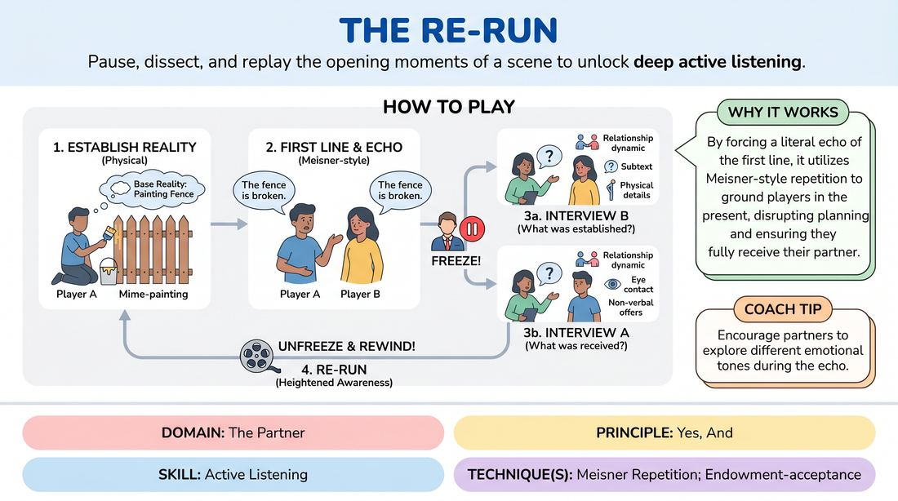

# The Echo Rewind

{ .game-hero }

> Pause, dissect, and replay the opening moments of a scene to unlock deep active listening.

## Overview
A slow-tempo, analytical exercise where two players begin a scene, only to be paused immediately after the first line of dialogue. By echoing the line and dissecting the non-verbal and verbal offers exchanged in those first few seconds, players learn to build a rich base reality. The scene is then re-run from the beginning, armed with a heightened awareness of their partner's offers.

## What It Trains
- **Domain:** D2 — The Partner
- **Principle(s):** Yes, And; Make Your Partner a Genius; Base Reality First
- **Skill(s):** Active Listening; Offer Reception; World-Building
- **Technique(s):** Meisner Repetition; Endowment-acceptance; C.R.O.W. (Character, Relationship, Objective, Where)
- **Focus:** skill_drill

**Objective:** To develop deep active listening, precise offer reception, and a strong base reality by forcing players to slow down, repeat their partner's first line, and analyze the unspoken physical and emotional context before continuing.

## Setup
Two active players stand in the performance space. The rest of the group acts as observers. No props or special staging are required.

## How to Play
1. Player A begins the scene by establishing a physical environment and activity (object work) to set a clear base reality.
2. Player B enters the scene or is already present, establishing a physical relationship and emotional attitude without speaking yet.
3. Player A delivers the very first line of dialogue, ensuring it is rooted in the physical reality they have established.
4. Immediately after Player A speaks, Player B repeats Player A's line word-for-word, matching or deliberately contrasting the emotional tone.
5. The facilitator calls 'Freeze!' to pause the action immediately after the repetition.
6. The facilitator interviews Player B, asking what physical details, relationship dynamics, and subtexts were established before and during that first line.
7. The facilitator interviews Player A, asking what non-verbal offers they received from Player B's physical presence and reaction.
8. The facilitator calls 'Unfreeze and Rewind!' and the players restart the scene from the very beginning, integrating their new, deep understanding of the initial offers to let the scene unfold naturally.

## Facilitation Notes
- Side-coaching cue: 'Listen to the music of the line, not just the words.' Encourage Player B to repeat the line with awareness of its pitch, speed, and emotional weight.
- Pitfall: Players rush into dialogue before establishing physical reality. Fix: Insist on at least 5-10 seconds of silent physical action and eye contact before the first line is spoken.
- Pitfall: The repetition feels like a mechanical joke. Fix: Coach Player B to use the repetition as a tool for deep absorption, letting the words land in their body before speaking them back.
- Side-coaching cue: 'What did you see before you heard?' Ask the players to identify micro-expressions or shifts in posture that occurred before the first word.

## Variations
- The Emotional Echo: Player B must repeat the line but amplify the emotional subtext they heard in Player A's voice.
- The Silent Rewind: Run the exercise entirely without dialogue, where Player B must physically mirror Player A's first major physical action before the pause and interview.
- The Multi-Step Echo: Extend the exercise to three lines of dialogue, pausing after each line to dissect the compounding offers before rewinding.

## Debrief
- What did you notice about your partner's offer during the replay that you completely missed during the first run?
- How does slowing down the first ten seconds of a scene change the depth of the relationship you build?
- How did repeating your partner's line affect your ability to 'yes-and' their reality rather than planning your own next line?

## Safety & Inclusion
Ensure players are comfortable with close physical observation. Remind players that analyzing non-verbal cues should focus on stage actions and choices, not personal attributes.

## Why It Works
By forcing a literal echo of the first line, this game disrupts the common habit of planning what to say next. It utilizes Meisner-style repetition to ground players in the present moment, ensuring they fully receive and digest their partner's verbal and physical offers before building the base reality.
