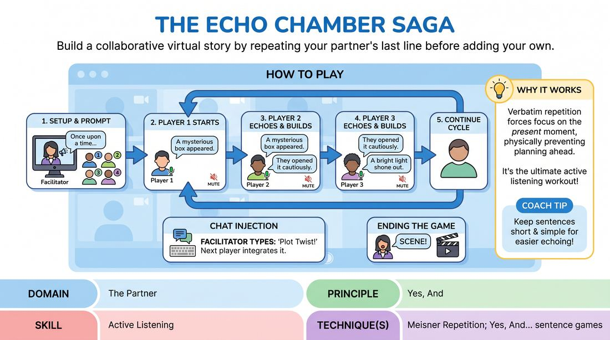

# The Echo Chain

{ .game-hero }

> Build a collaborative virtual story by repeating your partner's last line before adding your own.

## Overview
A structured virtual storytelling game designed to combat remote-call latency and sharpen active listening. Players take turns building a narrative one sentence at a time, but with a strict rule: they must repeat the previous player's sentence verbatim before contributing their own. This creates a highly focused, supportive environment where every voice is literally heard and validated.

## What It Trains
- **Domain:** D2 — The Partner
- **Principle(s):** Yes, And; Make Your Partner a Genius; Serve the Story; Group Mind
- **Skill(s):** Active Listening; Offer Reception; Narrative Architecture; Peripheral Awareness
- **Technique(s):** Meisner Repetition; Yes, And… sentence games; Thread-tracking drills
- **Focus:** mixed

**Objective:** To develop deep active listening and radical acceptance (Yes, And) using a virtual adaptation of Meisner repetition, ensuring players fully receive an offer before building upon it.

## At a Glance
| Aspect | Detail |
|---|---|
| Players | 6–12 (ideal 6-12) |
| Time | ~15 min |
| Complexity | 2/5 |
| Skill level | novice |
| Energy | medium |
| Physicality | none |
| Modality | virtual |
| Space | minimal |
| Props | none |
| Audience | not required |

## Setup
Conducted on a video conferencing platform. The facilitator renames all participants with a leading number (e.g., '1 - Alex', '2 - Taylor') to establish a clear, sequential speaking order. All players start in gallery view with their microphones muted and the chat window open.

## How to Play
1. The facilitator establishes the speaking order by renaming participants with sequential numbers and provides a simple, open-ended narrative prompt to start the story.
2. The facilitator spotlights Player 1, who unmutes, delivers a single, clear opening sentence to launch the story, and immediately mutes themselves.
3. The facilitator immediately spotlights Player 2. Player 2 unmutes and must first repeat Player 1's sentence verbatim (the 'Echo').
4. Directly after the echo, Player 2 adds exactly one new sentence of their own that advances the narrative (the 'Build'), then mutes themselves.
5. The facilitator spotlights Player 3, who must echo Player 2's new sentence verbatim, add their own new sentence, and mute.
6. This sequence continues down the numbered line, with each player echoing the previous player's contribution before adding their own.
7. Once the final numbered player completes their turn, the cycle loops back to Player 1, who echoes the final player's sentence and continues the story.
8. To inject energy, the facilitator can occasionally type a 'Plot Twist' or 'Genre Shift' into the chat, which the next spotlighted player must integrate into their new sentence.
9. The game continues for two to three full rounds, or until the facilitator calls 'Scene!' to bring the story to a satisfying or humorous climax.

## Facilitation Notes
- As the facilitator, practice rapid spotlighting. Your speed in switching the spotlight maintains the game's momentum and keeps energy high.
- If a player struggles to remember the exact sentence to echo, gently side-coach them or allow the group to softly help, keeping the atmosphere supportive rather than punitive.
- Watch out for players planning their next line instead of listening. Remind them that they cannot prepare because they don't know what sentence they will have to repeat.
- Encourage players to match the emotional delivery or physical posture of the line they are echoing to deepen the Meisner-style connection.

## Variations
- Emotion Echo: The echoing player must not only repeat the words verbatim but also mimic the exact emotional tone and vocal inflection of the previous speaker.
- Physical Echo: If cameras are on, players must replicate the physical gesture or facial expression of the previous speaker while delivering the echo.
- Blind Order: Remove the numbers from names. The facilitator spotlights players at random, forcing everyone to listen constantly since they never know when they will be called next.

## Debrief
- How did having to repeat the previous sentence change how closely you listened to your partner?
- Did you find yourself planning your line ahead of time? What happened when you let go of planning and just waited for the echo?
- How did the literal 'echo' feel as a form of 'Yes, And' validation?
- In what ways did the structured turn-taking and spotlighting reduce the usual friction of virtual communication?

## Safety & Inclusion
Since this game relies on verbal repetition and rapid turn-taking, ensure players with auditory processing differences or speech hesitancy are given grace. The facilitator can slow down the spotlight transitions, and the group should treat misremembered echoes as happy accidents rather than mistakes.

## Why It Works
By forcing a verbatim repetition, the game physically prevents players from planning ahead, which is the primary barrier to active listening. It adapts Meisner repetition to a narrative structure, ensuring that the 'Yes' (the echo/acceptance) is fully realized before the 'And' (the new sentence) is delivered. The technical structure of spotlighting and numbering eliminates the cognitive load of virtual turn-taking, allowing players to focus entirely on their partners.
