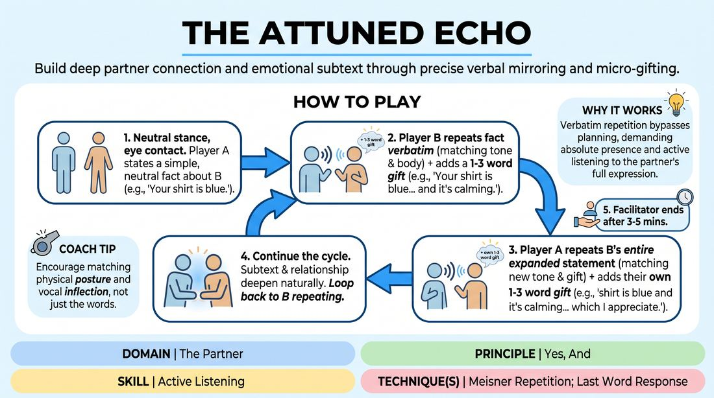

# Resonant Echo

{ .game-hero }

> Build deep partner connection and emotional subtext through precise verbal mirroring and micro-gifting.

## Overview
In this intimate, low-energy exercise, pairs stand face-to-face to co-create a scene using strict verbal repetition and tiny additions. Players alternate repeating their partner's entire previous statement verbatim—matching their exact vocal tone and physical posture—before adding a tiny, one-to-three-word emotional or status gift. The result is a highly focused, hypnotic dialogue where profound relationship dynamics emerge from simple, shared observations.

## What It Trains
- **Domain:** D2 — The Partner
- **Principle(s):** Yes, And; Make Your Partner a Genius; Assume Competence
- **Skill(s):** Active Listening; Status Modulation; Single-Partner Empathy & Mirroring; Offer Reception; Active Gifting
- **Technique(s):** Meisner Repetition; Last Word Response; Status Seesaw; Mirror exercise; Emotional-echo drills; Yes, And… sentence games; Endowment-acceptance; Endowment-gifting drills; Give them the answer
- **Focus:** connection

**Objective:** To develop advanced active listening, emotional attunement, and status modulation by combining repetition-based mirroring with precise, incremental gifting.

## Setup
Divide the group into pairs. Partners stand facing each other, about three to four feet apart, maintaining comfortable eye contact. No props or special staging are required; the space should be quiet enough for pairs to hear each other's vocal nuances.

## How to Play
1. Establish a neutral, grounded stance with your partner, maintaining steady but relaxed eye contact.
2. Player A begins the exchange by making a simple, objective, and emotionally neutral observation about Player B's physical appearance or immediate presence (e.g., 'You are wearing a green sweater').
3. Player B repeats Player A's entire statement verbatim, carefully mirroring Player A's vocal inflection, volume, pacing, and physical posture.
4. Immediately after repeating the statement, Player B appends a short phrase of one to three words that 'gifts' an emotional state, status level, or intellectual quality to Player A (e.g., '...and you feel powerful').
5. Player A must now repeat Player B's entire expanded statement verbatim, fully absorbing and mirroring the vocal and physical qualities of the gift Player B just delivered.
6. Immediately after their repetition, Player A adds their own one-to-three-word contribution that accepts, elevates, or modulates the established dynamic (e.g., '...and you feel powerful, yet isolated').
7. Continue this cycle of verbatim repetition and micro-gifting back and forth, allowing the scene's subtext and relationship to deepen organically without introducing entirely new topics or external plot points.
8. The facilitator calls 'freeze' or 'scene' after approximately three to five minutes of continuous, focused exchange.

## Facilitation Notes
- Side-coaching cue: 'Don't just repeat the words; repeat the feeling.' Remind players to mirror the exact sigh, pause, or micro-expression of their partner.
- Pitfall: Players trying to be funny or clever by adding dramatic plot twists. Fix: Coach them to keep additions grounded in the immediate relationship and emotional reality of the moment.
- Side-coaching cue: 'Let the physical follow the verbal.' Encourage players to let their posture and facial expressions naturally shift as they receive and repeat status-altering words.
- Pitfall: Breaking eye contact or laughing when the repetition feels intense. Fix: Instruct players to acknowledge the urge to break, take a breath, and gently return their focus to their partner's eyes.
- Side-coaching cue: 'Keep the additions tiny.' Strictly enforce the one-to-three-word limit to prevent players from retreating into narrative-building rather than emotional connection.

## Variations
- Physical Mirroring: Have partners physically mirror each other's movements throughout the entire exchange, matching gestures and shifts in weight alongside the verbal repetition.
- Tempo Shift: After a few minutes of slow, deliberate play, instruct the pairs to double the speed of their exchanges while maintaining the strict repetition and mirroring rules.

## Debrief
- How did it feel to have your exact words and vocal delivery mirrored back to you?
- What did you notice about your ability to listen when you knew you had to repeat your partner's entire statement verbatim?
- How did the physical and emotional dynamics of your relationship shift as the micro-gifts accumulated?
- In what ways did limiting your additions to three words force you to make more impactful, deliberate choices?

## Safety & Inclusion
Because this game requires sustained eye contact and close physical proximity, remind players that they can adjust the distance to what feels comfortable. If eye contact feels overstimulating or inaccessible, players may focus on their partner's forehead, nose, or general facial expression instead.

## Why It Works
By forcing players to repeat their partner's words verbatim, the game bypasses the analytical brain's urge to plan ahead, demanding absolute presence and active listening. The strict constraint of adding only one to three words ensures that every offer is a concentrated 'gift' of status or emotion, practicing the core 'Yes, And' principle at a microscopic level where partners must fully receive and embody an offer before building upon it.
