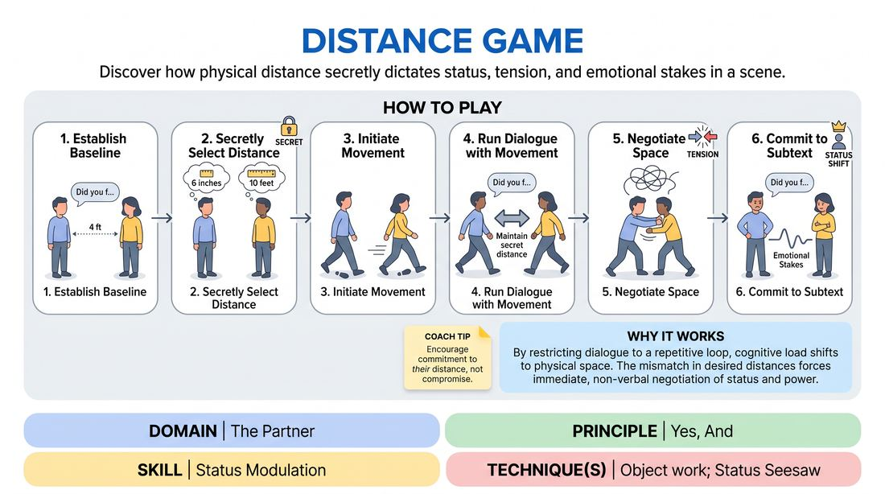

# Proximity Stakes

{ .game-hero }

> Discover how physical distance secretly dictates status, tension, and emotional stakes in a scene.

## Overview
Two players repeat a simple, mundane four-line dialogue while secretly trying to maintain a precise physical distance from one another. Because their chosen distances rarely match, a dynamic physical negotiation unfolds, naturally generating status shifts, subtext, and dramatic tension without changing a single word.

## What It Trains
- **Domain:** D2 — The Partner
- **Principle(s):** Commit 100%; Yes, And
- **Skill(s):** Physicality & Space Work; Status Modulation; Single-Partner Empathy & Mirroring; Stakes / The 'Want'
- **Technique(s):** Object work; Status Seesaw
- **Focus:** skill_drill

**Objective:** To develop status modulation, physical awareness, and partner empathy by using spatial proximity as a tool to drive emotional stakes and subtext.

## Setup
A clear, moderate-sized playing space where two players can move freely. No special materials are required, though a short stick or rope can be used for advanced variations.

## How to Play
1. Establish the Baseline: Have two players stand facing each other, about four feet apart, and perform a mundane, neutral four-line conversation (e.g., 'Did you find it?' 'Yes, it was over there.' 'Are you sure?' 'Positive.').
2. Secretly Select a Distance: Instruct both players to secretly select a highly specific target distance they wish to maintain from their partner (e.g., exactly 6 inches, exactly 8 feet, exactly 3 feet). They must keep this number to themselves.
3. Initiate the Movement: Instruct the players to begin moving to establish their desired distance before speaking.
4. Run the Dialogue with Movement: The players repeat the exact same four-line dialogue, but they must actively work to maintain their secret target distance throughout the exchange.
5. Negotiate the Space: As one player tries to get closer and the other tries to back away (or vice versa), they must physically adapt to their partner's movements while staying committed to their own secret distance.
6. Commit to the Subtext: Players must allow the physical struggle for distance to naturally dictate their vocal inflection, emotional intensity, and perceived status.

## Facilitation Notes
- Side-coaching cue: 'Commit to your exact measurement down to the inch. Do not compromise easily!'
- Side-coaching cue: 'Let the physical frustration of not getting your distance leak into how you say your lines.'
- Pitfall: Players might give up on their distance to make the scene polite. Fix: Remind them that the game relies on the physical conflict; they must stubbornly but safely pursue their target distance.
- Pitfall: Players might start adding new lines of dialogue. Fix: Keep them strictly to the original four lines so the focus remains entirely on physical status and subtext.

## Variations
- The Physical Tether: Connect the players physically using a short stick, a piece of rope, or even a matchstick held between their index fingers, forcing them to negotiate distance with a tangible boundary.
- Fluid Scene Progression: Transition from the repetitive four-line drill into a fully improvised scene where their distance desires change dynamically based on the emotional beats of the story.

## Debrief
- How did trying to maintain your secret distance change the meaning of the mundane lines?
- When your partner wanted a different distance than you, how did that affect your character's status and power?
- How can we use physical proximity on stage to signal shifts in relationships without relying on dialogue?

## Safety & Inclusion
Ensure players are mindful of physical boundaries and consent. Before starting, establish that players should not physically collide or force their partner into walls or obstacles. If a player feels uncomfortable with extreme closeness, they can choose a larger minimum distance or call pause to reset.

## Why It Works
By restricting dialogue to a repetitive loop, the players' cognitive load shifts entirely to physical space. The mismatch in desired distances forces an immediate, non-verbal negotiation of status and power, proving that physical proximity is a powerful tool for generating stakes and subtext.
