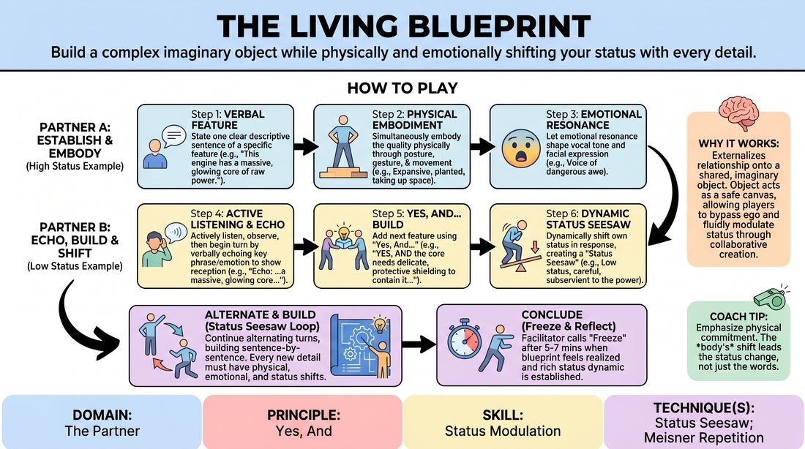

# The Living Blueprint

{ .game-hero }

> Build a complex imaginary object while physically and emotionally shifting your status with every detail.

## Overview
A two-player collaborative world-building exercise where partners construct a complex, imaginary object or environment. By layering verbal description, physical embodiment, and emotional resonance, players dynamically shift their personal status in response to the evolving creation. This externalizes their interpersonal connection onto a shared project, making status play fluid and collaborative.

## What It Trains
- **Domain:** D2 — The Partner
- **Principle(s):** Yes, And; Make Your Partner a Genius; Assume Competence
- **Skill(s):** Active Listening; Status Modulation; Single-Partner Empathy & Mirroring; Offer Reception; Active Gifting; Emotional Fluidity; Physicality & Space Work
- **Technique(s):** Meisner Repetition; Last Word Response; Status Seesaw; Mirror exercise; Emotional-echo drills; Yes, And… sentence games; Endowment-acceptance; Endowment-gifting drills; Give them the answer
- **Focus:** connection

**Objective:** To develop advanced status modulation (the status seesaw) and deep interpersonal attunement by using an external imaginary object as a catalyst for physical, emotional, and relational shifts.

## Setup
Players stand in pairs facing each other with comfortable space to move. No physical props are required. The facilitator prepares a list of complex, abstract, or fantastical prompts (e.g., 'a sentient clockwork engine', 'an ancient subterranean library', 'a futuristic weather-control console').

## How to Play
1. Divide the group into pairs facing each other. The facilitator provides a broad, imaginative prompt for a complex object or space to construct.
2. Player A begins by stating one clear, descriptive sentence that establishes a specific feature of the object (e.g., 'This engine has a massive, glowing core of pressurized liquid light').
3. Simultaneously, Player A must physically embody the quality of that feature through their posture, gesture, or movement (e.g., expanding their chest and planting their feet to represent 'massive' and 'pressurized').
4. Player A must also let the emotional resonance of their description shape their vocal tone and facial expression (e.g., speaking with a sense of dangerous awe).
5. Player B must actively listen, observe, and then begin their turn by verbally echoing the last key phrase or emotional quality of Player A's contribution to demonstrate deep reception.
6. Player B then adds the next feature using 'Yes, And', while dynamically shifting their own status to create a 'Status Seesaw' (e.g., if Player A was high-status and powerful, Player B might adopt a lower, delicate status to describe 'tiny, intricate copper veins feeding off the core').
7. Players continue alternating turns, building the blueprint sentence-by-sentence, ensuring every new detail is accompanied by physical embodiment, emotional resonance, and a conscious shift in status relative to their partner and the object.
8. The facilitator calls 'Freeze' or 'Scene' after 5 to 7 minutes, once the blueprint feels fully realized and both players have established a rich, shifting status dynamic.

## Facilitation Notes
- Side-coaching cue: 'Don't just mime the object—become its qualities. If it is heavy, let your entire physical presence feel weighted.'
- Pitfall: Players get stuck in a static status dynamic (e.g., one always high, one always low). Fix: Side-coach them to let the object's features dictate the shift. 'If your partner just built a majestic tower, how does your humble basement entrance shift the power dynamic?'
- Side-coaching cue: 'Echo the feeling, not just the words. Let your partner's emotional tone land on you before you respond.'
- Pitfall: Over-intellectualizing the build and losing the physical/emotional connection. Fix: Remind players to lead with their bodies first, letting the physical posture inspire the verbal description.

## Variations
- Silent Blueprint: The entire construction is done non-verbally through physical embodiment, mirroring, and status shifts, relying purely on physicalized offers.
- Three-Way Blueprint: Run the exercise in trios, where the status seesaw becomes a three-way dynamic, requiring even higher levels of active listening and status modulation.
- The Malfunction: Halfway through the build, the facilitator announces a crisis or malfunction in the object. Players must immediately adapt their emotional resonance and status to reflect the high-stakes change.

## Debrief
- How did focusing on building an external object change how you negotiated status with your partner compared to a direct character conflict?
- What physical or vocal cues made it easiest for you to recognize and respond to your partner's status shifts?
- How did echoing your partner's last words affect your ability to truly 'Yes, And' their contribution instead of planning your next move?

## Safety & Inclusion
Ensure players are mindful of physical boundaries and personal mobility. Physical embodiment should be adapted to each player's comfortable range of motion; physical contact is not required to build the shared space.

## Why It Works
By externalizing the relationship onto a shared, imaginary object, players bypass the ego-driven anxiety of direct confrontation. The object acts as a safe canvas where status can be modulated fluidly. The requirement to simultaneously speak, move, and feel forces a holistic, embodied state of play, making the 'Status Seesaw' an intuitive physical reaction rather than an intellectual choice.
