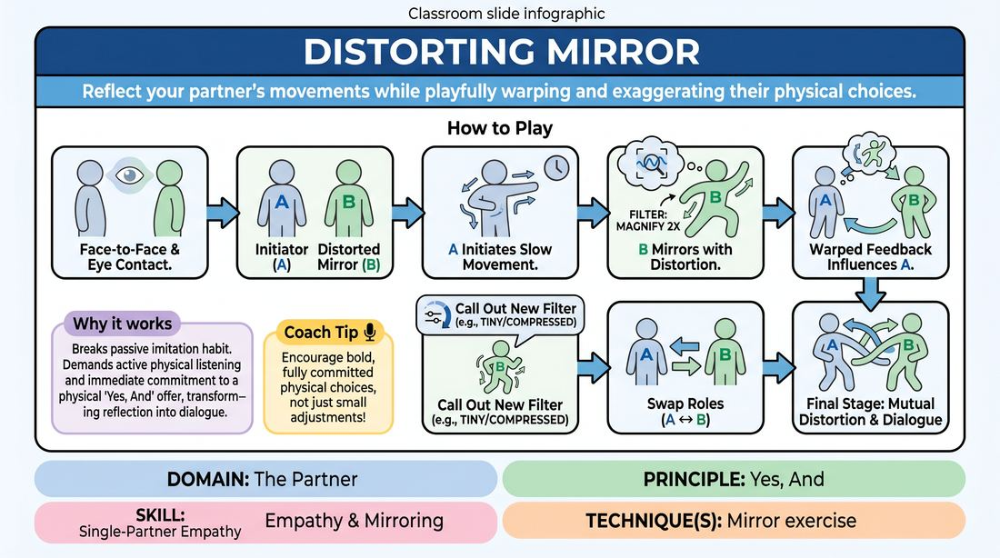

# The Distorted Mirror

{ .game-hero }

> Reflect your partner's movements while playfully warping and exaggerating their physical choices.

## Overview
In this physical partner exercise, players stand face-to-face to explore movement and connection. One player initiates slow physical actions, while the other acts as a mirror that applies a specific distortion filter, such as magnifying, shrinking, or slowing down the movement. This creates a dynamic physical feedback loop where both players must closely tune in to each other's physical offers.

## What It Trains
- **Domain:** D2 — The Partner
- **Principle(s):** Yes, And; Make Your Partner a Genius
- **Skill(s):** Single-Partner Empathy & Mirroring; Physicality & Space Work; Active Listening
- **Technique(s):** Mirror exercise
- **Focus:** connection

**Objective:** Develops physical empathy, active listening, and physical commitment by practicing physical 'Yes, And' through exaggeration and adaptation.

## Setup
Pairs stand facing each other with about three to four feet of space between them. Ensure the room has enough space for all pairs to move their arms and bodies freely without colliding.

## How to Play
1. Divide the group into pairs and have them stand face-to-face, establishing soft eye contact.
2. Designate Player A as the Initiator and Player B as the Distorted Mirror.
3. Instruct Player A to begin moving slowly and deliberately, using their head, torso, arms, and hands.
4. Instruct Player B to mirror Player A's movements, but with a specific distortion filter announced by the facilitator, such as making every movement twice as large.
5. Encourage Player A to watch their distorted reflection and let that warped feedback influence their next physical choices.
6. After a minute, call out a new distortion filter, such as making all movements tiny and compressed, or incredibly heavy and sluggish.
7. Swap roles so Player B becomes the Initiator and Player A becomes the Distorted Mirror.
8. For the final minute, remove the designated roles and allow both players to initiate and distort simultaneously, creating a mutual physical dialogue.

## Facilitation Notes
- Coaching cue: Keep your eye contact soft. Don't just watch your partner's hands; feel their entire body's movement.
- Coaching cue: Initiators, move slowly enough that your partner can actually follow and distort you. This is a duet, not a competition.
- Pitfall: Players move too fast, causing the mirror to lose track. Fix: Remind them to move as if they are moving through thick honey.
- Pitfall: The distortion becomes a caricature that mocks the partner. Fix: Frame the distortion as a physical lens or filter, emphasizing that we are elevating and celebrating our partner's choices.

## Variations
- Emotional Distortion: Instead of physical size or speed, the mirror distorts the emotional subtext, turning a slight smile into ecstatic joy or a slight frown into deep despair.
- The Echo Chamber: Play in groups of three, where Player A initiates, Player B mirrors with a slight distortion, and Player C mirrors Player B with an even greater distortion.
- Status Shift: The mirror distorts the movement to make it look significantly higher or lower status than the original movement.

## Debrief
- How did it feel to see your movements reflected back to you in an exaggerated or altered way?
- How did you have to adjust your listening when you couldn't rely on a simple, literal copy?
- In what ways did this exercise require you to 'Yes, And' your partner physically?

## Safety & Inclusion
Ensure players are mindful of physical boundaries and mobility levels. Distortions should be adapted to accommodate any physical limitations or injuries. Encourage players to communicate any physical boundaries before starting.

## Why It Works
By forcing the mirror to distort rather than copy, the exercise breaks the passive habit of rote imitation. It demands active physical listening and immediate commitment to a physical 'Yes, And' offer, transforming a simple reflection into a collaborative physical dialogue where both players build on each other's energy.
