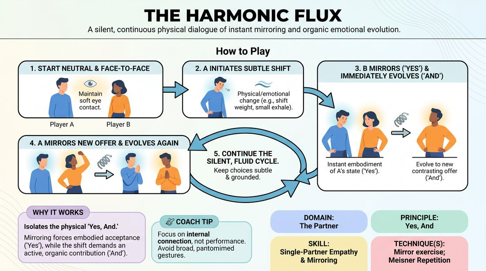

# The Attunement Loop

{ .game-hero }

> A silent, continuous physical dialogue of instant mirroring and organic emotional evolution.

## Overview
Two players stand face-to-face, engaging in a silent, continuous exchange of physical and emotional states. Instead of static copying, players instantly mirror their partner's physical offer and immediately evolve it into a new, contrasting state. The result is a fluid, hypnotic feedback loop that builds deep interpersonal connection and rapid physical responsiveness.

## What It Trains
- **Domain:** D2 — The Partner
- **Principle(s):** Yes, And; Make Your Partner a Genius; Assume Competence; Vulnerability
- **Skill(s):** Active Listening; Status Modulation; Single-Partner Empathy & Mirroring; Offer Reception; Active Gifting; Emotional Fluidity; Physicality & Space Work
- **Technique(s):** Mirror exercise; Meisner Repetition; Status Seesaw; Emotional-echo drills; Endowment-acceptance; Endowment-gifting drills
- **Focus:** connection

**Objective:** To develop advanced non-verbal attunement, physical empathy, and rapid status modulation by applying the 'Yes, And' principle directly to physical and emotional states without words.

## At a Glance
| Aspect | Detail |
|---|---|
| Players | 2+ (ideal 2 (or pairs in a larger group)) |
| Time | ~5 min |
| Complexity | 3/5 |
| Skill level | competent |
| Energy | medium |
| Physicality | medium |
| Modality | in_person |
| Space | minimal |
| Props | none |
| Audience | not required |

## Setup
Players pair up and stand facing each other at a comfortable distance (about arm's length) in a clear space. No props are required. The room should be relatively quiet to support deep focus.

## How to Play
1. Begin in a neutral stance, standing face-to-face with your partner, maintaining soft, supportive eye contact.
2. Player A initiates a subtle, non-verbal shift in either their physical status (such as shifting weight or changing posture) or their emotional state (such as a micro-expression of worry or curiosity).
3. Player B immediately receives and mirrors Player A's shift, physically embodying the exact same posture, tension, and emotional quality to represent the 'Yes'.
4. Without pausing, Player B immediately transitions that mirrored state into a new, contrasting physical or emotional offer to represent the 'And'.
5. Ensure the new offer is a logical, organic evolution of the mirrored state rather than a jarring, disconnected jump.
6. Player A now immediately mirrors Player B's new offer, fully absorbing it, and then instantly transitions into another contrasting physical or emotional state.
7. Continue this continuous, silent cycle of mirroring and shifting, maintaining a fluid, unbroken rhythm between both partners.
8. Keep the physical choices subtle and grounded in internal truth, avoiding broad, theatrical, or pantomimed gestures.

## Facilitation Notes
- Side-coaching cue: 'Absorb before you alter.' Ensure players are fully embodying their partner's state before they attempt to transition to their own new offer.
- Pitfall: Players make massive, cartoonish physical jumps (e.g., jumping from crying to manic laughter). Fix: Coach them to find the 'micro-shift'—a slight tilt of the head, a change in breathing, or a subtle shift in weight.
- Side-coaching cue: 'Keep the loop unbroken.' Encourage a steady, rhythmic pulse where the mirror and the shift blend into a single, continuous movement.
- Pitfall: Hesitation or intellectualizing the next move. Fix: Remind players to trust their first physical impulse rather than planning their next emotional state.
- Side-coaching cue: 'Let the eyes lead.' Remind players to maintain soft eye contact to read micro-expressions and stay deeply connected.

## Variations
- The Status Seesaw: Restrict the shifts specifically to high and low status, forcing players to constantly negotiate dominance and submission non-verbally.
- Sound Only: Instead of physical movement, players use abstract, non-verbal vocalizations (sighs, hums, clicks) to mirror and shift emotional tones.
- Group Wave: Stand in a circle. One player initiates a shift, their neighbor mirrors and shifts, passing the physical evolution around the circle like a wave.

## Debrief
- How did it feel to physically embody an emotion or status before choosing your own reaction to it?
- What did you notice about the transition point between mirroring your partner and introducing your own shift?
- How did keeping this exercise entirely silent change how closely you had to pay attention to your partner?
- When did the loop feel most connected, and what allowed that to happen?

## Safety & Inclusion
Since this exercise requires sustained eye contact and close physical proximity, remind players that they can adjust the distance to their comfort level. Encourage a 'soft focus' rather than an intense stare to keep the connection supportive and low-pressure. If eye contact is uncomfortable, players may focus on their partner's collarbone or shoulders.

## Why It Works
By stripping away verbal dialogue, this game isolates the physical and emotional core of 'Yes, And.' Mirroring forces an immediate, embodied acceptance of the partner's reality (the 'Yes'), while the subsequent shift demands an active, supportive contribution (the 'And'). This builds a deep, somatic empathy, training players to read and respond to subtextual offers in active scene work.
