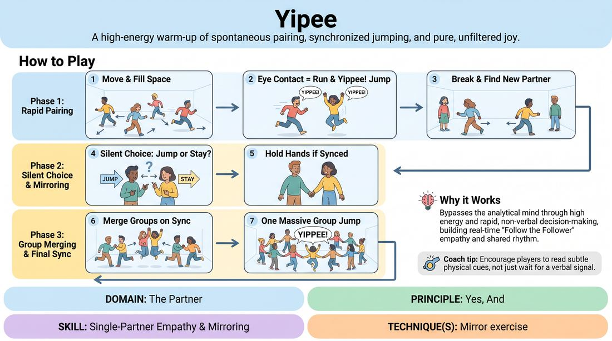

# Yippee Connection

{ .game-hero }

> A high-energy warm-up of spontaneous pairing, synchronized jumping, and pure, unfiltered joy.

## Overview
Players move dynamically through a shared space, forming rapid, fleeting partnerships to execute a synchronized jump and vocalization. As the game progresses, players must read subtle physical cues to decide whether to jump or stay grounded, eventually merging the entire room into a single, unified group.

## What It Trains
- **Domain:** D2 — The Partner
- **Principle(s):** Fail Joyfully; Yes, And; Group Mind; Follow the Follower
- **Skill(s):** Unfiltered Spontaneity; Single-Partner Empathy & Mirroring; Peripheral Awareness; Pacing & Rhythm
- **Technique(s):** Mirror exercise
- **Focus:** connection

**Objective:** To develop deep non-verbal connection, rapid partner mirroring, and group mind through shared physical rhythm and spontaneous agreement.

## At a Glance
| Aspect | Detail |
|---|---|
| Players | 4+ (ideal 10-30) |
| Time | ~5 min |
| Complexity | 1/5 |
| Skill level | novice |
| Energy | high |
| Physicality | high |
| Modality | in_person |
| Space | large_open |
| Props | none |
| Audience | not required |

## Setup
A large, open room free of obstacles. Players stand scattered throughout the space, ready to move. No props are required.

## How to Play
1. Instruct all players to move dynamically around the room at a brisk pace, filling the empty spaces.
2. When two players make eye contact, they must immediately run toward each other, stop face-to-face, look each other in the eye, and simultaneously shout 'Yippee!' while jumping high into the air.
3. Immediately after the jump, both players must turn away, resume moving through the space, and seek out a new partner to repeat the interaction.
4. Introduce the second phase: When two players meet, they must silently decide whether to jump or remain still. They must attempt to mirror each other's physical choice perfectly without speaking beforehand, shouting 'Yippee!' only if they both successfully jump.
5. Introduce the final phase: If two players successfully synchronize a jump, they must hold hands or stay side-by-side as a pair. They then seek out other pairs or individuals.
6. When two groups meet, they must attempt to synchronize their jump. If successful, they merge into a larger group.
7. Continue this merging process until the entire room has joined together into one massive, single group that successfully executes a synchronized 'Yippee!' jump.

## Facilitation Notes
- Coaching cue: 'Keep your eyes up! Don't plan your jump—feel your partner's timing and breath.'
- Coaching cue: 'If you misread your partner and one jumps while the other stays still, laugh it off, separate, and find someone else immediately!' This reinforces failing joyfully.
- Pitfall: Players might overthink the decision to jump or not. Fix: Remind them to rely on physical intuition and eye contact rather than hesitation.
- Pitfall: Collisions can happen in high-energy movement. Fix: Remind players to maintain peripheral awareness and control their physical momentum as they navigate the space.

## Variations
- Sound Swap: Change the word 'Yippee!' to different sounds or emotional expressions, such as a gasp, a warrior cry, or a sigh of relief, to explore different tonal qualities.
- Slow-Motion: Run the entire exercise in slow motion, forcing players to hyper-focus on the micro-movements of their partner's body before the jump.

## Debrief
- How did you know when your partner was about to jump without talking? What physical cues did you read?
- How did it feel when you and your partner were perfectly synchronized versus when you were out of sync?
- How did the energy shift as the pairs merged into larger groups? What did you have to change about your awareness?

## Safety & Inclusion
Ensure players are mindful of physical boundaries and varying physical abilities. Offer low-impact alternatives, such as a rapid hand raise or a verbal shout instead of a full jump, for players with joint issues or mobility limitations.

## Why It Works
By combining high physical energy with rapid, non-verbal decision-making, the game bypasses the analytical mind. It forces players to practice 'Follow the Follower' in real-time, building an immediate sense of shared rhythm, empathy, and physical agreement that translates directly into scene work.
