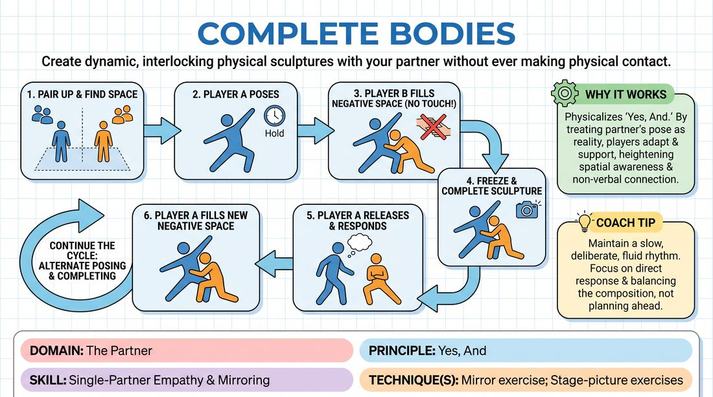

# Complementary Shapes

{ .game-hero }

> Create dynamic, interlocking physical sculptures with your partner without ever making physical contact.

## Overview
In this physical exercise, pairs work together to form interlocking, cooperative body sculptures. One player strikes a pose, and their partner immediately fills the surrounding negative space to complete the visual picture without touching. Players alternate moving and holding, building a silent, physical dialogue of mutual support.

## What It Trains
- **Domain:** D2 — The Partner
- **Principle(s):** Yes, And; Make Your Partner a Genius
- **Skill(s):** Single-Partner Empathy & Mirroring; Physicality & Space Work; Peripheral Awareness
- **Technique(s):** Mirror exercise; Stage-picture exercises
- **Focus:** connection

**Objective:** To develop deep physical empathy, peripheral awareness, and non-verbal 'yes-and' by responding directly to a partner's physical choices and making them look brilliant.

## Setup
An open room with enough space for pairs to move freely without colliding. No props or materials are required. Players pair up and stand facing each other with about three feet of space between them.

## How to Play
1. Divide the group into pairs and have them find a dedicated space in the room where they can move safely.
2. Designate Player A to start by striking a distinct, frozen physical pose using their entire body (e.g., high, low, wide, or twisted).
3. Player B must observe Player A's pose and immediately 'complete' the picture by moving into the negative space around, under, or over Player A.
4. Player B must get as close as possible to Player A to create a unified sculpture, but they must not make any physical contact.
5. Once Player B freezes in their complementary pose, Player A carefully releases their original pose and moves to find a new way to complete Player B's shape.
6. Continue this alternating cycle of posing and completing, maintaining a slow, deliberate, and fluid rhythm.
7. Focus on balancing the composition, ensuring that each new pose directly responds to and elevates the partner's physical offer.

## Facilitation Notes
- Coaching cue: 'Look for the empty spaces. How can you frame your partner's body to make their pose look intentional and dramatic?'
- Pitfall: Players moving too quickly or rushing their poses. Fix: Encourage them to hold each completed sculpture for a full breath before the next person moves, appreciating the visual composition.
- Coaching cue: 'Keep it safe and controlled. Challenge your partner physically, but never put them in a position where they have to strain or lose balance.'
- Pitfall: Accidental physical contact. Fix: Remind players that the tension of almost touching creates a stronger visual and energetic connection than actual contact.

## Variations
- Narrative Addition: Every time a player moves to complete a shape, they deliver a single sentence of a collaborative story, letting the physical pose inspire the narrative tone.
- Soundscape: Instead of words, players emit a sustained abstract sound or tone that matches the emotional quality of the physical sculpture they are forming.
- Group Sculpture: Start with a pair, and every ten seconds, another player enters the space to complete the growing group shape until the entire ensemble is interlocking.

## Debrief
- How did it feel to 'yes-and' your partner using only your body instead of words?
- What did you notice about the tension created by getting close without actually touching?
- How did your partner's physical choices influence your own sense of balance and space?

## Safety & Inclusion
Since this game requires close physical proximity, explicitly establish boundaries before starting. Remind players that they have complete agency over their comfort levels regarding distance, and that the 'no-touching' rule must be strictly respected to ensure a safe, comfortable environment for everyone.

## Why It Works
This game physicalizes the core improv principle of 'Yes, And.' By treating a partner's physical posture as an undeniable reality, players learn to adapt and support rather than lead. The constraint of not touching heightens spatial awareness and forces players to focus intensely on their partner's physical form, building deep non-verbal empathy.
