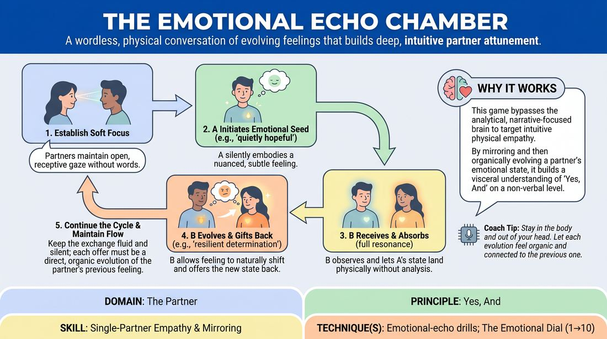

# The Emotional Echo Chamber

{ .game-hero }

> A wordless, physical conversation of evolving feelings that builds deep, intuitive partner attunement.

## Overview
Two players stand face-to-face, communicating entirely without words. One partner initiates a subtle, deeply felt emotional state through posture, breath, and micro-expressions, which the other partner receives, absorbs, and slightly evolves before passing it back. This continuous cycle strips away verbal defense mechanisms, forcing players to connect on a purely visceral, empathetic level.

## What It Trains
- **Domain:** D2 — The Partner
- **Principle(s):** Vulnerability; Yes, And; Make Your Partner a Genius; Assume Competence
- **Skill(s):** Emotional Fluidity; Physicality & Space Work; Active Listening; Status Modulation; Single-Partner Empathy & Mirroring; Offer Reception; Active Gifting
- **Technique(s):** The Emotional Dial (1→10); Meisner Repetition; Status Seesaw; Mirror exercise; Emotional-echo drills; Endowment-acceptance; Endowment-gifting drills
- **Focus:** connection

**Objective:** To develop non-verbal attunement, emotional fluidity, and active empathy by practicing 'Yes, And' on an energetic level, allowing a partner's emotional state to genuinely affect and transform your own.

## At a Glance
| Aspect | Detail |
|---|---|
| Players | 2+ (ideal 2 (in pairs)) |
| Time | ~10 min |
| Complexity | 3/5 |
| Skill level | competent |
| Energy | low |
| Physicality | low |
| Modality | in_person |
| Space | minimal |
| Props | none |
| Audience | not required |

## Setup
Divide the group into pairs. Partners stand facing each other, approximately three to four feet apart, in a quiet space with minimal distractions. No props or special materials are required.

## How to Play
1. Establish Soft Focus: Partners stand face-to-face and establish soft, receptive eye contact, maintaining an open, relaxed gaze that takes in the partner's entire physical presence.
2. Initiate the Emotional Seed: Player A silently selects a specific, nuanced emotional state (such as 'quietly hopeful despite disappointment') and embodies it fully using posture, breathing patterns, and facial micro-expressions.
3. Receive and Absorb: Player B observes Player A with full attention, letting Player A's physical and emotional state resonate within their own body without analyzing or labeling the emotion.
4. Evolve the Echo: Once Player B has absorbed the feeling, they allow it to naturally shift or progress into a related emotional state (for example, quiet disappointment shifts to a heavy, resigned acceptance).
5. Gift the Evolution: Player B embodies this new, evolved emotional state and offers it back to Player A using only non-verbal cues, breath, and posture.
6. Continue the Cycle: Player A receives Player B's evolved state, lets it land, transforms it into a new related feeling, and gifts it back, continuing this wordless exchange back and forth.
7. Maintain the Flow: Keep the exchange fluid and silent, avoiding sudden, disconnected emotional leaps; each offer must be a direct, organic evolution of the emotion just received.

## Facilitation Notes
- Side-Coaching Cue: 'Let the feeling land in your body before you try to change it. Don't plan your response; let your partner's breath change your breath.'
- Pitfall & Fix: Players often default to broad, cartoonish emotional caricatures. Fix: Coach them to dial the physical expression down to a level 3 out of 10, focusing on internal truth and breathing rather than pantomime.
- Side-Coaching Cue: 'If you feel stuck, shift your physical posture or change your breathing pattern to unlock a new emotional pathway.'
- Pitfall & Fix: Players may rush the exchange, passing emotions back and forth too quickly. Fix: Remind them to take a full, deep breath to fully receive and internalize the partner's gift before initiating their response.

## Variations
- Vocal Resonance: Allow players to use non-verbal vocalizations (sighs, hums, groans, or clicks) to support and amplify their physical emotional offers.
- The Status Seesaw: Instruct players to let the emotional evolution naturally shift their relative status, observing how vulnerability or confidence organically alters the power dynamic between them.
- Gibberish Bridge: Introduce gibberish dialogue to the exchange, allowing players to use nonsense words to carry the emotional tone while keeping the focus off literal narrative.

## Debrief
- How did it feel to communicate deep emotional shifts without the safety net of spoken words?
- Were there moments where you felt your partner truly 'saw' and received your emotional gift? What physical cues signaled that to you?
- How did you navigate the transition from receiving an emotion to evolving it? Did it feel like a logical step or an intuitive leap?
- How did the status or power dynamic between you and your partner shift as the emotions evolved?

## Safety & Inclusion
Because sustained eye contact and emotional vulnerability can feel intense for some participants, remind players that they can blink, soften their gaze, or take a brief step back if they feel overwhelmed. Establish a simple, non-verbal 'pause' signal (like touching one's own collarbone) if a player needs to momentarily reset.

## Why It Works
This game bypasses the analytical, narrative-focused brain and targets intuitive physical empathy. By forcing players to physically mirror and then organically evolve their partner's emotional state, it builds a visceral understanding of 'Yes, And.' It teaches that an offer is not just a line of dialogue, but an energetic state that must be received and allowed to change you.
