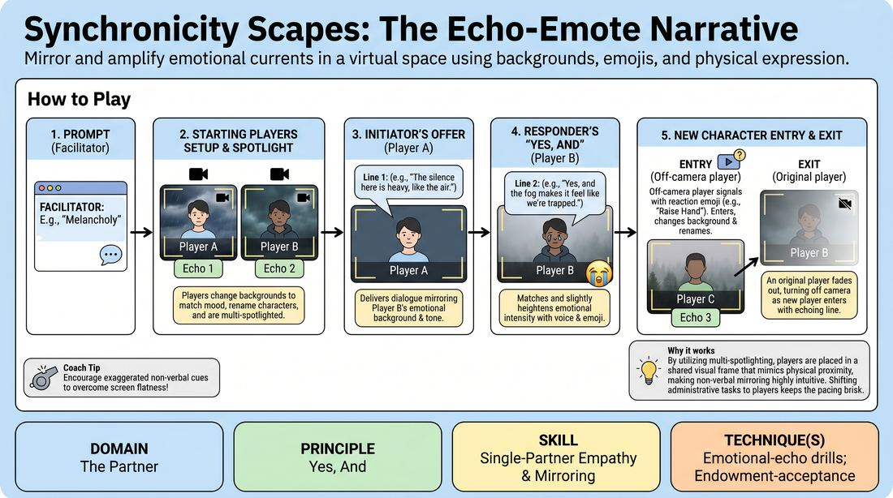

# Emotional Echo Chambers

{ .game-hero }

> Mirror and amplify emotional currents in a virtual space using backgrounds, emojis, and physical expression.

## Overview
Emotional Echo Chambers is a virtual-native improv game where players build a shared narrative landscape using visual backgrounds, emoji reactions, and physical mirroring. By layering non-verbal emotional offers over spoken dialogue, participants practice deep empathy and rapid agreement in a digital space. The game transforms the constraints of video calls into a dynamic, multi-sensory playground.

## What It Trains
- **Domain:** D2 — The Partner
- **Principle(s):** Yes, And; Make Your Partner a Genius; Vulnerability; Group Mind
- **Skill(s):** Single-Partner Empathy & Mirroring; Active Listening; Offer Reception; Emotional Fluidity; World-Building; Support Work
- **Technique(s):** Emotional-echo drills; Endowment-acceptance; The Emotional Dial (1→10); C.R.O.W. (Character, Relationship, Objective, Where)
- **Focus:** mixed

**Objective:** To develop advanced emotional mirroring, non-verbal offer reception, and multi-modal agreement by utilizing digital platform features to echo and heighten a partner's emotional state.

## At a Glance
| Aspect | Detail |
|---|---|
| Players | 6–12 (ideal 6-12) |
| Time | ~15 min |
| Complexity | 3/5 |
| Skill level | competent |
| Energy | medium |
| Physicality | low |
| Modality | virtual |
| Space | minimal |
| Props | yes |
| Audience | not required |

## Setup
Conducted on a video conferencing platform with all participants on camera in Gallery View. Players should have access to a variety of virtual backgrounds (abstract colors, textures, or locations) and know how to use platform reaction emojis. No physical props are needed, but players must be familiar with renaming themselves and using the platform's spotlighting features.

## How to Play
1. The facilitator solicits a single abstract emotion or mood prompt from the group (e.g., 'melancholy', 'electric anticipation') via the chat window.
2. Two starting players are selected. They immediately change their virtual backgrounds to visually represent this mood and rename themselves with a character title inspired by their partner's background.
3. The facilitator multi-spotlights these two players so they are displayed side-by-side on everyone's screen, allowing them to easily see and mirror each other's physical expressions.
4. Player A (the Initiator) delivers a single line of dialogue that establishes their relationship, deeply mirroring the emotional tone of Player B's background and facial expression.
5. Player B (the Responder) immediately 'yes, ands' the offer, matching and slightly heightening the emotional intensity (the 'emotional echo') using both voice and a platform reaction emoji.
6. To introduce a new character, any off-camera player can turn their camera on and use a specific reaction emoji (like a 'raise hand' or 'heart') to signal they are entering as an 'Echo'.
7. The entering player immediately renames themselves to fit the scene, changes their background to match the established environment, and is added to the multi-spotlight by the facilitator.
8. The new player delivers an emotional line that echoes the current state of the scene, while one of the original players gracefully fades out by turning off their camera and removing their spotlight, keeping the active group to a manageable two to three spotlighted players.

## Facilitation Notes
- To reduce facilitator burden, ensure players are fully responsible for renaming themselves and managing their own backgrounds. The facilitator's primary technical job is simply managing the multi-spotlight.
- Ensure the platform's multi-spotlight feature is active so all spotlighted players are visible to everyone simultaneously. If the platform does not support multi-spotlight, instruct players to use 'Pin' or 'Hide Non-Video Participants' to keep focus.
- Coach players to focus on physical mirroring—matching head tilts, posture, and facial expressions of their partner to deepen the emotional connection.
- Remind players that backgrounds do not need to be literal locations; abstract colors or textures often work better to represent internal emotional states.

## Variations
- Silent Echoes: Play the entire scene in complete silence, relying solely on physical mirroring, background changes, and emoji reactions to build and resolve a narrative arc.
- The Emotional Dial: The facilitator or audience uses the chat to type numbers from 1 to 10, signaling the spotlighted players to instantly scale up or down the intensity of their mirrored emotion.
- Status Swap: When a new player enters, they must adopt the exact opposite emotional status of the current dominant character, forcing a rapid shift in the scene's dynamic.

## Debrief
- How did renaming yourself based on your partner's background change your approach to character creation?
- What did you notice about your ability to mirror emotions when you could see your partner side-by-side in the multi-spotlight?
- How did the combination of visual backgrounds and emojis help you read your partner's offers without relying solely on dialogue?

## Safety & Inclusion
Ensure players who cannot use virtual backgrounds due to hardware limitations are fully included. They can participate by holding up colored physical items (like a colored folder or shirt) to their camera, or by using physical gestures and facial expressions to create the 'echo' effect. Establish a clear 'cut' signal if emotional mirroring becomes too intense for any participant.

## Why It Works
By utilizing multi-spotlighting, players are placed in a shared visual frame that mimics physical proximity, making non-verbal mirroring highly intuitive. Shifting the administrative tasks (like renaming) to the players keeps the pacing brisk and allows the facilitator to focus on side-coaching. The multi-sensory inputs (backgrounds, emojis, voice) provide multiple access points for players to connect emotionally, bypassing the typical lag of virtual communication.
