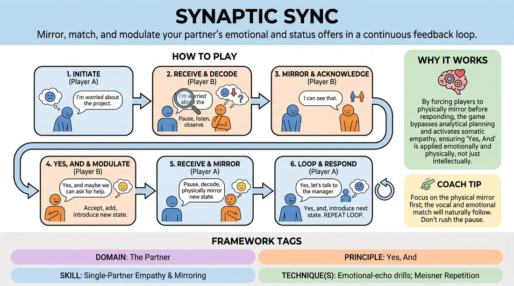

# Resonant Echoes

{ .game-hero }

> Mirror, match, and modulate your partner's emotional and status offers in a continuous feedback loop.

## Overview
A highly focused two-player scene-building exercise that trains improvisers to listen beyond literal words. Players must actively decode, physically mirror, and dynamically build upon their partner's verbal content, emotional subtext, and status choices. The result is a deeply connected, highly responsive scene where every line of dialogue is a fully integrated package of physical, emotional, and social information.

## What It Trains
- **Domain:** D2 — The Partner
- **Principle(s):** Yes, And; Make Your Partner a Genius; Assume Competence
- **Skill(s):** Active Listening; Status Modulation; Single-Partner Empathy & Mirroring; Offer Reception; Active Gifting
- **Technique(s):** Meisner Repetition; Last Word Response; Status Seesaw; Mirror exercise; Emotional-echo drills; Yes, And… sentence games; Endowment-acceptance; Endowment-gifting drills; Give them the answer
- **Focus:** connection

**Objective:** To develop deep interpersonal attunement and single-partner empathy by practicing emotional-echo drills, active gifting, and status modulation in real-time.

## At a Glance
| Aspect | Detail |
|---|---|
| Players | 2+ (ideal 2) |
| Time | ~10 min |
| Complexity | 3/5 |
| Skill level | competent |
| Energy | medium |
| Physicality | low |
| Modality | in_person |
| Space | minimal |
| Props | none |
| Audience | not required |

## Setup
Two players stand facing each other in a shared performance space. No props or special materials are required. The facilitator establishes a simple, open-ended relationship context to ground the interaction.

## How to Play
1. Player A initiates the scene with a single, clear line of dialogue that carries a distinct emotional state and an implied status level.
2. Before speaking, Player B must pause to actively receive the offer, decoding Player A's verbal message, emotional tone, and physical status cues.
3. Player B physically and vocally mirrors or acknowledges Player A's emotional state and status posture, demonstrating physical alignment and empathy with their partner's offer.
4. While maintaining this physical and emotional connection, Player B delivers a 'Yes, And' line of dialogue that accepts the reality of Player A's statement.
5. In delivering their line, Player B introduces their own distinct emotional state and status choice, which can either amplify Player A's state, shift to a contrasting state, or hold the current dynamic.
6. Player A now receives this multi-layered offer, mirrors Player B's new emotional and status state, and responds with a 'Yes, And' line that introduces a new emotional and status variation.
7. The players continue this continuous loop of receiving, mirroring, and modulating, ensuring that every single line of dialogue is preceded by a physical and emotional echo of their partner.

## Facilitation Notes
- Coaching Cue: 'Breathe and absorb.' Remind players to take a physical beat to let their partner's emotion land on them before they react or speak.
- Pitfall: Robotic copying. Players might mimic their partner mechanically. Fix: Encourage them to internalize the feeling behind the posture rather than just copying the exact shape.
- Coaching Cue: 'Name the subtext.' If players seem disconnected, freeze the scene and ask each player to state what emotion and status they currently perceive in their partner.
- Pitfall: Neutralizing. Players default to a safe, conversational middle ground. Fix: Challenge them to make bold, extreme choices with their emotional states and status levels.

## Variations
- Scaffolded Start: For less experienced players, run the exercise focusing only on mirroring the emotional state first, then add the status layer once they are comfortable.
- Status Seesaw: Force players to always adopt the opposite status of their partner, creating a dynamic power struggle where status constantly shifts.
- Silent Echo: Play the entire scene using only gibberish or physical movement, relying entirely on emotional mirroring and status modulation without verbal language.

## Debrief
- How did taking a moment to physically mirror your partner change how you listened to their words?
- What was more challenging: identifying your partner's emotional state or modulating your own status in response?
- How did this exercise prevent you from planning your next line in advance?

## Safety & Inclusion
Ensure players are aware that mirroring physical postures should always respect personal boundaries and physical comfort. If a player has limited mobility, partners should mirror the emotional energy and vocal quality rather than exact physical shapes.

## Why It Works
By forcing players to physically mirror their partner's emotional and status states before responding, the game bypasses analytical planning and activates somatic empathy. This ensures that 'Yes, And' is applied not just to the intellectual ideas in a scene, but to the physical and emotional realities of the characters, creating a deeply resonant connection.
