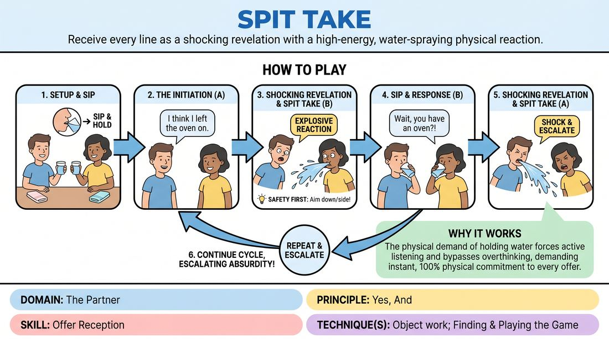

# Spit Take

{ .game-hero }

> Receive every line as a shocking revelation with a high-energy, water-spraying physical reaction.

## Overview
Two players engage in a scene while holding cups of water, taking a sip before each line. Every statement made by their partner must be received as an absolute bombshell, triggering an immediate, dramatic spit take. It is a high-energy exercise in physical comedy, extreme offer reception, and comedic timing.

## What It Trains
- **Domain:** D2 — The Partner
- **Principle(s):** Yes, And; Commit 100%; Show, Don't Tell
- **Skill(s):** Offer Reception; Active Listening; Physicality & Space Work; Game Identification
- **Technique(s):** Object work; Finding & Playing the Game
- **Focus:** comedy_game

**Objective:** To develop hyper-reactive offer reception and physical commitment by translating verbal statements into immediate, high-stakes physical reactions.

## At a Glance
| Aspect | Detail |
|---|---|
| Players | 2–2 (ideal 2) |
| Time | ~5 min |
| Complexity | 2/5 |
| Skill level | advanced_beginner |
| Energy | high |
| Physicality | high |
| Modality | in_person |
| Space | moderate |
| Props | glasses of water, towels |
| Audience | not required |

## Setup
An open performance space with a slip-resistant floor or towels laid down. Each of the two players receives a cup of clean water and a personal towel. A designated splash zone is established to keep the stage safe.

## How to Play
1. Two players stand center stage, each holding a cup of water, with towels nearby.
2. Before any dialogue begins, both players take a moderate sip of water and hold it in their mouths without swallowing.
3. Player A initiates the scene with a simple, mundane statement (e.g., 'I think I left the oven on').
4. Player B must instantly receive this line as a shocking, world-altering revelation, executing a dramatic spit take.
5. To ensure safety and hygiene, Player B directs the spray downward or slightly to the side, avoiding their partner's face.
6. After spitting, Player B immediately takes another sip of water, holds it, and delivers their response.
7. Player A receives Player B's line with equal shock, executing their own spit take, then sips and responds.
8. The players continue this rapid-fire cycle, escalating the emotional stakes and absurdity of the scene with every line.

## Facilitation Notes
- Side-coach players to keep the sips small; a mouthful of water is hard to control and can lead to choking.
- Ensure players do not spit directly into each other's faces for hygiene and comfort, unless explicitly agreed upon beforehand.
- Pitfall: Players swallowing the water instead of spitting. Fix: Remind them that the physical release of the water is the 'Yes, And' to the partner's offer.
- Encourage variety in the spit takes—some can be explosive, others can be slow-drips of sheer disbelief.

## Variations
- Dry Run: Perform the game without actual water, using mime and vocal sound effects to practice the physical timing before adding liquid.
- The Delayed Fuse: Players must wait three seconds after the line is delivered, letting the realization slowly dawn on them before the explosive spit take.
- The Escalation: Start with tiny dribbles for minor news, building up to massive, room-clearing sprays as the secrets get bigger.

## Debrief
- How did the physical requirement of holding water change how closely you listened to your partner's words?
- What did it feel like to treat even the most mundane line as a shocking, high-stakes offer?
- How did the physical commitment of the spit take help drive the comedic game of the scene?

## Safety & Inclusion
Water on stage creates a significant slipping hazard. Lay down towels or mats in the active play area, and have a mop ready. Ensure players use their own designated cups to maintain hygiene. Players with respiratory or swallowing sensitivities can participate using the 'Dry Run' variation.

## Why It Works
By forcing a physical reaction to every line, the game bypasses the analytical brain and demands instant, 100% commitment to the partner's offer. The physical constraint of holding water ensures active listening, as players must wait for the exact moment of delivery to release the tension, perfectly illustrating the 'Show, Don't Tell' principle through physical comedy.
