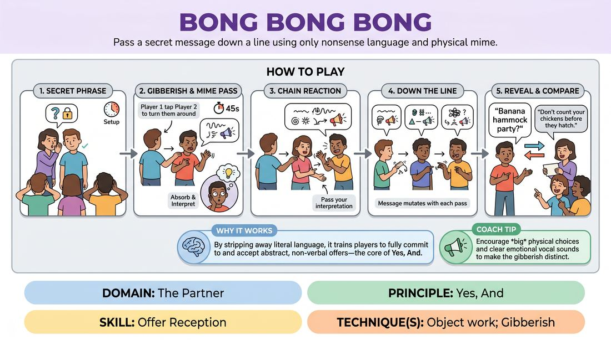

# Gibberish Relay

{ .game-hero }

> Pass a secret message down a line using only nonsense language and physical mime.

## Overview
In this high-energy telephone-style game, players attempt to pass a secret phrase down a line of teammates. Because they can only communicate using gibberish and physical movement, the message inevitably mutates, resulting in a hilarious final comparison of what was sent versus what was received.

## What It Trains
- **Domain:** D2 — The Partner
- **Principle(s):** The First Thought Is a Gift; Yes, And; Make Your Partner a Genius
- **Skill(s):** Physicality & Space Work; Vocal Craft; Active Listening; Offer Reception; Active Gifting
- **Technique(s):** Object work; Gibberish; Endowment-acceptance; Endowment-gifting drills
- **Focus:** comedy_game

**Objective:** Develops active listening, physical offer reception, and vocal commitment by forcing players to accept and replicate abstract physical and vocal offers without overthinking.

## At a Glance
| Aspect | Detail |
|---|---|
| Players | 4+ (ideal 4-8) |
| Time | ~5 min |
| Complexity | 2/5 |
| Skill level | novice |
| Energy | medium |
| Physicality | medium |
| Modality | in_person |
| Space | minimal |
| Props | none |
| Audience | not required |

## Setup
Line up four players on stage. Players 2, 3, and 4 turn their backs to Player 1 and cover their ears so they cannot hear or see the initial suggestion. The facilitator prepares a list of common idioms or actions.

## How to Play
1. The facilitator whispers a secret common phrase or idiom to Player 1 while the other players remain turned away with their ears covered.
2. Player 1 taps Player 2 on the shoulder to turn them around, then has 45 seconds to communicate the phrase using only gibberish and physical mime.
3. Player 2 must actively watch and listen, absorbing the physical shapes, vocal inflections, and emotional energy of Player 1.
4. Once the time is up, Player 1 steps back, and Player 2 taps Player 3 to turn around.
5. Player 2 passes their interpretation of the message to Player 3 using the same gibberish and mime constraints.
6. This chain continues down the line until the final player receives the message from the penultimate player.
7. The facilitator calls out a reveal cue, and starting with the final player and moving backward to Player 1, each player shares what they believed the message was.

## Facilitation Notes
- Coaching cue: Don't try to translate the gibberish into English in your head; instead, mimic the exact physical shapes and vocal tones you are receiving.
- Pitfall: Players spelling out letters in the air or using English mouth movements. Fix: Remind players that gibberish must sound like a fully formed, expressive foreign language.
- Coaching cue: Match the emotional intensity of your partner. If they are frantic, receive it frantically!
- Pitfall: Players freezing up because they don't understand the literal meaning. Fix: Encourage immediate physical initiation; trust your first physical impulse.

## Variations
- Emotional Shift: Each player in the chain must pass the message using a completely different, randomly assigned emotion.
- Sound Effects Only: Players cannot use gibberish syllables and must rely entirely on non-verbal sound effects and physical movement.
- The Guessing Game: The final player gets three attempts to guess the exact starting phrase to win a point for the team.

## Debrief
- How did it feel to receive an offer when you had no intellectual context for what it meant?
- What strategies helped you pass on the essence of the message even when you didn't know the exact words?
- How does matching your partner's physical energy and vocal tone make their nonsense make sense?

## Safety & Inclusion
Ensure players with hearing or visual differences are accommodated by using clear physical touch cues for transitions, and adjust the sensory blocking to fit everyone's comfort levels.

## Why It Works
By stripping away literal language, this game bypasses the analytical brain and forces players to rely on pure physical commitment and vocal dynamics. It teaches the core of Yes-And by requiring players to treat abstract, nonsensical offers as absolute, meaningful truth.
