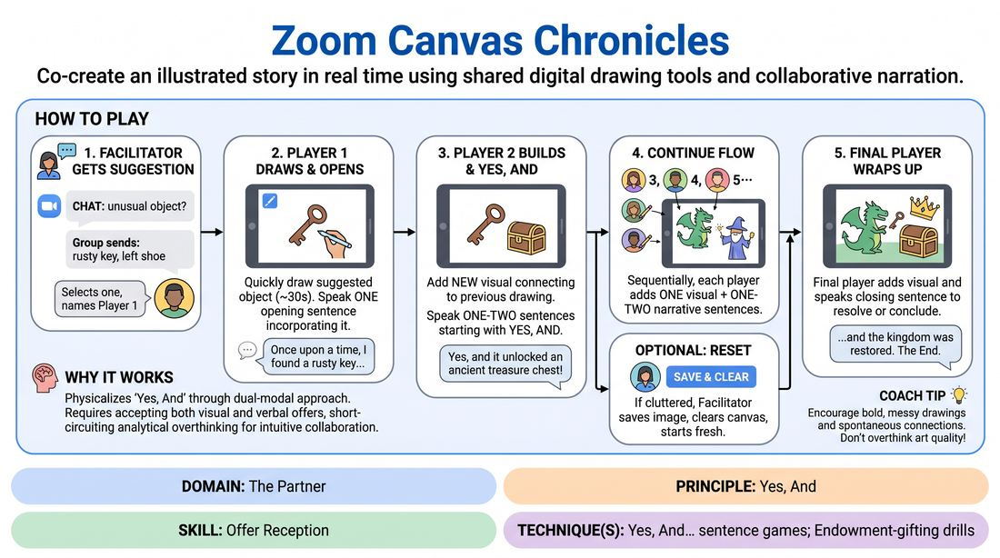

# Shared Canvas Chronicles

{ .game-hero }

> Co-create an illustrated story in real time using shared digital drawing tools and collaborative narration.

## Overview
Shared Canvas Chronicles is a collaborative virtual game where players build an illustrated story together on a shared digital whiteboard. Taking turns, each participant adds a single visual element to the canvas while speaking one or two sentences that accept and expand the narrative. The result is a whimsical, co-created artifact that blends visual and verbal 'Yes, And' in a low-stakes, highly engaging format.

## What It Trains
- **Domain:** D2 — The Partner
- **Principle(s):** Yes, And; Make Your Partner a Genius; Show, Don't Tell; Serve the Story; Group Mind
- **Skill(s):** Active Listening; Offer Reception; Active Gifting; Narrative Architecture; World-Building; Peripheral Awareness
- **Technique(s):** Yes, And… sentence games; Endowment-gifting drills; Story Spine; C.R.O.W. (Character, Relationship, Objective, Where)
- **Focus:** narrative

**Objective:** To develop deep offer reception and multi-modal 'Yes, And' skills by requiring players to actively listen to verbal narrative threads while simultaneously integrating and building upon visual offers on a shared screen.

## At a Glance
| Aspect | Detail |
|---|---|
| Players | 6–15 (ideal 6-12) |
| Time | ~25 min |
| Complexity | 2/5 |
| Skill level | novice |
| Energy | medium |
| Physicality | low |
| Modality | virtual |
| Space | minimal |
| Props | none |
| Audience | not required |

## Setup
Set up a virtual meeting room using a platform that supports screen sharing and participant annotation. The facilitator shares a blank white screen (or a simple, solid-colored background). Ensure all participants have annotation permissions enabled and know how to access the drawing tools (pen, stamp, or shapes). Instruct everyone to switch to grid view so they can see both the canvas and their fellow players' faces.

## How to Play
1. The facilitator solicits a one-word suggestion for an unusual or mundane object from the group via the chat box (e.g., 'rusty key', 'left shoe').
2. The facilitator selects one suggestion and designates the first player to begin the chronicle.
3. Player 1 uses the annotation tools to quickly draw the suggested object on the shared canvas, taking no more than 30 seconds.
4. As soon as they finish drawing, Player 1 speaks one compelling opening sentence that establishes the scene and explicitly incorporates the drawn object.
5. The facilitator designates the next player in sequence (or follows a pre-established order, such as alphabetical or a digital passing order).
6. The next player adds a new visual element to the canvas that connects to or expands upon the existing drawing.
7. Immediately after drawing, this player speaks one or two sentences starting with a conceptual 'Yes, And' that accepts the previous narrative and explains how their new visual addition fits into the story.
8. Play continues sequentially through the group, with each player contributing one visual element and one to two narrative sentences.
9. If the canvas becomes overly cluttered, the facilitator saves the current image for posterity, clears the screen, and invites the next player to start a fresh visual chapter that continues the same verbal storyline.
10. The final player is prompted to deliver a concluding visual addition and a closing sentence that wraps up the chronicle with a satisfying resolution or a dramatic cliffhanger.

## Facilitation Notes
- Establish a clear turn order early (e.g., posting a list in the chat) to eliminate dead air and keep the momentum high.
- Side-coach players to keep drawings simple and fast. Emphasize that stick figures, squiggles, and basic shapes are perfect; speed and imagination are more important than artistic skill.
- If a player gets stuck, encourage them to look at the drawing for inspiration. Ask: 'What does that shape look like to you? Draw what's next to it.'
- Watch out for players who ignore the previous player's verbal contribution to focus solely on their own pre-planned drawing. Remind them to 'Yes, And' both the visual and verbal offers.
- Ensure the facilitator is comfortable with the platform's 'Save' and 'Clear' annotation functions to seamlessly manage canvas clutter without interrupting the narrative flow.

## Variations
- Blind Additions: Players must close their eyes while drawing their visual element, forcing them to narrate how their chaotic scribble fits into the story.
- Emotional Shifts: The facilitator calls out a new emotion or genre (e.g., 'sci-fi', 'gothic horror', 'melodrama') at the start of a player's turn, requiring them to shift the tone of both their drawing and narration.
- Silent Partners: One player draws an element without speaking, and the next player must verbally interpret what was drawn before adding their own visual and verbal contribution.

## Debrief
- How did having to draw your offer change how you formulated your verbal contribution?
- What was it like to have your visual drawing interpreted in a completely unexpected way by the next player?
- How did we balance serving the overall story versus focusing on our individual visual ideas?
- In what ways did the visual canvas help us build a more specific and concrete physical environment than words alone?

## Safety & Inclusion
Ensure that participants who may have physical or accessibility limitations with digital drawing tools are fully included. They can verbally describe what they want to add to the canvas, and either the facilitator or a designated 'scribe' player can draw it on their behalf. Emphasize a judgment-free creative space where artistic ability is completely irrelevant.

## Why It Works
This game works because it physicalizes the concept of 'Yes, And' through a dual-modal approach. By requiring players to accept a visual offer (the drawing) and a verbal offer (the story) simultaneously, it short-circuits the analytical mind and forces radical acceptance. The shared canvas acts as a persistent, collective memory of the scene, making environment and object work tangible in a virtual space. This shared visual anchor builds a strong sense of group mind and collective ownership, which directly combats virtual meeting fatigue.
