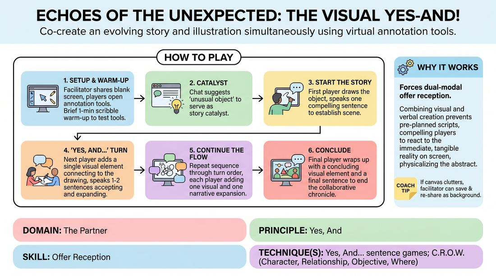

# Shared Canvas Chronicles

{ .game-hero }

> Co-create an evolving story and illustration simultaneously using virtual annotation tools.

## Overview
A collaborative, multi-modal remote game where players sequentially build both a narrative and a shared drawing. By adding one visual element and one spoken sentence per turn, participants practice radical acceptance and physical-to-verbal integration in a low-stakes digital environment.

## What It Trains
- **Domain:** D2 — The Partner
- **Principle(s):** Yes, And; Show, Don't Tell; Group Mind
- **Skill(s):** Active Listening; Offer Reception; World-Building; Peripheral Awareness
- **Technique(s):** Yes, And… sentence games; C.R.O.W. (Character, Relationship, Objective, Where)
- **Focus:** mixed

**Objective:** To develop deep offer reception and 'Yes, And' skills by requiring players to actively listen to verbal cues and visually adapt to graphic offers, building a cohesive world together.

## Setup
Conducted via a virtual video conferencing platform. The facilitator shares a blank white screen (or a solid neutral background) and ensures all participants have annotation privileges enabled. Players should be in Gallery View with their annotation toolbars open and ready.

## How to Play
1. The facilitator shares a blank white screen and instructs all players to open their platform's annotation toolbar, selecting a basic drawing tool.
2. Run a brief 1-minute warm-up where everyone draws a simple shape or squiggle to test their tools and lower performance anxiety regarding drawing ability.
3. Ask the group to type suggestions for an 'unusual object' into the chat, then select one to serve as the story's catalyst.
4. Designate a clear turn order for the players (e.g., alphabetical or a pre-shared list) to ensure smooth transitions without verbal lag.
5. The first player draws the suggested unusual object on the shared screen and immediately speaks one compelling sentence to establish the scene, directly referencing what they drew.
6. The next player adds a single visual element that connects to the existing drawing, and immediately speaks one or two sentences that accept and expand the narrative ('Yes, And'), incorporating their new visual addition.
7. Continue this sequence through the established order, with each player contributing one visual addition and one corresponding narrative expansion.
8. If the canvas becomes overly cluttered, the facilitator saves the current image, clears the screen, and re-shares the saved image as a background layer to keep the workspace clean.
9. The final player wraps up the round by adding a concluding visual element and a final sentence that brings the collaborative chronicle to a satisfying or dramatic resolution.

## Facilitation Notes
- Side-coaching cue: 'Draw first, speak second!' This prevents players from planning their lines before they see what their hands actually create.
- Pitfall: Players overcomplicating their drawings, which slows down the game's momentum. Fix: Remind the group that stick figures, simple lines, and abstract shapes are highly encouraged; speed and imagination trump artistic skill.
- Side-coaching cue: 'Yes, And both the words and the lines!' Ensure players are building on the visual reality of the canvas, not just the spoken story.
- Pitfall: Technical confusion with annotation tools. Fix: Keep the pre-game warm-up mandatory and have a quick troubleshooting guide ready (e.g., how to find the 'Annotate' button under 'View Options').

## Variations
- Blind Additions: Players must close their eyes while drawing their element, then open them and immediately justify whatever mark they made within the story.
- Emotional Canvas: The facilitator secretly assigns an emotion to each player via private chat; their drawing style (e.g., jagged lines, soft curves) and spoken sentence must reflect that emotion.
- Silent Symphony: The entire game is played in complete silence, with players using only drawings and typed chat sentences to build the narrative.

## Debrief
- How did having to draw your offer change how you formulated your spoken 'Yes, And'?
- What did it feel like to have someone else visually alter or build upon a drawing you made?
- How did we maintain a cohesive 'Group Mind' when we couldn't rely on physical stage presence?

## Safety & Inclusion
Ensure players who are uncomfortable drawing or have physical accessibility barriers can participate by verbally describing their visual addition to the facilitator, who can draw it on their behalf. Remind everyone that there is no judgment on artistic ability.

## Why It Works
This game works because it forces dual-modal offer reception. By combining visual and verbal creation, players cannot rely on pre-planned scripts; they must react to the immediate, tangible reality on the screen. This physicalizes the abstract concept of 'Yes, And,' making active listening and collaborative world-building highly visible and concrete.
