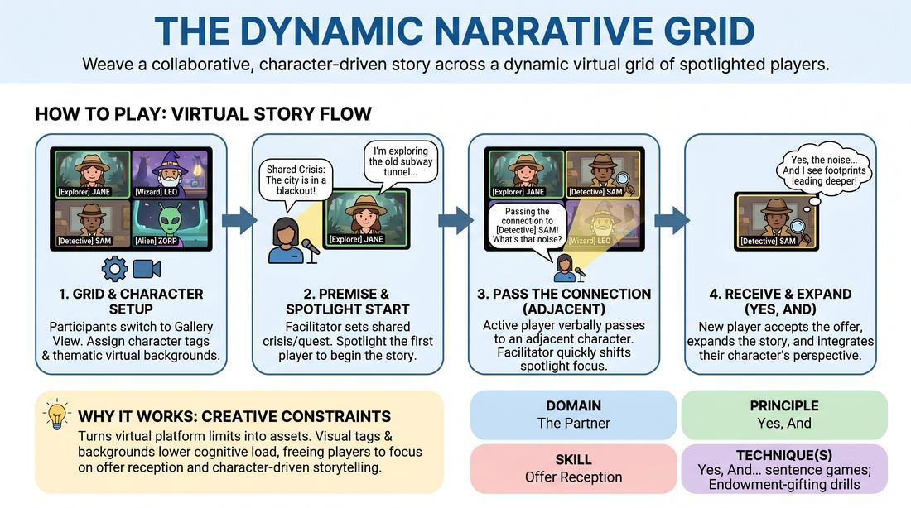

# The Storytelling Grid

{ .game-hero }

> Weave a collaborative, character-driven story across a dynamic virtual grid of spotlighted players.

## Overview
The Storytelling Grid is an interactive virtual storytelling game that transforms the standard video gallery layout into a contiguous, shared narrative space. Participants adopt distinct character roles, set thematic virtual backgrounds, and collaboratively build an unfolding story. By passing focus to adjacent tiles on the screen, players practice seamless handoffs, active listening, and immediate acceptance of narrative offers.

## What It Trains
- **Domain:** D2 — The Partner
- **Principle(s):** Yes, And; Make Your Partner a Genius; Serve the Story; Group Mind
- **Skill(s):** Active Listening; Offer Reception; Active Gifting; Narrative Architecture; World-Building; Peripheral Awareness; Pacing & Rhythm
- **Technique(s):** Yes, And… sentence games; Endowment-gifting drills; Story Spine; C.R.O.W. (Character, Relationship, Objective, Where); Timing exercises
- **Focus:** narrative

**Objective:** To develop rapid offer reception and collaborative narrative building using the 'Yes, And' principle in a virtual environment, while training peripheral awareness and pacing.

## At a Glance
| Aspect | Detail |
|---|---|
| Players | 6–12 (ideal 6-12) |
| Time | ~20 min |
| Complexity | 2/5 |
| Skill level | novice |
| Energy | medium |
| Physicality | none |
| Modality | virtual |
| Space | minimal |
| Props | Zoom client with Spotlight capability, Virtual backgrounds, Character tags (renaming) |
| Audience | not required |

## Setup
Players join a virtual meeting platform in gallery view. The facilitator prepares a list of character roles (e.g., 'The Botanist', 'The Mechanic', 'The Mystic') and a central narrative premise (e.g., a malfunctioning spaceship or an ancient temple exploration). Each player renames themselves to include their assigned character role and selects a virtual background that represents their character's immediate environment or tools.

## How to Play
1. Instruct all participants to switch their video conferencing software to gallery view so everyone is visible in a grid format.
2. Assign each player a unique character tag to append to their display name and have them select a virtual background that visually represents their character's workspace or environment.
3. Introduce the overarching narrative premise, establishing a shared crisis or quest that connects all the characters in a single location.
4. The facilitator spotlights the first player to initiate the story, establishing their character's immediate situation and setting the scene.
5. To transition, the active speaker must verbally pass the narrative to an adjacent player in the grid by saying: 'Passing the connection to [Character Name]! What is happening in your sector?'
6. The facilitator must immediately shift the platform's spotlight focus to the named player to ensure a seamless visual transition and minimize audio lag.
7. The newly spotlighted player must immediately accept the previous player's contribution ('Yes'), expand upon it ('And'), and integrate their own character's perspective and virtual background into the story.
8. The active player then passes the narrative to another adjacent player who has not yet spoken, continuing the chain.
9. The facilitator monitors the flow, using the chat to drop prompt questions if the narrative stalls, and guides the story to a natural climax or resolution after 10 to 15 minutes.

## Facilitation Notes
- Rapid Spotlighting: The facilitator must be highly attentive, ready to spotlight the next player the instant their name is spoken to maintain momentum and prevent dead air.
- Grid Discrepancies: Because gallery view layouts can vary slightly between users, instruct players to pass to anyone they perceive as adjacent, or simply name any player who hasn't spoken yet if they are unsure.
- Enforce 'Yes, And': If a player ignores the previous offer or resets the scene, gently side-coach them to acknowledge the last statement before introducing their own character's action.
- Background Integration: Encourage players to actively reference elements in their virtual backgrounds (e.g., 'As you can see behind me, the vines are growing rapidly!') to ground the digital space.

## Variations
- The Blind Pass: Players pass the spotlight to an adjacent tile without naming them, relying entirely on the facilitator to spot who they are pointing to on their screen (best for advanced groups with stable grid layouts).
- Atmospheric Shift: The facilitator periodically types environmental changes in the chat (e.g., 'Gravity loss!', 'The temperature drops!') that all players must immediately incorporate into their next turn.
- Speed Run: Reduce the time each player has in the spotlight to a single sentence, forcing rapid-fire 'Yes, And' transitions and high-energy pacing.

## Debrief
- How did having a visual character tag and background affect your ability to make immediate offers?
- What strategies did you use to ensure your 'Yes, And' directly built upon the previous player's contribution rather than starting a new thread?
- How did the physical layout of the grid shape your sense of connection and collaboration compared to a standard conversation?

## Safety & Inclusion
Ensure all participants are comfortable using virtual backgrounds; if technical limitations or privacy concerns prevent someone from using a background, allow them to describe their environment verbally or use a physical household object as their prop.

## Why It Works
This game succeeds by turning the technical constraints of virtual platforms into creative assets. The combination of visual character tags and virtual backgrounds lowers the cognitive load of character creation, allowing players to focus entirely on active listening. The structured 'pass the spotlight' mechanic eliminates the common virtual issue of overlapping speech, while the adjacency rule fosters a sense of shared physical space and group mind.
