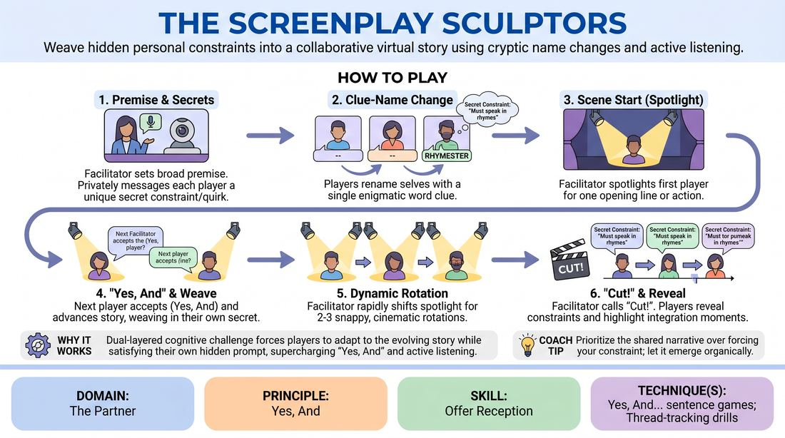

# The Secret Scriptwriters

{ .game-hero }

> Weave hidden personal constraints into a collaborative virtual story using cryptic name changes and active listening.

## Overview
This is a collaborative, virtual storytelling game where players build a cohesive narrative while secretly managing individual creative constraints. Operating in a virtual gallery, players receive private prompts and rename themselves with a single-word clue that hints at their secret. The resulting experience is a high-focus, hilarious exercise in narrative integration, where players must balance their hidden agendas with the collective flow of the story.

## What It Trains
- **Domain:** D2 — The Partner
- **Principle(s):** Yes, And; Serve the Story; Group Mind
- **Skill(s):** Active Listening; Offer Reception; Narrative Architecture; Peripheral Awareness
- **Technique(s):** Yes, And… sentence games; Thread-tracking drills
- **Focus:** narrative

**Objective:** To develop advanced offer reception and active listening by forcing players to seamlessly integrate highly specific, restricted personal prompts into an unfolding group narrative without disrupting the story's organic architecture.

## At a Glance
| Aspect | Detail |
|---|---|
| Players | 6–12 (ideal 6-12) |
| Time | ~20 min |
| Complexity | 3/5 |
| Skill level | advanced_beginner |
| Energy | medium |
| Physicality | low |
| Modality | virtual |
| Space | minimal |
| Props | none |
| Audience | not required |

## Setup
A virtual meeting room with all participants in gallery view. The facilitator needs the ability to send private direct messages to individual players and spotlight or pin specific video feeds. Ensure the platform setting that allows participants to rename themselves is enabled. No physical props or materials are required.

## How to Play
1. The facilitator establishes a broad, high-stakes, or unusual narrative premise to set the scene.
2. The facilitator privately messages each player a unique, secret constraint or character quirk that they must weave into the story.
3. Each player renames their virtual display name to a single, enigmatic word that serves as a subtle clue to their secret constraint.
4. The facilitator starts the scene by spotlighting the first player, who delivers a single line of dialogue or a clear physical action that establishes the beginning of the story while subtly weaving in their secret constraint.
5. The facilitator immediately shifts the spotlight to the next player, who must accept the previous contribution and advance the narrative while integrating their own secret constraint.
6. Play continues rapidly through the group for two to three full rotations, with the facilitator dynamically spotlighting players to maintain a snappy, cinematic pace.
7. Once the narrative reaches a natural climax or hilarious entanglement, the facilitator calls 'Cut!' to end the scene.
8. Players take turns revealing their secret constraints to the group, highlighting the moments where they tried to subtly slip them into the story.

## Facilitation Notes
- Pacing is Key: Keep the spotlight transitions fast. If a player hesitates, side-coach with 'Trust your first instinct!' or 'Just one sentence!' to prevent overthinking.
- Avoid the Information Dump: A common pitfall is players blurting out their secret constraint immediately. Remind them that the goal is subtle integration—the story must make sense to an outside observer.
- Technical Prep: Before starting, run a quick 30-second test where everyone practices renaming themselves to ensure no technical friction during the game.
- Yes, And Priority: If a player's secret constraint conflicts with the established reality, they must prioritize the established reality. The story's logic always trumps the individual secret.

## Variations
- The Detective: One player is designated as the Detective and does not receive a secret constraint. Their goal is to guess everyone else's secrets by the end of the scene based on their lines and name clues.
- Visual Backdrops: Players can change their virtual background to a generic image that subtly hints at their secret constraint, adding a visual layer of storytelling.
- Pass the Spotlight: Instead of the facilitator directing the spotlight, the active player verbally passes the turn to another player by calling out their enigmatic name clue.

## Debrief
- How did having a secret constraint change the way you listened to your scene partners?
- What strategies did you use to make your secret feel like a natural part of the story rather than a forced interruption?
- How did the enigmatic name clues affect your expectations of what your partners would say or do?

## Safety & Inclusion
Ensure that secret constraints do not require physical movements that are inaccessible to players with limited mobility or space. Remind players that they can privately message the facilitator if they receive a constraint they feel uncomfortable playing, and a new one will be provided immediately.

## Why It Works
This game supercharges Yes, And by introducing a dual-layered cognitive challenge. Players cannot simply plan their lines in advance because they must adapt to the evolving story, yet they must also satisfy their own hidden prompt. The renaming mechanic creates a playful meta-game of peripheral awareness, encouraging players to look for deeper subtext in every offer.
