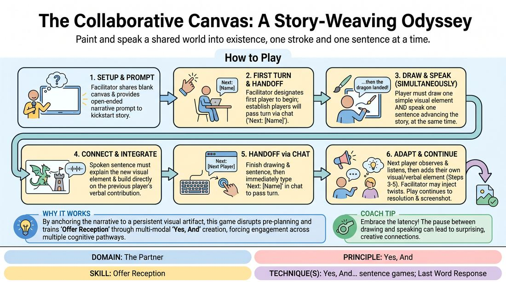

# The Illustrated Chronicle

{ .game-hero }

> Paint and speak a shared world into existence, one stroke and one sentence at a time.

## Overview
A virtual, multi-modal storytelling game where participants co-create a single, evolving digital illustration while weaving a cohesive narrative. Each player contributes a single visual element to a shared online canvas while simultaneously speaking a single sentence that advances the plot, transforming digital latency into a structured creative advantage.

## What It Trains
- **Domain:** D2 — The Partner
- **Principle(s):** Yes, And; Make Your Partner a Genius; Serve the Story; Group Mind
- **Skill(s):** Active Listening; Offer Reception; Active Gifting; Narrative Architecture; World-Building; Peripheral Awareness
- **Technique(s):** Last Word Response; Yes, And… sentence games; Endowment-gifting drills; Story Spine; C.R.O.W. (Character, Relationship, Objective, Where)
- **Focus:** narrative

**Objective:** To master the Yes, And principle by receiving and building upon both visual and verbal offers, developing narrative agility, active listening, and collaborative world-building in a virtual environment.

## At a Glance
| Aspect | Detail |
|---|---|
| Players | 6–12 (ideal 6-12) |
| Time | ~20 min |
| Complexity | 3/5 |
| Skill level | advanced_beginner |
| Energy | medium |
| Physicality | none |
| Modality | virtual |
| Space | minimal |
| Props | Zoom Whiteboard, Annotation Tools, Chat |
| Audience | not required |

## Setup
Set up a virtual meeting room with a shared digital whiteboard accessible to all participants. Ensure all players have annotation tools enabled and their chat window open. Instruct players to use gallery view to maintain visual connection.

## How to Play
1. The facilitator shares a blank digital whiteboard and provides an open-ended narrative prompt to kickstart the story.
2. The facilitator designates the first player to begin, establishing that players will pass the turn by typing Next: [Player Name] in the chat at the end of their turn to prevent virtual lag.
3. When called upon, a player must simultaneously draw one simple visual element on the whiteboard and speak exactly one sentence that advances the story.
4. The spoken sentence must directly explain or interact with the visual element the player is drawing, while building seamlessly on the previous player's verbal and visual contributions.
5. Once the player finishes their drawing and their sentence, they immediately type the next player's name in the chat to hand off the turn.
6. The next player observes the drawing, listens to the story, and adds their own visual element while delivering their connecting sentence.
7. Throughout the game, the facilitator may inject narrative prompts or plot twists to challenge the players to adapt their drawings and story beats.
8. Play continues until every player has contributed at least once and the story reaches a natural resolution, at which point the facilitator saves a screenshot of the completed digital masterpiece.

## Facilitation Notes
- Alleviate drawing anxiety by reminding players that artistic skill is completely irrelevant; simple stick figures, basic geometric shapes, or abstract scribbles are perfect narrative offers.
- Ensure players are drawing while speaking, rather than doing one after the other, to engage the brain in balancing both visual and verbal creation simultaneously.
- If the whiteboard becomes too crowded, use a multi-page whiteboard feature or gently guide players to draw in the negative space, treating the clutter as a narrative constraint.
- If a player's sentence is too vague, side-coach them with prompts like: Name the object you just drew! or How does your character feel about that tree?
- If a player hesitates too long while drawing, encourage them to make a bold, simple mark and let their voice explain what it is, keeping the momentum alive.

## Variations
- Blind Canvas: Players must close their eyes while drawing their element, then open them and immediately justify whatever chaotic shape they created within the story.
- Dialogue Bubbles: Instead of just speaking, players must use the text annotation tool to write a dialogue bubble for a character on the screen, reading it aloud as their sentence.
- Emotional Shift: The facilitator privately messages players in the chat with a specific emotion they must inject into both their drawing style and their spoken sentence.

## Debrief
- How did having to draw and speak at the same time change how you listened to the previous player's offer?
- Did you find yourself planning your drawing before your turn, and how did that affect your ability to Yes, And what actually happened right before you?
- How did we turn messy or unexpected drawings into brilliant narrative gifts?
- In what ways did the visual canvas help us maintain a shared reality compared to a purely verbal storytelling game?

## Safety & Inclusion
Ensure that players who may have physical or accessibility limitations using digital drawing tools are offered alternative ways to participate, such as verbally describing their visual addition for the facilitator to draw on their behalf, or using simple stamp tools instead of freehand drawing.

## Why It Works
This game works because it forces players to engage multiple cognitive pathways at once, disrupting the analytical editor mind that tries to pre-plan. By anchoring the verbal narrative to a persistent visual artifact, it eliminates the ephemeral nature of virtual speech, giving players a concrete, shared reality to Yes, And. The explicit chat-based turn-taking removes the anxiety of virtual interruption, allowing players to focus entirely on receiving and gifting offers.
