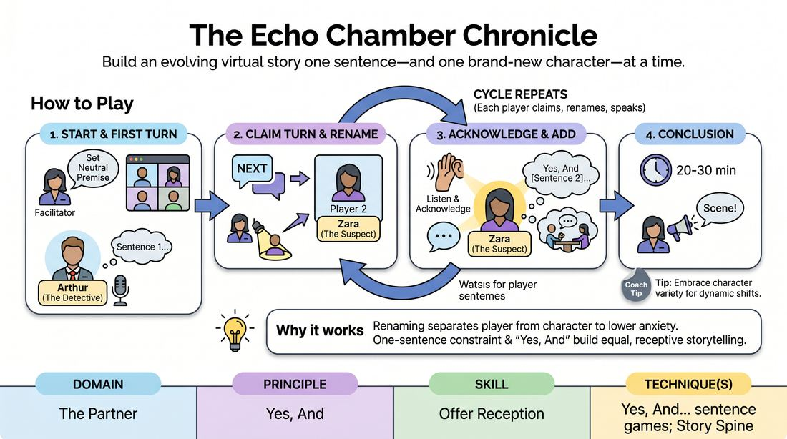

# The Persona Chronicle

{ .game-hero }

> Build an evolving virtual story one sentence—and one brand-new character—at a time.

## Overview
A fast-paced, virtual storytelling game where players collaboratively construct a narrative one sentence at a time. Before delivering their line, each player must rename themselves in the video platform to embody a brand-new character archetype, instantly shifting the story's perspective and depth.

## What It Trains
- **Domain:** D2 — The Partner
- **Principle(s):** Yes, And; Serve the Story; Group Mind
- **Skill(s):** Active Listening; Offer Reception; Narrative Architecture; World-Building
- **Technique(s):** Yes, And… sentence games; Story Spine; C.R.O.W. (Character, Relationship, Objective, Where)
- **Focus:** narrative

**Objective:** To master the 'Yes, And' principle by receiving a narrative offer and immediately building upon it from a newly assumed character perspective, sharpening active listening and rapid characterization.

## At a Glance
| Aspect | Detail |
|---|---|
| Players | 6–12 (ideal 6-12) |
| Time | ~30 min |
| Complexity | 3/5 |
| Skill level | advanced_beginner |
| Energy | medium |
| Physicality | low |
| Modality | virtual |
| Space | minimal |
| Props | none |
| Audience | not required |

## Setup
Conducted via a virtual video conferencing platform in Gallery View. All players should have their microphones muted by default. The facilitator acts as the host, managing the spotlight feature and monitoring the chat window. No physical props or materials are required, but players must have renaming permissions enabled.

## How to Play
1. The facilitator gathers a simple, neutral story premise from the group to establish the narrative starting point.
2. The first player is selected to begin and must quickly rename themselves on the video platform using the format: 'Name (Archetype/Trait)'—for example, 'Arthur (Paranoid Neighbor)'.
3. The facilitator spotlights this first player, who unmutes and delivers a single, opening sentence of the story in character, then mutes themselves.
4. To claim the next turn, any player who is ready types 'NEXT' in the chat. The facilitator monitors the chat to establish the clear speaking order based on who typed first.
5. The player who claimed the turn must immediately rename themselves to a completely new character archetype that makes sense in response to the previous sentence.
6. Once renamed, the player unmutes, visually or verbally acknowledges the previous line to show active listening, and then delivers exactly one sentence of story progression in their new character's voice.
7. The facilitator immediately spotlights the active speaker to focus the group's attention, removing the spotlight once they finish and mute.
8. The cycle repeats, with each subsequent player claiming a turn via chat, renaming themselves, acknowledging the previous offer, and contributing one sentence.
9. The facilitator brings the story to a satisfying conclusion after 20 to 30 minutes, or once every player has had multiple turns, by calling 'Scene!'

## Facilitation Notes
- To prevent technical lag during renaming, encourage players to have a few archetype ideas ready or use a shared chat document of quick traits they can copy-paste.
- Side-coach players to keep their contributions to exactly one sentence to maintain momentum and prevent single players from dominating the narrative.
- If the story loses cohesion, pause briefly to remind players of the 'Yes, And' rule: your character must validate the reality of the sentence immediately preceding yours before adding new information.
- As a facilitator, keep your spotlighting finger ready. Fast spotlighting creates a highly dynamic, television-like viewing experience for the rest of the gallery.

## Variations
- Emotional Echoes: Instead of archetypes, players must rename themselves with an extreme emotion (e.g., 'Sarah (Ecstatic)' or 'Tom (Terrified)') and deliver their sentence embodying that emotional state.
- The Callback Challenge: The facilitator can occasionally call out a previously established character name, forcing the current speaker to instantly rename themselves back to that character and react to how the story has changed.

## Debrief
- How did changing your name and archetype before speaking alter the way you received the previous player's offer?
- What challenges did you face in balancing your character's specific trait with the need to advance the shared story?
- How did the visual cue of seeing everyone's renamed characters in the gallery affect your sense of the story's world?

## Safety & Inclusion
Ensure all players are comfortable with the renaming feature before starting, and offer assistance or a simplified renaming format (such as typing the character name in chat instead) for players on mobile devices or those with limited technical accessibility.

## Why It Works
By forcing players to rename themselves before speaking, the game physically separates the player from their character, lowering performance anxiety. The strict one-sentence constraint ensures equal participation, while the 'Yes, And' requirement coupled with a new perspective prevents narrative stagnation and builds a rich, multi-faceted world.
