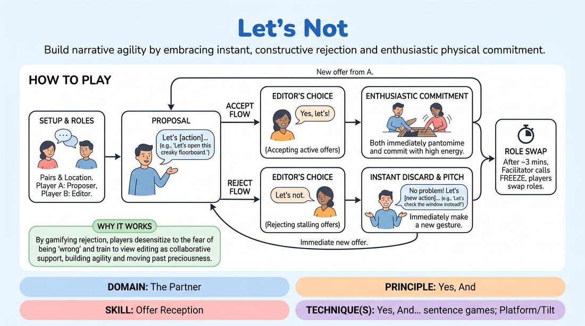

# Let's Not

{ .game-hero }

> Build narrative agility by embracing instant, constructive rejection and enthusiastic physical commitment.

## Overview
A dynamic, paired narrative exercise where players co-create a scene, but with a twist: one player acts as an active editor who instantly filters out passive offers. The proposing player must cheerfully discard rejected ideas without hesitation, immediately pitching fresh alternatives, while both players enthusiastically commit to any accepted actions. This fast-paced drill removes the fear of failure and sharpens the instinct for high-stakes, physical storytelling.

## What It Trains
- **Domain:** D2 — The Partner
- **Principle(s):** Yes, And; Serve the Story
- **Skill(s):** Offer Reception; Active Gifting; Narrative Architecture
- **Technique(s):** Yes, And… sentence games; Platform/Tilt
- **Focus:** skill_drill

**Objective:** To cultivate rapid offer reception and narrative editing skills. Players learn to detach their egos from their initial ideas, instantly recognize what makes an offer active and narrative-driving, and practice resilient, high-energy pivoting to serve the story.

## At a Glance
| Aspect | Detail |
|---|---|
| Players | 2+ (ideal Pairs) |
| Time | ~10 min |
| Complexity | 2/5 |
| Skill level | advanced_beginner |
| Energy | medium |
| Physicality | low |
| Modality | in_person |
| Space | minimal |
| Props | none |
| Audience | not required |

## Setup
Players stand in pairs facing each other with comfortable space to move. No props are required. The facilitator prepares a list of everyday or high-stakes starting locations (e.g., 'a dusty attic', 'the edge of a volcano') to kick off each pair's scene.

## How to Play
1. Divide players into pairs and assign each pair a starting location to establish their scene's environment.
2. Designate Player A as the Proposer and Player B as the Editor for the first round.
3. Player A initiates the action by making a physical and verbal suggestion starting with 'Let's...', such as 'Let's open this creaky floorboard.'
4. Player B must instantly decide to either accept the offer by saying 'Yes, let's!' or reject it by saying 'Let's not.'
5. To keep the game constructive, the Editor (Player B) must reject offers that stall the action (e.g., 'Let's sit and wait') and accept offers that introduce physical movement, high stakes, or immediate narrative progression.
6. If Player B accepts, both players immediately pantomime and commit to that action with high energy for a few seconds before Player A makes the next 'Let's...' proposal.
7. If Player B rejects, Player A must instantly drop the idea with a smile, showing no hesitation or disappointment, and immediately pitch a brand-new 'Let's...' offer.
8. After approximately three minutes of continuous play, the facilitator calls freeze, and the players swap roles so Player B becomes the Proposer and Player A becomes the Editor.

## Facilitation Notes
- Coaching Cue: 'Reject the stall, accept the action!' Guide Editors to reject passive, conversational offers (e.g., 'Let's talk about our feelings') and enthusiastically accept physical, high-stakes offers (e.g., 'Let's defuse this bomb'). This ensures rejection is a tool for narrative momentum, not arbitrary blocking.
- Coaching Cue: 'Drop it like a hot potato!' Remind Proposers to treat rejection as a helpful gift that saves them from a boring scene. There should be zero pause, sighing, or justification between a rejection and the next pitch.
- Pitfall: The Editor rejects too many times in a row, stalling the scene's momentum. Fix: Side-coach the Editor to never reject more than twice consecutively. The third offer must be accepted to keep the physical action flowing.
- Encourage players to fully embody the accepted actions. If the proposal is 'Let's climb this rope,' both players must physically pantomime climbing with full commitment, which builds shared physical reality.

## Variations
- Virtual Screen-Touch: In a remote setup, players use gallery view. When an offer is accepted, both players must perform the physical action within their camera frame. If rejected, the Proposer does a quick physical 'spin' or 'reset' gesture on camera to visually reset their energy before pitching the next idea.
- The Yes-And Progression: After an acceptance, players must build on the action with three rapid-fire 'Yes, and' physical details before the Proposer can make another 'Let's...' pitch.
- Bidirectional Editing: Both players can pitch 'Let's...' offers and both have the power to say 'Let's not' to each other, requiring high mutual trust and rapid-fire adaptation.

## Debrief
- How did it feel to have your ideas instantly rejected? What mental shift helped you let them go without ego?
- As the Editor, how did focusing on 'narrative momentum' change how you evaluated your partner's offers?
- How does this game change your perspective on self-editing and filtering your own ideas before you speak in a scene?

## Safety & Inclusion
Establish a clear boundary before playing: rejections are strictly narrative and directed at the fictional proposals, never at the player's personal identity, physical boundaries, or safety. If a proposal touches on a personal boundary, players can use a pre-established safety word or gesture to reset the scene immediately without question.

## Why It Works
While 'Yes, And' is the bedrock of improv, players often struggle with preciousness over their own ideas. By gamifying rejection, 'Let's Not' desensitizes players to the fear of being 'wrong' and trains them to view editing as a collaborative, positive filter. It sharpens their instinct for high-value, active gifts that propel the story forward rather than stalling it in polite agreement.
