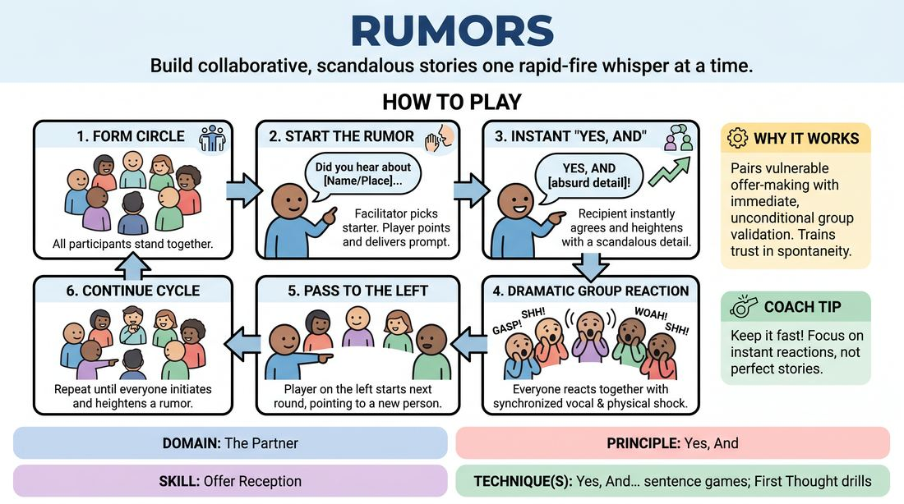

# The Rumor Mill

{ .game-hero }

> Build collaborative, scandalous stories one rapid-fire whisper at a time.

## Overview
A fast-paced, high-energy circle warm-up where players spread fictional, absurd gossip about imaginary subjects or everyday objects. Players practice instant agreement and heightening, supported by the collective, dramatic reactions of the entire group.

## What It Trains
- **Domain:** D2 — The Partner
- **Principle(s):** Yes, And; The First Thought Is a Gift; Group Mind
- **Skill(s):** Offer Reception; Unfiltered Spontaneity; Active Gifting; Support Work
- **Technique(s):** Yes, And… sentence games; First Thought drills; Endowment-gifting drills
- **Focus:** connection

**Objective:** To master the core 'Yes, And' mechanic by instantly accepting a partner's premise and immediately adding a new, escalating detail without overthinking.

## Setup
Have all players stand in a circle facing inward. No props or special materials are required; just a clear space where everyone can see and hear each other.

## How to Play
1. Form a standing circle with all participants.
2. The facilitator designates a starting player to initiate the first rumor.
3. The active player turns, points to another player in the circle, and delivers a rumor prompt starting with: 'Did you hear about...' followed by a person, place, or thing.
4. The pointed-to player must instantly agree and add a scandalous, absurd, or escalating detail starting with 'Yes, and...'
5. Immediately following this addition, the entire circle must react in unison with a dramatic, synchronized physical and vocal reaction, such as gasping, whispering, or giggling.
6. Once the reaction settles, the player standing directly to the left of the person who just answered starts the next round by pointing to a new player and launching a new rumor.
7. Continue the cycle around the circle until everyone has had a chance to both initiate and heighten a rumor.

## Facilitation Notes
- Encourage players to keep their initial rumor prompts simple and mundane to give their partner plenty of room to heighten.
- Remind players to respond instantly without filtering or planning; the first thought that comes to mind is always the best gift.
- If a player hesitates or gets stuck, side-coach them with: 'Say yes first, then let the next word surprise you!'
- Ensure the group reaction is loud and enthusiastic; this collective support removes the fear of making a 'bad' offer and builds group mind.
- Watch out for players trying to write a complex story in their head before it is their turn. Keep the tempo brisk to bypass the analytical brain.

## Variations
- Character Voices: Play the game where every rumor must be delivered and received in the style of stereotypical busybodies, complete with physical postures and exaggerated vocal tones.
- Targeting Group Members: Instead of fictional subjects, players spread harmless, highly positive, or absurdly fictional rumors about other players in the room, ensuring boundaries are set beforehand.
- The Chain Reaction: Instead of the player to the left starting the next round, the player who just answered immediately passes a new rumor to a different player, keeping the focus darting across the circle.

## Debrief
- How did it feel to have the entire group instantly support your idea with a massive gasp or laugh?
- What made it easier to come up with a heightening detail—a simple prompt or a highly complex one?
- How does committing to 'Yes, And' immediately relieve the pressure of having to be clever?

## Safety & Inclusion
If playing the variation where rumors are about actual group members, establish a clear boundary that all rumors must be entirely fictional, positive, or absurdly harmless. Ensure players can opt out of being the subject of a rumor by raising a hand or giving a non-verbal signal.

## Why It Works
This game works because it pairs the vulnerability of spontaneous offer-making with immediate, unconditional group validation. By forcing a 'Yes, And' structure and rewarding it with a collective group reaction, it conditions players to trust their first instincts and view every offer as a perfect gift.
