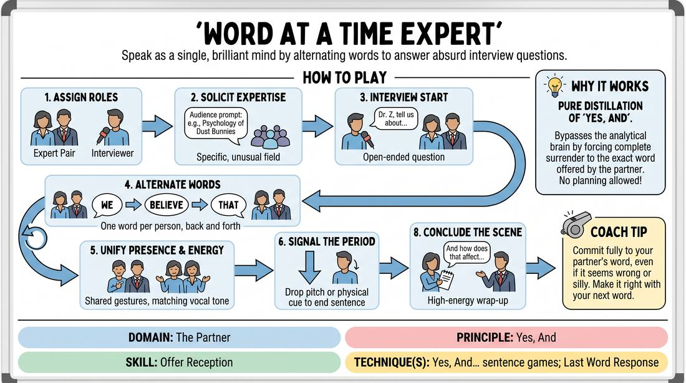

# The Two-Headed Expert

{ .game-hero }

> Speak as a single, brilliant mind by alternating words to answer absurd interview questions.

## Overview
Two players stand shoulder-to-shoulder to portray a single, world-renowned specialist, while a third player interviews them. The catch is that the expert must answer every question by alternating words, one at a time, to construct cohesive sentences. The result is a hilarious exercise in surrender, deep listening, and spontaneous collaboration.

## What It Trains
- **Domain:** D2 — The Partner
- **Principle(s):** Yes, And; Make Your Partner a Genius; Group Mind
- **Skill(s):** Active Listening; Offer Reception; Peripheral Awareness; Pacing & Rhythm
- **Technique(s):** Last Word Response; Yes, And… sentence games; Timing exercises
- **Focus:** comedy_game

**Objective:** To develop absolute offer reception and active listening by stripping away a player's ability to plan ahead, forcing them to fully commit to their partner's immediate contribution.

## At a Glance
| Aspect | Detail |
|---|---|
| Players | 3–4 (ideal 3) |
| Time | ~5 min |
| Complexity | 2/5 |
| Skill level | advanced_beginner |
| Energy | medium |
| Physicality | low |
| Modality | in_person |
| Space | minimal |
| Props | none |
| Audience | not required |

## Setup
Three players stand in the performance space. Two players stand close together, shoulder-to-shoulder, representing the "Expert." The third player stands slightly apart, facing them as the "Interviewer." No props or materials are required.

## How to Play
1. Assign roles: two players form the Expert, and one player acts as the Interviewer.
2. Ask the group or audience for a highly specific, unusual, or fictional field of expertise (e.g., 'The psychology of dust bunnies' or 'Advanced bubble wrap engineering').
3. The Interviewer begins the scene by introducing the Expert and asking an open-ended, curious question about their field.
4. The two Expert players must answer the question by alternating words, starting with one player saying a single word, the second saying the next word, and back and forth.
5. The Expert players must speak with a shared physical presence, using unified gestures and matching vocal energy to sell the illusion of being one person.
6. To end a sentence, the player speaking the final word must drop their vocal pitch or use a physical cue to signal a period, allowing the next sentence to start fresh.
7. The Interviewer listens closely to the answers, asking follow-up questions that build on the bizarre details the Expert provides.
8. Continue the interview for two to three minutes, aiming for a natural, high-energy conclusion before wrapping up.

## Facilitation Notes
- Coaching cue: 'Listen to the word that was actually said, not the one you hoped they would say.' Remind players to let go of their pre-planned sentences.
- Pitfall: Players pausing to think of the 'perfect' or funniest word. Fix: Encourage a steady, rhythmic pulse. A simple, grammatically logical word delivered quickly is always better than a clever word delivered after a long pause.
- Coaching cue: 'Support the grammar.' If your partner says 'The,' your job is to provide a noun or adjective, not to jump to a completely new thought.
- Encourage the Interviewer to actively listen and treat the Expert's absurd answers as absolute truth, raising the stakes of the interview.

## Variations
- The Oracle: Frame the two-headed character as an ancient, mystical entity answering deep, philosophical questions about life, love, and the future.
- Three-Headed Expert: Increase the challenge by having three players stand shoulder-to-shoulder, rotating the word-by-word delivery among three brains.
- Physical Mirroring: The two Expert players must mirror each other's hand gestures in real-time as they speak, heightening their physical connection.

## Debrief
- How did it feel to completely lose control over where the sentence was going?
- What did you have to do to make sure the sentences remained grammatically correct?
- How does this game illustrate the core concept of 'Yes, And' at its most basic level?

## Safety & Inclusion
Because this game traditionally requires players to stand shoulder-to-shoulder, check in on physical comfort levels beforehand. Players can easily play this standing a few feet apart, sitting in chairs, or using eye contact instead of physical contact to maintain their connection.

## Why It Works
This game is a pure distillation of 'Yes, And.' By limiting players to a single word at a time, it completely bypasses the analytical brain. Players cannot plan a joke or a narrative arc; they must fully receive the exact word offered by their partner and immediately build upon it to keep the sentence alive.
