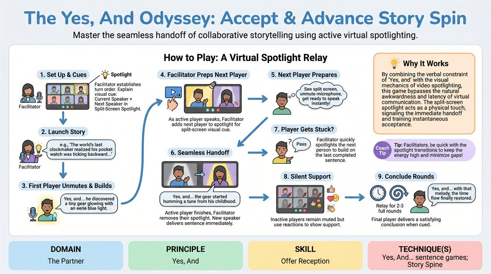

# Accept and Advance Relay

{ .game-hero }

> Master the seamless handoff of collaborative storytelling using active virtual spotlighting.

## Overview
A virtual-native storytelling drill where players build a cohesive narrative one sentence at a time. By utilizing the platform's spotlighting tools, the facilitator creates a visual 'baton pass' that eliminates digital latency and trains players to instantly accept and expand upon their partner's offers.

## What It Trains
- **Domain:** D2 — The Partner
- **Principle(s):** Yes, And; Make Your Partner a Genius; Serve the Story; Group Mind
- **Skill(s):** Active Listening; Offer Reception; Active Gifting; Narrative Architecture; Peripheral Awareness
- **Technique(s):** Yes, And… sentence games; Story Spine; Thread-tracking drills
- **Focus:** skill_drill

**Objective:** To internalize the 'Yes, And' rule of narrative progression, practice active listening under virtual constraints, and master the physical and verbal handoff of story offers.

## At a Glance
| Aspect | Detail |
|---|---|
| Players | 5–10 (ideal 5-10) |
| Time | ~15 min |
| Complexity | 2/5 |
| Skill level | novice |
| Energy | medium |
| Physicality | none |
| Modality | virtual |
| Space | minimal |
| Props | none |
| Audience | not required |

## Setup
Set up a virtual meeting room with all participants in grid view. Ensure the facilitator has host privileges to manage video spotlighting. Establish a clear speaking order in the chat or by renaming participants with numbers (e.g., '1 - Alex', '2 - Taylor'). All players start muted with cameras on.

## How to Play
1. The facilitator establishes the turn order and explains the visual cue: the current speaker will be spotlighted, and the next speaker will be added to the spotlight as a visual warning to unmute.
2. The facilitator launches the story with a single, high-stakes narrative sentence (e.g., 'The world's last clockmaker realized his pocket watch was ticking backward').
3. The facilitator spotlights the first player, who must immediately unmute and begin their sentence with 'Yes, and...' to accept the premise and advance the plot.
4. As the active player speaks, the facilitator adds the next player in the sequence to the spotlight, creating a split-screen visual cue.
5. The next player, seeing themselves spotlighted alongside the speaker, unmutes and prepares to speak without delay.
6. The moment the active speaker finishes their single sentence, the facilitator removes their spotlight, leaving only the new speaker, who immediately delivers their 'Yes, and...' line.
7. If a player gets stuck, they may say 'Pass,' prompting the facilitator to quickly spotlight the next person in line to build on the last completed sentence.
8. Unactive players keep their microphones muted but use silent digital reactions (like thumbs-up or heart emojis) to support the story.
9. The relay continues for two to three full rounds until the final player is cued to deliver a satisfying concluding sentence.

## Facilitation Notes
- Coaching Cue: Remind players that 'Yes, and' is a mindset. The 'Yes' must explicitly validate the previous sentence's reality, and the 'And' must introduce a new, concrete detail that moves the action forward.
- Pitfall: Facilitator lag in spotlighting. Fix: Keep the participant list open and hover over the next player's 'More' button early so you can add them to the spotlight 3-4 words before the current speaker finishes.
- Pitfall: Players writing their lines in advance. Fix: Remind the group that they cannot plan their line because they don't know what the person immediately before them will say. Encourage them to listen to the very last word.
- Coaching Cue: If a player makes a passive addition (e.g., 'Yes, and it was nice'), side-coach with: 'Make a bold move! What happens next?'

## Variations
- Emotion Pass: The facilitator chats a specific emotion to the next speaker privately, and they must deliver their 'Yes, and' line embodying that emotion.
- Blind Relay: Instead of a pre-set order, the active speaker calls out the name of the next storyteller at the end of their sentence, requiring the facilitator to spotlight them rapidly.
- Object Gifting: Each player must introduce a physical object from their real-world desk space into the virtual story when it is their turn.

## Debrief
- How did the visual cue of being spotlighted affect your readiness to speak compared to waiting for a verbal cue?
- What is the difference between merely agreeing with the previous line and actually advancing the narrative?
- How did it feel to let go of your planned ideas and react purely to the offer made right before your turn?

## Safety & Inclusion
Ensure players know that 'Pass' is a completely valid, shame-free option to keep the energy high and reduce performance anxiety. For players with slower internet connections or physical limitations in unmuting quickly, the facilitator can allow them to remain unmuted throughout the game or use a simple hand gesture as their cue.

## Why It Works
By combining the verbal constraint of 'Yes, and' with the visual mechanics of video spotlighting, this game bypasses the natural awkwardness and latency of virtual communication. The split-screen spotlight acts as a physical touch, signaling safety and readiness, which allows the brain to focus entirely on active listening and immediate offer reception.
