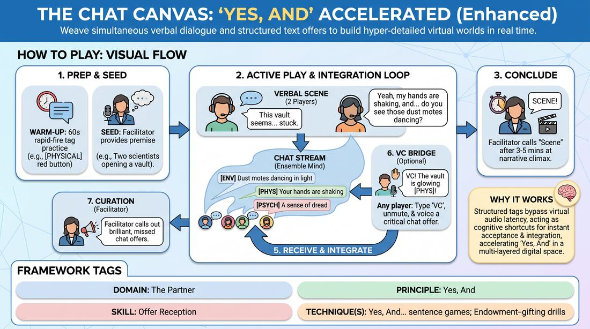

# The Dual-Channel Canvas

{ .game-hero }

> Weave simultaneous verbal dialogue and structured text offers to build hyper-detailed virtual worlds in real time.

## Overview
This high-energy virtual training game transforms the video-conferencing chat box into a secondary narrative engine. While active players speak, the rest of the ensemble feeds in real-time environmental, physical, and psychological details using specific text tags. The result is a rich, multi-layered scene where verbal and written offers continuously collide and elevate one another.

## What It Trains
- **Domain:** D2 — The Partner
- **Principle(s):** Yes, And; Make Your Partner a Genius; Show, Don't Tell; Base Reality First; Group Mind
- **Skill(s):** Active Listening; Offer Reception; Active Gifting; World-Building; Peripheral Awareness
- **Technique(s):** Yes, And… sentence games; Endowment-gifting drills; C.R.O.W. (Character, Relationship, Objective, Where); Thread-tracking drills
- **Focus:** skill_drill

**Objective:** To master rapid offer reception and active listening across multiple sensory inputs, training players to instantly validate and integrate diverse narrative gifts without interrupting the verbal flow.

## At a Glance
| Aspect | Detail |
|---|---|
| Players | 5–9 (ideal 5-9) |
| Time | ~15 min |
| Complexity | 4/5 |
| Skill level | competent |
| Energy | high |
| Physicality | low |
| Modality | virtual |
| Space | minimal |
| Props | none |
| Audience | not required |

## Setup
Conducted in a virtual meeting space. All players must use Gallery View, keep their chat window open and pinned to the side, and have their microphones ready to unmute instantly. No physical props or special software are required.

## How to Play
1. Warm-Up Drill: The facilitator calls out a location, such as a submarine kitchen, and for 60 seconds all players rapidly type tagged offers into the chat to practice the formatting without speaking.
2. Establish the Seed: The facilitator or an off-screen player provides a simple, active starting premise, such as two scientists opening a mysterious vault.
3. Initiate the Verbal Scene: Two players begin a standard verbal scene based on the premise, keeping their dialogue paced to allow for visual processing.
4. Deploy the Chat Stream: The remaining players, acting as the ensemble mind, immediately begin typing short, single-sentence offers into the chat, prefaced by one of four specific tags: [ENV] for environmental details, [PROP] for physical objects, [THOUGHT] for a character's inner monologue, or [YESAND] to directly build on a spoken line.
5. Receive and Integrate: The active verbal players must read the incoming chat stream while speaking, seamlessly weaving the written details into their spoken dialogue and physical reactions.
6. The Verbalizing Chat (VC) Bridge: If any player sees a chat offer that must be brought to the verbal forefront immediately, they type VC in the chat, unmute, and speak that offer aloud as part of the scene.
7. Facilitator Curation: The facilitator monitors both channels and may occasionally call out a brilliant, unacknowledged chat offer to prompt the verbal players to integrate it.
8. Conclude the Tapestry: The facilitator calls Scene after 3 to 5 minutes once a satisfying, highly detailed narrative climax is reached.

## Facilitation Notes
- Coaching Cue: Keep chat offers to a single, punchy sentence. Long paragraphs clog the stream and increase cognitive load.
- Pitfall & Fix: Players get screen-stare and lose physical expression. Fix: Remind players to physically react to the chat offers, such as shivering when an [ENV] tag says the room is freezing.
- Coaching Cue: Use the [YESAND] tag to validate a partner's verbal offer instantly, bypassing audio lag.
- Pitfall & Fix: Verbal players ignore the chat entirely. Fix: The facilitator should actively pause the verbal flow and say, Incorporate the last [PROP] offer right now! to build the habit.

## Variations
- Tag-Out Takeover: Off-screen players can use a [SWAP] tag in chat to instantly replace one of the active verbal players, stepping into their character's shoes with the same physical setup.
- Silent Symphony: Run the entire scene in silence for the first two minutes, using only chat tags and physical reactions, before unmuting to resolve the story verbally.
- Character Subtext Only: Limit the chat tags strictly to [THOUGHT], forcing the verbal players to navigate a subtext-heavy scene where they know exactly what their partner is secretly thinking.

## Debrief
- How did managing two streams of information change your focus compared to a standard verbal scene?
- What strategies did you use to read the chat without losing your physical connection to your scene partner?
- How did the structured tags help you categorize and accept offers more quickly?

## Safety & Inclusion
Ensure players are comfortable with rapid visual scanning; if any player has visual processing or typing difficulties, they can participate purely verbally or be designated as the Voice of the Chat to read out text offers. Keep the chat content respectful and aligned with group boundaries.

## Why It Works
By separating the generation of details from the verbal dialogue, this game bypasses the audio latency of virtual platforms. The structured tags act as cognitive shortcuts, allowing players to instantly categorize and accept offers, which accelerates the Yes, And cycle and builds a highly cohesive group mind.
