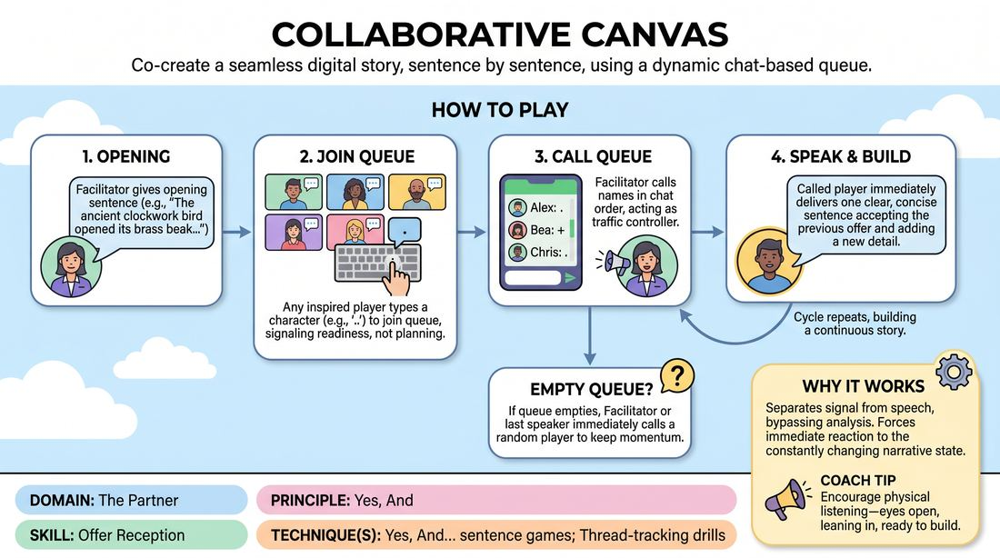

# The Narrative Canvas

{ .game-hero }

> Co-create a seamless digital story, sentence by sentence, using a dynamic chat-based queue.

## Overview
The Narrative Canvas is a virtual storytelling game where players collaborate to build a cohesive story one sentence at a time. By utilizing a text-based chat queue to signal the desire to speak, players bypass the typical lag and conversational overlap of online platforms. The result is a fast-paced, highly engaging exercise in deep listening, immediate offer acceptance, and collective imagination.

## What It Trains
- **Domain:** D2 — The Partner
- **Principle(s):** Yes, And; Serve the Story; Group Mind
- **Skill(s):** Active Listening; Offer Reception; Narrative Architecture; Peripheral Awareness
- **Technique(s):** Yes, And… sentence games; Thread-tracking drills
- **Focus:** skill_drill

**Objective:** To train rapid offer reception and active listening by requiring players to fully accept the immediately preceding sentence and build directly upon it without pre-planning.

## Setup
Set up a virtual meeting room with all participants in gallery view. Ensure the text chat panel is open and visible to everyone. The facilitator should prepare a few narrative-starting prompts.

## How to Play
1. The facilitator establishes the virtual space, ensuring everyone is in gallery view with their chat windows open.
2. To maintain a brisk pace and eliminate muting lag, all players keep their microphones unmuted throughout the game, provided they are in a quiet environment.
3. The facilitator provides an evocative opening sentence to launch the story (e.g., 'The ancient clockwork bird suddenly opened its brass beak and spoke in a human whisper.').
4. Any player who feels inspired to add the next sentence types a single character (such as a period '.' or '+') into the chat window to join the queue.
5. Players must not pre-plan their sentences; entering the queue simply signals their readiness to receive whatever offer is active when their turn arrives.
6. The facilitator acts as the traffic controller, calling out the names of the players in the exact order their characters appear in the chat queue.
7. When called, the player immediately delivers exactly one clear, concise sentence that directly accepts and builds upon the previous player's contribution.
8. If the chat queue ever empties mid-story, the facilitator immediately calls on a random player to keep the momentum alive, or the last speaker prompts the next by asking a quick, in-character question.

## Facilitation Notes
- To prevent audio lag, encourage players to remain unmuted. If background noise forces a player to mute, coach them to unmute the moment they enter the chat queue, rather than waiting for their name to be called.
- Keep a watchful eye on the chat queue. If the queue dries up, don't let the story stall; instantly throw the spotlight to a player who hasn't spoken recently by saying, 'And then, [Name]...'
- Watch out for 'blocking' or 'pivoting' where a player ignores the previous sentence to force their own pre-planned idea. If this happens, gently side-coach: 'Accept that last detail and build from there!'
- Remind players to keep their contributions to a single sentence. If a player starts telling a whole paragraph, gently raise a hand or say 'Just one sentence!' to keep the game equitable.

## Variations
- Genre Shift: The facilitator types a new genre (e.g., 'Sci-Fi', 'Noir', 'Fairy Tale') into the chat mid-story, and the next speakers must instantly adapt the tone.
- Word Limit: Restrict each contribution to a maximum of ten words to force extreme conciseness and high-impact choices.
- Pass the Baton (Large Groups): For groups larger than eight, split the room into active tellers and 'chat-reactors' who drop emojis to guide the emotional tone of the story.

## Debrief
- How did keeping your microphone unmuted (or unmuting early) affect the rhythm and momentum of the story?
- What happened to your pre-planned ideas when the person right before you took the story in a completely unexpected direction?
- How did we handle moments when the queue emptied, and how did that spontaneous hand-off feel?

## Safety & Inclusion
For players with visual impairments or motor-control challenges who cannot easily type in the chat, establish an alternative cue (such as raising a physical hand, using a built-in 'raise hand' icon, or making a specific sound) to enter the queue. The facilitator or a designated co-host will manually insert them into the sequence.

## Why It Works
By separating the signal to speak (typing a character) from the actual delivery, the game short-circuits the analytical mind. Players cannot plan ahead because the narrative state changes right before they speak. This forces pure offer reception and active listening, while the single-sentence constraint lowers the stakes, making creative risk-taking safe and accessible.
