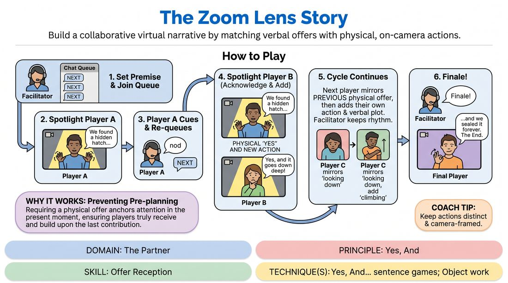

# The Focal Point Story

{ .game-hero }

> Build a collaborative virtual narrative by matching verbal offers with physical, on-camera actions.

## Overview
A collaborative storytelling game designed for virtual spaces where players build a cohesive narrative one or two sentences at a time. Each storyteller must contribute both a verbal plot point and a distinct, camera-framed physical action, which the next player must physically and verbally 'Yes, And'. The facilitator uses the platform's spotlight feature to shift the group's focus dynamically, creating a cinematic, shared experience.

## What It Trains
- **Domain:** D2 — The Partner
- **Principle(s):** Yes, And; Make Your Partner a Genius; Serve the Story; Group Mind
- **Skill(s):** Physicality & Space Work; Active Listening; Offer Reception; Narrative Architecture; World-Building; Peripheral Awareness
- **Technique(s):** Object work; Yes, And… sentence games; Story Spine; Thread-tracking drills
- **Focus:** mixed

**Objective:** To develop deep offer reception and physical listening skills in a virtual environment, training players to treat both verbal statements and physical gestures as vital narrative offers that must be accepted and built upon.

## At a Glance
| Aspect | Detail |
|---|---|
| Players | 6–12 (ideal 6-12) |
| Time | ~15 min |
| Complexity | 2/5 |
| Skill level | novice |
| Energy | medium |
| Physicality | low |
| Modality | virtual |
| Space | minimal |
| Props | none |
| Audience | not required |

## Setup
An online video meeting with all participants on camera in gallery view. The facilitator must have host privileges to spotlight individual video feeds. Participants should position their cameras so their head, shoulders, and hands are clearly visible within the frame. The text chat panel must be open for managing the turn order.

## How to Play
1. The facilitator establishes a narrative genre or starting premise (e.g., 'a high-stakes space mission' or 'discovering a hidden room') to give the story a clear direction.
2. The facilitator explains the turn-taking queue: players who wish to speak next will type 'NEXT' in the chat panel, creating a visible, orderly line of storytellers.
3. The facilitator spotlights the first player from the queue, making their video feed the primary focus for the entire group.
4. The spotlighted player delivers one to two sentences of the story while simultaneously performing a clear, camera-friendly physical action or facial expression that illustrates their words.
5. The active player concludes their turn with a simple visual cue (like a nod or a hand gesture) and types 'NEXT' in the chat to rejoin the queue.
6. The facilitator immediately spotlights the next player in the chat queue, who must begin by physically and verbally acknowledging the previous player's offer.
7. This new player integrates the previous physical gesture into their own action before introducing a new physical movement and continuing the story with one or two sentences.
8. The cycle continues with the facilitator rapidly spotlighting the next queued player, maintaining a steady, rhythmic narrative flow.
9. After several rounds of collaborative building, the facilitator calls out 'Finale!' to signal the next queued player to bring the story to a satisfying resolution.

## Facilitation Notes
- Keep the spotlight transitions fast. The facilitator should have their mouse ready over the next player's video feed to minimize dead air and maintain narrative momentum.
- If a player forgets to include a physical action, gently side-coach them with: 'Show us what that looks like in your frame!' to reinforce the physical 'Yes, And'.
- Ensure players are not just mimicking the previous action, but justifying it. For example, if the previous player reached out to touch something, the next player might start by reacting to the texture of what was touched.
- Manage the chat queue actively. If multiple players type 'NEXT' at once, simply follow the chronological order of the chat log to keep the process fair and stress-free.

## Variations
- Emotional Shift: The facilitator types an emotion in the chat (e.g., 'Fear', 'Joy') right before spotlighting a player, forcing them to adapt the physical and verbal tone of the story instantly.
- Prop Pass: Players must use a common household object within their camera frame, passing it off-screen to the left, while the next player must 'receive' it from the right side of their screen.

## Debrief
- How did focusing on your partner's physical movement change how you listened to their verbal story?
- What challenges did you face when trying to 'Yes, And' a physical offer through a flat screen, and how did you overcome them?
- How did the spotlight mechanic affect your sense of presence and focus compared to a standard group conversation?

## Safety & Inclusion
Ensure players are aware they can adapt physical actions to their comfort and mobility levels; small facial expressions or subtle head tilts are just as valuable as large hand gestures. If a player cannot use their camera, they can describe their physical action verbally, and the next player can physicalize it.

## Why It Works
By requiring both a verbal and physical contribution, the game prevents players from pre-planning their lines. They must actively watch the screen to receive the physical offer, which anchors their attention in the present moment. The spotlight mechanic mimics a cinematic edit, reducing peripheral distractions and heightening the group's collective focus on a single, shared reality.
