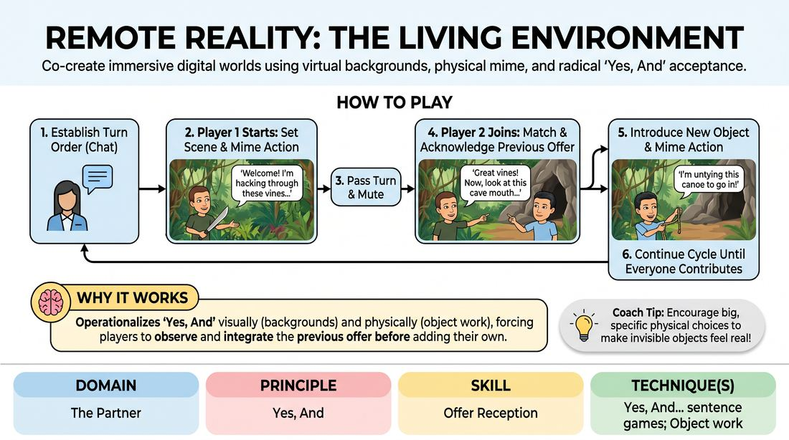

# Background Biomes

{ .game-hero }

> Co-create immersive digital worlds using virtual backgrounds, physical mime, and radical 'Yes, And' acceptance.

## Overview
Background Biomes is a virtual-first improv game where players collaboratively construct a shared physical environment using their video platform's virtual background feature. One by one, players step into the spotlight, matching or expanding the established setting while physically interacting with invisible objects. The result is a highly engaging, visually rich group environment built entirely from individual digital contributions.

## What It Trains
- **Domain:** D2 — The Partner
- **Principle(s):** Yes, And; Show, Don't Tell; Base Reality First
- **Skill(s):** Physicality & Space Work; Active Listening; Offer Reception; World-Building
- **Technique(s):** Object work; Yes, And… sentence games; C.R.O.W. (Character, Relationship, Objective, Where)
- **Focus:** mixed

**Objective:** To develop deep offer reception and physical world-building in a virtual space. Players practice 'Yes, And' by visually matching their partner's environmental choices and verbally/physically validating previous physical offers before introducing their own.

## Setup
Players join a virtual meeting room with their cameras on, set to grid view. All players must have the ability to change their virtual backgrounds quickly (either using pre-saved images or a built-in search tool). The facilitator prepares to use the text chat to manage the turn order and keep the pace active.

## How to Play
1. The facilitator selects the first player and types their name into the text chat to establish the turn order.
2. The first player unmutes, announces 'Welcome to our world!', and immediately changes their virtual background to establish the initial setting (e.g., a dense jungle, a submarine interior, or a medieval castle).
3. This first player then physically mimes interacting with an invisible object in their environment for 5 to 10 seconds, describing their action aloud (e.g., 'I am carefully harvesting this glowing blue moss from the cave wall').
4. The first player passes the turn by calling out the next player's name, then mutes their microphone.
5. The next player unmutes and immediately changes their virtual background to match or logically extend the previous player's setting (e.g., moving from the cave wall to a subterranean river).
6. This player must first verbally and physically acknowledge the previous player's action or object (e.g., 'Ah, that glowing moss will light our way down this dark river!') to demonstrate active offer reception.
7. The active player then introduces a new invisible object through physical mime and verbal description (e.g., 'Let me untie this wooden canoe so we can head downstream').
8. The active player passes the turn to the next person listed in the chat, and the cycle continues until all players have contributed to the shared environment.

## Facilitation Notes
- Side-coaching cue: 'See the object, feel the weight!' Encourage players to use precise physical space work (object work) rather than just talking about the items.
- Pitfall: Technical lag or hesitation when changing backgrounds. Fix: Have players pre-load a folder of 5-10 diverse background images before the session starts, or allow a 5-second grace period where they mime searching for the background.
- Side-coaching cue: 'Yes, and the space!' Remind players that their background choice must directly relate to the previous player's setting, avoiding abrupt jumps (e.g., don't jump from a deep-sea trench to outer space unless there is a clear narrative bridge).
- Pitfall: Players ignoring the previous player's offer. Fix: Gently pause the game and ask the current player, 'How can you use or reference what the last person just did before you add your new item?'

## Variations
- Emotional Climate: Players must match not only the physical environment but also the emotional tone or temperature established by the first player (e.g., spooky, high-tech suspense, or serene calm).
- Object Passing: Instead of just referencing the previous object, players must physically 'pass' their mimed object across the screen border to the next player, who must 'receive' it in their frame before changing their background.

## Debrief
- How did matching the virtual background change how you listened to and visualized your partner's physical offers?
- What challenges did you face when trying to 'Yes, And' both a visual background and a spoken/mimed action simultaneously?
- How does establishing a clear physical environment (Base Reality) make it easier to find characters and stories in a scene?

## Safety & Inclusion
Ensure players who cannot use virtual backgrounds due to hardware limitations can participate by verbally describing their 'imagined background' or holding up a hand-drawn sketch to their camera. Encourage low-physicality options for the mime portion to accommodate all mobility levels.

## Why It Works
This game operationalizes 'Yes, And' on two distinct levels: visual (the background) and physical/narrative (the object work). By forcing players to wait, observe, and explicitly integrate the previous player's physical offer before adding their own, it builds high-level offer reception. Using the text chat for turn-taking bypasses audio latency, turning a common virtual limitation into a structured, low-friction gameplay mechanic.
