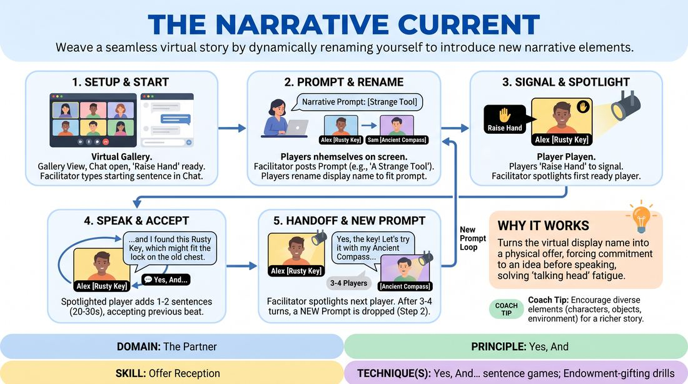

# The Rename Relay

{ .game-hero }

> Weave a seamless virtual story by dynamically renaming yourself to introduce new narrative elements.

## Overview
A virtual collaborative storytelling game where players use their video conferencing display names as dynamic narrative offers. By renaming themselves to represent characters, objects, or environmental details, participants inject fresh elements into an evolving story, taking turns spotlighting their contributions in a continuous, flowing chain.

## What It Trains
- **Domain:** D2 — The Partner
- **Principle(s):** Yes, And; Serve the Story; Group Mind
- **Skill(s):** Active Listening; Offer Reception; Active Gifting; Narrative Architecture; Pacing & Rhythm
- **Technique(s):** Yes, And… sentence games; Endowment-gifting drills; Timing exercises
- **Focus:** narrative

**Objective:** To master rapid offer reception and seamless 'Yes, And' integration in a virtual environment, training players to instantly accept and build upon both verbal and visual cues.

## Setup
A virtual meeting platform with Gallery View enabled, participant renaming permitted, and the host capable of spotlighting and monitoring the chat and 'Raise Hand' features. No physical props or space required.

## How to Play
1. The facilitator establishes the virtual space in Gallery View, ensuring all participants have permission to rename themselves and know how to use the 'Raise Hand' and chat features.
2. The facilitator launches the story by typing a starting sentence in the chat and reading it aloud to set the initial scene.
3. The facilitator immediately posts the first 'Narrative Prompt' in the chat, directing players to introduce a specific type of element, such as a strange tool or an unexpected visitor.
4. Players brainstorm an element that fits the prompt and immediately change their display name to reflect it, for example, 'Alex [The Rusty Key]'.
5. Once renamed, players use the platform's 'Raise Hand' feature to signal to the facilitator that they are ready to enter the story.
6. The facilitator spotlights the first player with a raised hand, who has 20 to 30 seconds to deliver one or two sentences that accept the previous story beat and integrate their renamed element.
7. As the active speaker finishes their contribution, the facilitator spotlights the next player in the queue, creating a visual handoff that signals the next speaker to immediately continue the narrative without awkward pauses.
8. After three or four players have contributed, the facilitator drops a new 'Narrative Prompt' into the chat, prompting players to rename themselves again with new elements and raise their hands to continue the cycle.

## Facilitation Notes
- Coaching Cue: Remind players to 'Speak the name!' They must verbally reference the element in their display name, rather than just letting it sit on screen.
- Technical Flow: To minimize latency, the facilitator should spotlight the next speaker 2-3 seconds before the current speaker finishes their sentence, creating a smooth visual crossfade.
- Pitfall: Players getting stuck trying to write the perfect name. Fix: Encourage them to go with their first instinct; simple, concrete nouns work better than complex concepts.
- Narrative Drift: If the story loses its thread, the facilitator can briefly unmute to summarize the current state of the plot before dropping the next prompt.

## Variations
- Blind Elements: The facilitator private-messages different prompts to individual players, so the group doesn't know what category of element is being introduced until the player renames themselves.
- Status Shift: Players must append a status level from 1 to 10 to their renamed element and play the scene with that status dynamic.
- Genre Shift: The facilitator changes the genre of the story mid-way through via the chat, forcing players to adapt their renamed elements to the new style.

## Debrief
- How did seeing the upcoming speaker's renamed element before they spoke affect how you listened to the current speaker?
- What strategies helped you seamlessly integrate your renamed element without derailing the existing plot?
- How did the visual spotlight transition affect the rhythm and pacing of our virtual collaboration compared to standard unmuting?

## Safety & Inclusion
Ensure all participants are comfortable with the renaming feature and that the facilitator monitors names to prevent any inappropriate or exclusionary language. If a participant has technical difficulty renaming themselves, they can type their element in the chat, and the facilitator can read it or rename them manually.

## Why It Works
This game leverages the unique constraints of virtual platforms to solve the 'talking head' fatigue of online improv. By turning the display name into a physical offer, it forces players to commit to an idea before they even speak. The combination of visual cues (the name change and raised hand) and technical facilitation (spotlighting) replaces the physical eye contact of an in-person stage, creating a highly structured, low-friction environment for practicing rapid 'Yes, And' narrative building.
