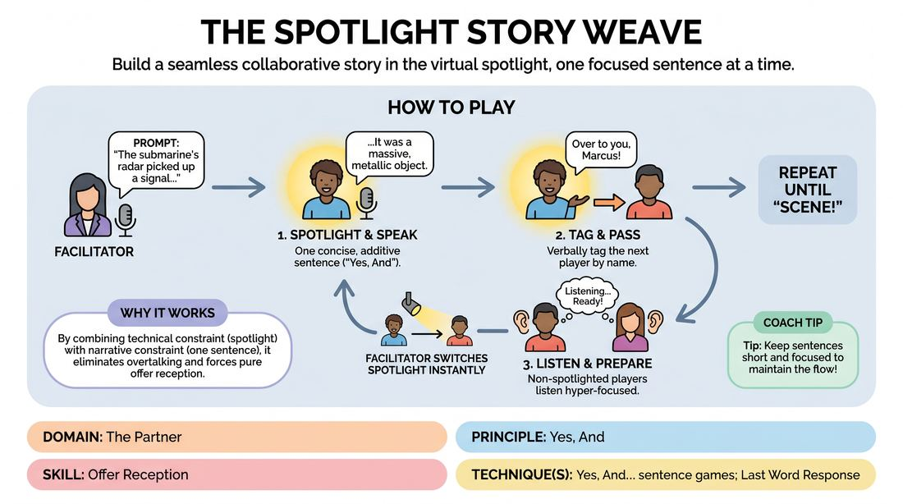

# Spotlight Story-Weaving

{ .game-hero }

> Build a seamless collaborative story in the virtual spotlight, one focused sentence at a time.

## Overview
Spotlight Story-Weaving is a virtual narrative game where players collaboratively construct a cohesive story under the literal digital spotlight. A facilitator dynamically shifts the platform's spotlight feature to match whoever is currently speaking, creating a highly focused, television-like broadcast experience. Players must listen intently, deliver a single constructive sentence, and pass the baton to a peer, keeping the momentum alive.

## What It Trains
- **Domain:** D2 — The Partner
- **Principle(s):** Yes, And; Make Your Partner a Genius; Serve the Story; Group Mind
- **Skill(s):** Active Listening; Offer Reception; Narrative Architecture; Pacing & Rhythm
- **Technique(s):** Last Word Response; Yes, And… sentence games; Story Spine; Timing exercises
- **Focus:** narrative

**Objective:** To develop rapid offer reception and disciplined 'Yes, And' narrative building in a virtual environment, while training active listening and minimizing digital crosstalk.

## At a Glance
| Aspect | Detail |
|---|---|
| Players | 5–10 (ideal 5-10) |
| Time | ~15 min |
| Complexity | 2/5 |
| Skill level | novice |
| Energy | medium |
| Physicality | none |
| Modality | virtual |
| Space | minimal |
| Props | none |
| Audience | not required |

## Setup
Players join a virtual video meeting. Everyone must turn their cameras on and set their view to 'Gallery View' so they can see all participants. The facilitator must have host privileges and be comfortable using the platform's 'Spotlight' or 'Pin for Everyone' feature. No physical props or materials are required.

## How to Play
1. The facilitator establishes the premise of the story with a single, open-ended prompt (e.g., 'The submarine's radar picked up a signal that shouldn't exist...').
2. The facilitator immediately spotlights the first player, making their video feed the primary focus for all participants.
3. The spotlighted player must deliver exactly one complete, concise sentence that directly accepts and builds upon ('Yes, Ands') the established premise.
4. At the end of their sentence, the active player must verbally tag another participant by name (e.g., '...and that's when the hatch began to creak. Over to you, Marcus!').
5. The facilitator must instantly switch the platform's spotlight to the named participant (Marcus), passing the digital baton.
6. The newly spotlighted player immediately delivers their single-sentence contribution, building directly on the previous line, and tags the next player.
7. Players who are not spotlighted must practice hyper-focused listening, remaining silent and ready to react instantly if their name is called.
8. The cycle continues for several rounds, ensuring every player has contributed multiple times, until the facilitator calls 'Scene!' to bring the story to a satisfying conclusion.

## Facilitation Notes
- As the facilitator, practice the technical mechanics beforehand. The transition of the spotlight must be as instantaneous as possible to maintain narrative momentum.
- Side-coach players to keep their contributions to a single, impactful sentence. If a player begins to monologue, gently cue them to 'tag your partner' to keep the pace brisk.
- If a player experiences a brief lag or freeze, the facilitator should step in as a narrator to bridge the gap, or immediately spotlight a different player to keep the energy high.
- Encourage players to use physical gestures (like pointing at the camera or passing an imaginary object) when tagging to give the facilitator a visual cue a split-second before the name is spoken.

## Variations
- Genre Shift: The facilitator periodically calls out a new genre (e.g., 'Sci-Fi!', 'Noir!', 'Soap Opera!') mid-story, and the next spotlighted player must immediately adapt their tone.
- The Chat Queue: Instead of verbal tagging, players type a single-word emotional prompt in the chat, and the facilitator spotlights whoever typed the most compelling prompt next.
- Character Renaming: Once a player introduces a character, the next tagged player must rename themselves on the platform to that character's name and play their turn in character.

## Debrief
- How did knowing you could be spotlighted at any second change the way you listened to the story?
- What made a tag-off easy to build upon versus difficult to build upon?
- How did the visual focus of the spotlight affect your sense of presence and performance pressure?

## Safety & Inclusion
Ensure all players are comfortable with having their video spotlighted. If a participant has bandwidth issues or prefers not to be spotlighted, they can participate via audio-only, with the facilitator announcing their turn verbally, or they can opt to act as the 'scribe' in the chat.

## Why It Works
By combining the technical constraint of the spotlight feature with the narrative constraint of a single sentence, the game eliminates the common virtual pitfall of talking over one another. It forces players to practice pure offer reception because they cannot plan their line in advance; they must adapt to the exact state of the story the moment the spotlight lands on them.
