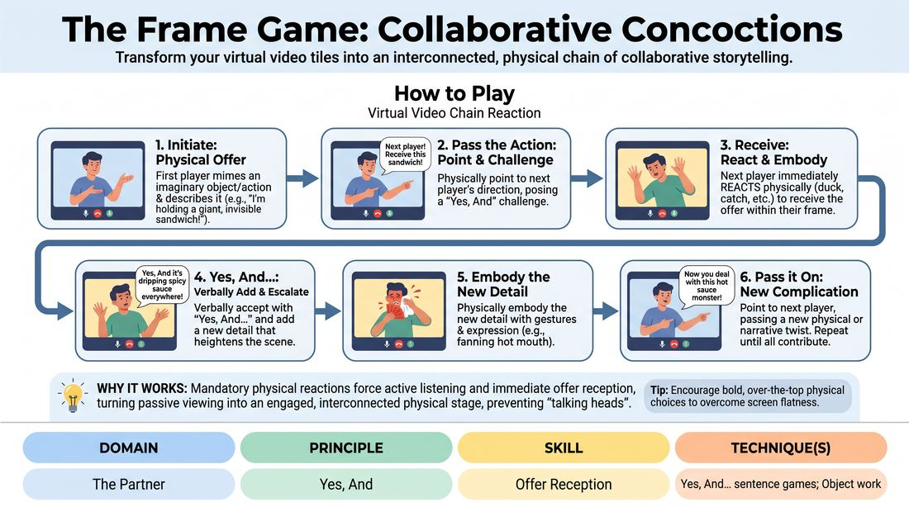

# Gallery Box Storytellers

{ .game-hero }

> Transform your virtual video tiles into an interconnected, physical chain of collaborative storytelling.

## Overview
In this virtual-first game, players use their individual video feeds as miniature theatrical stages to build a continuous, physical narrative. By combining verbal 'Yes, And' offers with expressive body language, the group weaves an absurd, interconnected reality. A structured turn-taking system keeps the energy high and eliminates the awkward pauses of online communication.

## What It Trains
- **Domain:** D2 — The Partner
- **Principle(s):** The First Thought Is a Gift; Yes, And; Show, Don't Tell; Group Mind
- **Skill(s):** Physicality & Space Work; Active Listening; Offer Reception; Active Gifting; World-Building
- **Technique(s):** Object work; Last Word Response; Yes, And… sentence games; Endowment-gifting drills; C.R.O.W. (Character, Relationship, Objective, Where)
- **Focus:** mixed

**Objective:** To master the 'Yes, And' principle in a virtual environment by actively receiving verbal and physical offers, immediately validating them through physical embodiment, and passing clear, actionable gifts to the next player.

## Setup
Ensure all participants are in 'Gallery View' so everyone can see all video feeds simultaneously. The facilitator creates a sequential speaker order and posts it in the meeting chat. No physical props are required, but players should position their cameras so their upper bodies and hands are clearly visible.

## How to Play
1. The facilitator establishes the turn order in the chat and introduces the first player as the Initial Architect.
2. The first player initiates the story by miming a simple physical action or holding an imaginary object within their video frame, describing what it is.
3. The active player then physically 'points' toward their camera edge in the direction of the next player in the chat queue, posing a 'Yes, And' challenge or question.
4. The next player must immediately receive the offer by physically reacting to it (e.g., ducking, catching, or smelling the imaginary object) within their own frame.
5. This player verbally accepts the premise with a 'Yes, And...' statement, adding a new narrative detail that escalates the situation.
6. The player then physically embodies this new detail using their upper body, facial expressions, and hand gestures to make the imaginary world visible.
7. Finally, this player points to the next person in the queue, passing a new physical or narrative complication to them.
8. The chain reaction continues until every player has contributed, building a highly physical, absurd, and cohesive group narrative.

## Facilitation Notes
- Side-coach physicality: If a player is just talking, call out, 'Show us! Let us see the weight of that object in your hands!'
- Manage the queue: Keep the chat order visible and call out the next player's name if there is any hesitation to maintain a rapid, energetic pace.
- Pitfall - Directional pointing confusion: Because gallery views can be arranged differently for each user, instruct players to point generally 'out of their frame' or call the next person's name aloud while pointing.
- Encourage immediate reaction: Remind players to react physically before they speak, which helps ground the virtual offer instantly.

## Variations
- Background Integration: Players must incorporate their actual physical room surroundings or a virtual background into the narrative when their turn arrives.
- Emotional Infection: Each pass of the baton must include an emotional state (e.g., 'Yes, and you are terrified of this!') which the receiving player must immediately embody.
- Speed Run: Once the story is established, run the exact same sequence in reverse order as fast as possible, with each player only giving a one-word physical reaction.

## Debrief
- How did physicalizing the offers change how closely you had to watch your screen?
- What strategies helped you accept an absurd offer instantly without overthinking?
- How did the structured chat queue affect your sense of timing and playfulness compared to unstructured virtual conversations?

## Safety & Inclusion
Since this game relies on physical movement on camera, encourage participants to adapt gestures to their comfort and mobility levels. If a participant cannot turn on their camera, they can participate via audio-only by describing their physical reactions in vivid detail, or act as the 'scribe' who documents the story in the chat.

## Why It Works
By turning individual video frames into distinct physical stages, this game overcomes the flat, passive nature of virtual meetings. The mandatory physical reaction forces active listening and immediate offer reception, preventing players from planning their lines. The structured chat queue removes the cognitive friction of virtual turn-taking, allowing the group mind to flow freely without audio collisions.
