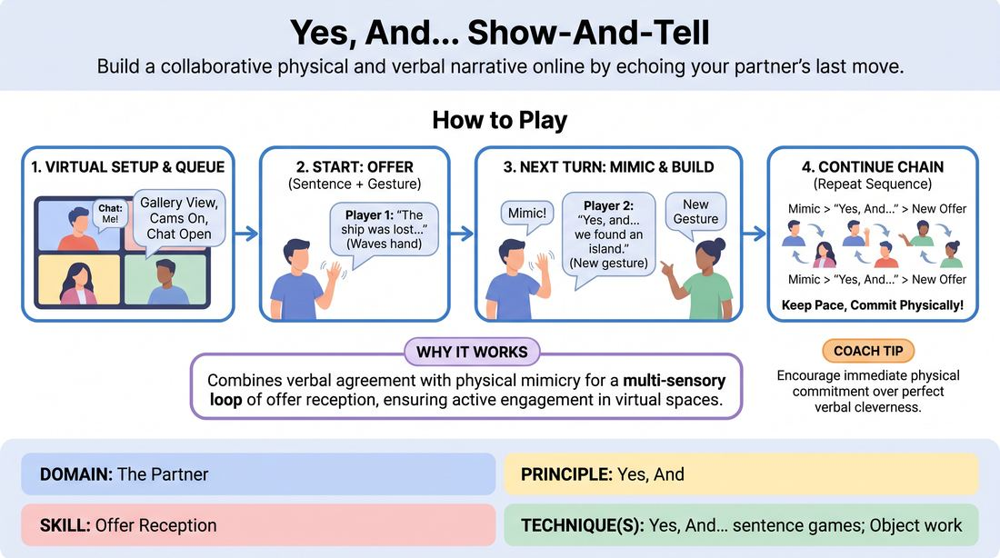

# The Echoing Storyteller

{ .game-hero }

> Build a collaborative physical and verbal narrative online by echoing your partner's last move.

## Overview
A virtual storytelling game where players build a continuous narrative one sentence at a time. Each new speaker must physically mimic the previous player's action before adding their own verbal and physical contribution, creating a highly engaging visual chain of agreement.

## What It Trains
- **Domain:** D2 — The Partner
- **Principle(s):** Yes, And; Serve the Story; Group Mind
- **Skill(s):** Physicality & Space Work; Active Listening; Offer Reception; Narrative Architecture; Support Work
- **Technique(s):** Object work; Last Word Response; Mirror exercise; Yes, And… sentence games; Story Spine
- **Focus:** mixed

**Objective:** To develop deep active listening and physical offer reception in a virtual space, reinforcing the core 'Yes, And' principle by requiring players to physically and verbally validate their partner's contribution before building upon it.

## Setup
Played in a virtual meeting room with all participants on camera in a gallery view. The chat window is open and used to manage the turn order. No physical props are required, but players should ensure their upper bodies are clearly visible in their camera frames.

## How to Play
1. Instruct all players to turn on their cameras, switch to gallery view, and open the text chat window.
2. Explain that the group will build a collaborative story one sentence at a time, with each turn requiring both a verbal statement and a physical gesture.
3. Establish the turn-taking mechanism: to claim the next turn, a player must type a specific keyword like 'Me' in the chat, creating a clear queue to prevent overlapping audio.
4. The first player starts the story with a single opening sentence accompanied by a distinct, clear physical gesture within their camera frame.
5. The next player in the chat queue unmutes and must immediately perform a quick, impressionistic mimicry of the first player's physical gesture as a physical 'Yes'.
6. After mimicking the gesture, the active player says 'Yes, and...' to verbally accept the premise, adds the next sentence of the story, and introduces their own new physical gesture.
7. Continue this chain through the queue, ensuring each player performs the sequence: Mimic previous gesture, say 'Yes, and...', add new sentence, and perform new gesture.
8. Keep the pace brisk, encouraging players to focus on immediate physical commitment rather than overthinking the perfect narrative connection.

## Facilitation Notes
- Side-coaching cue: 'Keep the mimicry fast and impressionistic!' Remind players it is a lightning-fast echo to show they saw the offer, not a perfect theatrical reenactment.
- Pitfall: Players get stuck trying to think of a clever sentence and freeze physically. Fix: Coach them to start with the physical mimicry first; the physical movement often unlocks the verbal idea.
- Pitfall: Audio overlap or confusion over who goes next. Fix: Strictly enforce the chat-based queue. If two people unmute, refer to the timestamped chat to see who claimed the spot first.
- Side-coaching cue: 'Make your gestures big and clear!' Since virtual frames are small, subtle movements get lost. Encourage expressive upper-body and facial work.

## Variations
- Emotional Echo: Instead of mimicking a physical action, the next player must mimic the exact facial expression and emotional state of the previous player before transitioning to their own.
- Sound Effect Chain: Players must accompany their gesture with a distinct vocal sound effect, which the next player must also mimic before adding their own sentence, gesture, and sound.

## Debrief
- How did having to physically mimic your partner change how closely you watched them compared to a normal video call?
- Did you find that performing the physical action first made it easier or harder to come up with your next line of the story?
- How did the chat queue help manage the flow and reduce the anxiety of interrupting others online?

## Safety & Inclusion
Ensure players are aware they can adapt any physical gesture to fit their personal mobility and comfort level. If a gesture is physically inaccessible, they can mimic its essence or shape using whatever movement works best for them, including facial expressions or verbal descriptions.

## Why It Works
By combining verbal agreement with physical mimicry, the game creates a multi-sensory loop of offer reception. In virtual spaces, audio lag and lack of eye contact often lead to passive listening. Forcing a physical echo ensures players are visually anchored to their partners, turning passive screen-watching into active, embodied collaboration.
