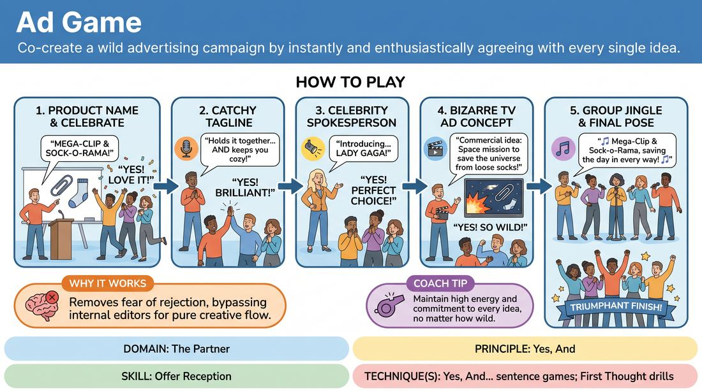

# The Pitch Meeting

{ .game-hero }

> Co-create a wild advertising campaign by instantly and enthusiastically agreeing with every single idea.

## Overview
Five players act as a high-energy creative team in an advertising agency. They must collaborate to build a complete product campaign from scratch, instantly accepting every suggestion with absolute enthusiasm. The game is a fast-paced, high-energy exercise in radical agreement and collaborative support.

## What It Trains
- **Domain:** D2 — The Partner
- **Principle(s):** The First Thought Is a Gift; Yes, And; Make Your Partner a Genius; Group Mind
- **Skill(s):** Unfiltered Spontaneity; Active Listening; Offer Reception; Support Work
- **Technique(s):** First Thought drills; Yes, And… sentence games
- **Focus:** skill_drill

**Objective:** To practice immediate, unfiltered agreement ('Yes, And') and active listening, training players to treat their partner's first offer as an absolute gift.

## At a Glance
| Aspect | Detail |
|---|---|
| Players | 5–5 (ideal 5) |
| Time | ~10 min |
| Complexity | 2/5 |
| Skill level | novice |
| Energy | high |
| Physicality | low |
| Modality | in_person |
| Space | minimal |
| Props | none |
| Audience | not required |

## Setup
Five players stand in a semi-circle facing the rest of the group. No props or special staging are required.

## How to Play
1. Establish the scene: Five players step forward as a team of advertising executives in a high-stakes pitch meeting.
2. The facilitator or the group prompts the team with a basic, mundane object (e.g., 'a paperclip' or 'socks') to kick off the campaign.
3. The first player proposes a brand-new, absurd name for this product.
4. The entire group must instantly celebrate this name with high energy, shouting agreement.
5. The second player builds on this by proposing a catchy tagline or slogan for the product, which the group again enthusiastically accepts.
6. The third player introduces a celebrity spokesperson who will endorse the product, met with immediate, joyful agreement.
7. The fourth player describes a dramatic or bizarre concept for the television commercial.
8. The fifth player initiates a musical jingle for the product, which the entire group immediately joins in to sing and harmonize together.
9. The game concludes once the jingle is sung and the team strikes a final, triumphant pose.

## Facilitation Notes
- Coaching cue: 'Don't think, just agree!' Encourage players to yell 'Yes!' before they even process the idea fully.
- Pitfall: Hesitation or trying to find a 'better' idea. Fix: Remind players that the first idea uttered is the absolute best idea in the universe.
- Coaching cue: 'Make your partner a genius!' Treat every bizarre suggestion as a stroke of marketing brilliance.
- Pitfall: Over-complicating the jingle. Fix: Keep the jingle simple, repetitive, and rhythmic so the whole group can easily jump in and sing along.

## Variations
- The Critic's Twist: Introduce a sixth player who plays a skeptical client, forcing the team to 'Yes, And' the client's bizarre critiques and incorporate them into the pitch.
- Rapid Fire: Run the game with a strict 2-minute timer to force faster decision-making and reduce overthinking.
- Physicalized Pitch: Players must physically act out the commercial concept as it is being described by the fourth player.

## Debrief
- How did it feel to have your very first, unpolished idea met with instant, roaring approval?
- What happened to the pressure of being 'funny' or 'clever' when you knew your team would support whatever you said?
- How does immediate agreement help build a cohesive group mind?

## Why It Works
By removing the fear of rejection, players bypass their internal editors. The structured sequence of tasks (name, tagline, celebrity, commercial, jingle) provides a clear roadmap, allowing players to focus entirely on the delivery of enthusiastic agreement rather than worrying about what comes next.
