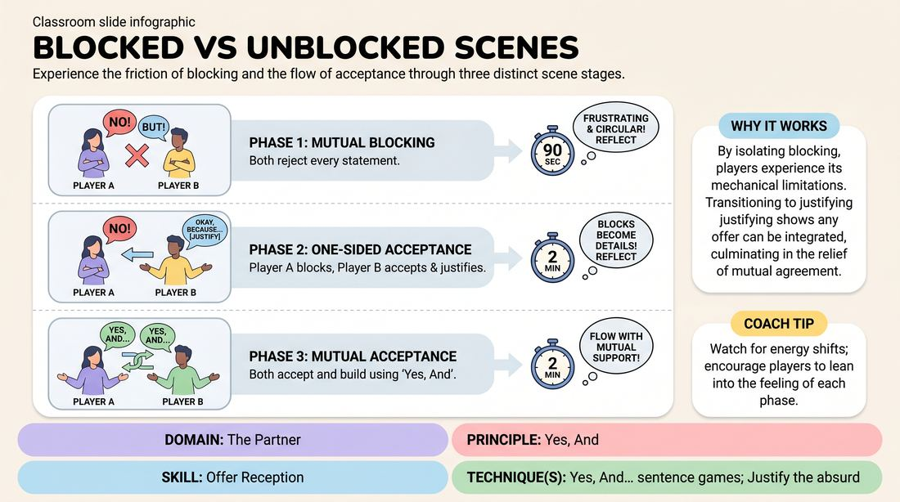

# The Acceptance Progression

{ .game-hero }

> Experience the friction of blocking and the flow of acceptance through three distinct scene stages.

## Overview
This exercise guides players through three distinct phases of scene work: mutual blocking, one-sided blocking with justification, and mutual acceptance. By deliberately experiencing the frustration of rejection and the relief of agreement, players develop a visceral understanding of how to receive and build on any offer.

## What It Trains
- **Domain:** D2 — The Partner
- **Principle(s):** Yes, And; Make Your Partner a Genius
- **Skill(s):** Active Listening; Offer Reception; Justification
- **Technique(s):** Yes, And… sentence games; Justify the absurd
- **Focus:** skill_drill

**Objective:** To build deep awareness of offer reception, contrast the narrative friction of blocking with the collaborative flow of 'Yes, And', and practice justifying difficult or contradictory offers.

## Setup
Players pair up and stand or sit facing each other. No props or special staging are required. The facilitator will guide the entire room through three timed phases simultaneously.

## How to Play
1. Divide the group into pairs (Player A and Player B) spread out across the space.
2. Phase 1 (Mutual Blocking): Instruct pairs to start a scene where both players must immediately reject, deny, or contradict every single statement their partner makes.
3. Run Phase 1 for 90 seconds, then pause the group to briefly reflect on how it felt (typically exhausting, circular, and frustrating).
4. Phase 2 (One-Sided Acceptance): Instruct Player A to continue blocking every statement, while Player B must completely accept Player A's blocks, justify them, and build on them.
5. Run Phase 2 for 2 minutes, then pause. Note how Player B's acceptance transforms Player A's blocks into useful narrative details.
6. Phase 3 (Mutual Acceptance): Instruct both players to fully accept and build on every offer using the classic 'Yes, And' principle, where every statement is treated as absolute truth.
7. Run Phase 3 for 2 minutes, allowing the scenes to flow naturally with mutual support.

## Facilitation Notes
- Side-coaching for Phase 1: 'Notice how hard you have to work to keep the scene alive when nothing is allowed to be true.'
- Side-coaching for Phase 2: 'Player B, don't just agree—explain why the block makes sense. Make your partner's rejection look like a brilliant choice.'
- Common Pitfall: In Phase 2, Player B might accidentally block back out of habit. Remind them to treat the block as a gift.
- Side-coaching for Phase 3: 'Let go of the struggle. Let the scene be easy. Just say yes and add one small detail.'

## Variations
- Role Reversal: In Phase 2, swap roles so Player B blocks and Player A practices the difficult task of accepting and justifying.
- The Silent Block: Play Phase 1 or 2 using physical actions and object work instead of dialogue, blocking each other's physical offers.

## Debrief
- How did your physical energy and tension levels change between Phase 1 (mutual blocking) and Phase 3 (mutual acceptance)?
- In Phase 2, how did it feel to be the blocker when your partner kept accepting your blocks? Did it make you feel like a genius?
- Why is justification such a powerful tool when a partner accidentally blocks or derails a scene?

## Safety & Inclusion
Ensure players understand that 'blocking' in Phase 1 and 2 refers to narrative choices, not physical boundary-crossing or personal insults. Encourage players to keep the content lighthearted and avoid using personal attacks as blocks.

## Why It Works
By isolating blocking, players experience its mechanical limitations in a safe, low-stakes environment. When they transition to justifying a block, they learn that any offer—even a difficult one—can be integrated. Finally, experiencing mutual acceptance immediately after friction makes the ease of 'Yes, And' feel incredibly rewarding and intuitive.
